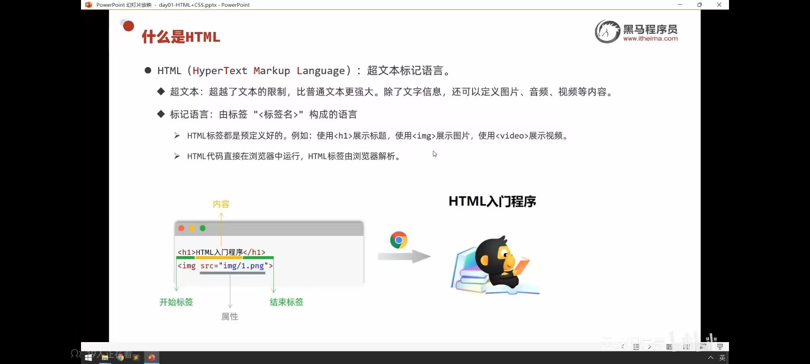
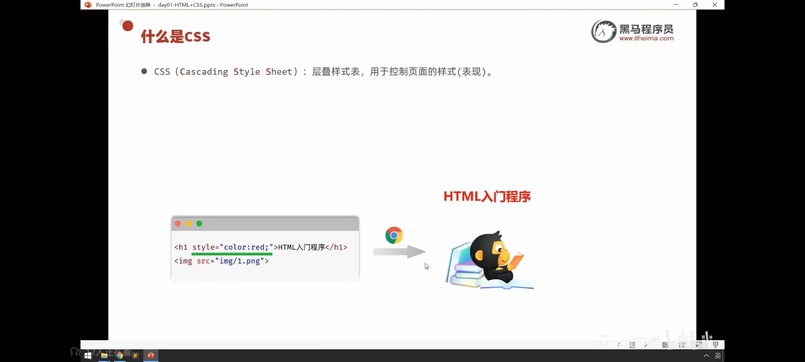
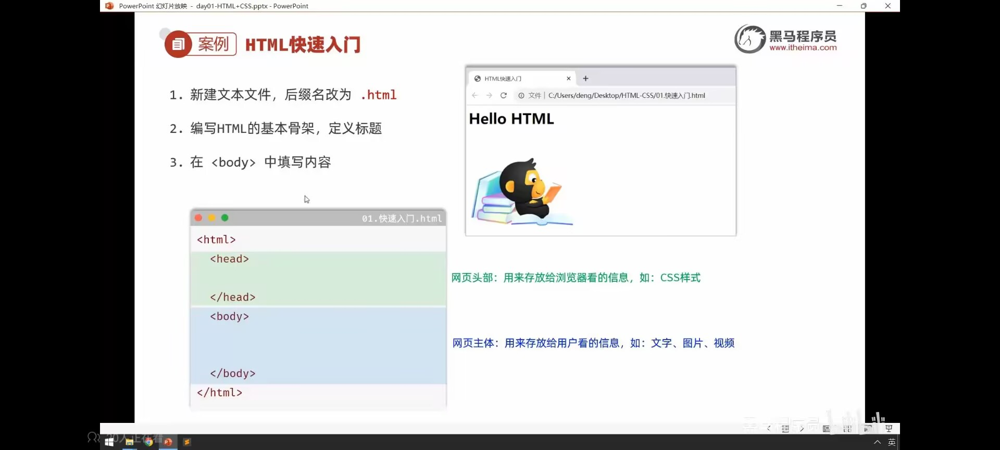
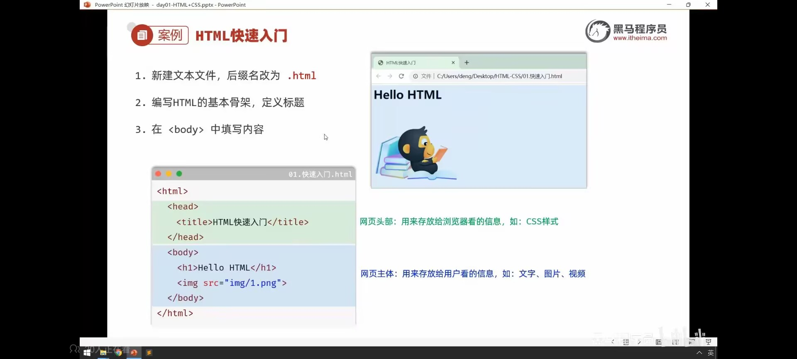

# 后端开发学习笔记

---

## 📑 目录

> 点击各章节标题可快速跳转（Typora/Obsidian 等 Markdown 编辑器支持）

| 序号 | 章节 | 核心内容 |
|------|------|----------|
| 一 | [爬虫](#爬虫) | 静态/动态数据获取、Cookie、GET/POST、Scrapy框架、MongoDB、JS逆向 |
| 二 | [Python基础](#python基础) | 路径操作、字典/元组技巧、深浅拷贝、异步、OS库、正则表达式 |
| 三 | [后端Python开发](#后端python开发) | Flask框架（路由/传参/重定向/响应）、Django框架 |
| 四 | [后端Java开发基础](#后端java开发基础) | Java语法、OOP、异常、IO流、多线程、网络编程（TCP/UDP） |
| 五 | [Java后端开发Web](#java后端开发web) | HTTP、Servlet、Filter/Listener、前端三剑客、Maven、SpringBoot、MySQL、MyBatis、AOP、部署 |
| 六 | [苍穹外卖](#苍穹外卖) | SpringBoot实战项目、Redis基础、Spring Cache、HttpClient、WebSocket |
| 七 | [自己项目](#自己项目) | AIServer（RAG/多智能体/JWT）、GuestBook（Nacos/Docker） |
| 八 | [微服务](#微服务) | MyBatisPlus、Docker/DockerCompose、Nacos、服务治理、Sentinel、Seata、RabbitMQ、ES |
| 九 | [黑马点评（Redis进阶）](#黑马点评redis进阶) | Redis命令/客户端、缓存策略、分布式锁、秒杀优化、消息队列、Redis持久化 |
| 十 | [大模型知识](#大模型知识) | MoE模型、RAG技术、向量数据库、微调与显存估算 |
| 十一 | [Git使用](#git使用) | 仓库创建、分支管理、推送GitHub、SSH配置、冲突解决 |
| 十二 | [代码报错修改](#代码报错修改) | MySQL启动报错、SpringBoot问题、端口占用、Nacos配置 |

---

### 详细子目录

<details>
<summary><strong>一、爬虫</strong></summary>

- 入门须知
  - 常识（静态/动态数据获取）
  - 方法（抓包、XHR筛选）
  - 什么是Cookie
  - 什么是GET/POST
- Scrapy框架
  - 准备（创建项目、创建爬虫、运行爬虫）
  - 操作（Request vs Item、meta传参）
  - 管道（Pipeline数据存储）
  - 细节（正则匹配、DEBUG）
  - IMG的Pipeline（图片下载）
  - 一些操作
  - Crawl Spider
  - Cookie特别注意
  - 下载中间件修改UA
  - IP代理
  - Scrapy结合Selenium
  - MongoDB集成
- MongoDB查询操作手册
  - 查找操作（find/findOne）
  - 运算符（$eq/$lt/$gt/$or/$in等）
  - 模糊匹配
  - 自定义查询
  - 限制结果数量（limit/skip）
  - 排序和统计（sort/count）
  - 字段判断和去重（$exists/distinct）
- 其他爬虫技术
  - fake-useragent
  - 反爬与反反爬
  - Splash运用
  - request.Session
- JS逆向
  - 抓包
  - Debug寻找数据
  - JS渲染代码
  - 网络JS信息抓包

</details>

<details>
<summary><strong>二、Python基础</strong></summary>

- 常识
  - ./和../的含义
  - 不同操作系统路径统一（pathlib）
- 小技巧
  - zip合并列表
  - 序列解包
  - 字典操作（get方法健壮性）
  - 元组
  - format/格式化
  - 函数（重载、变量作用域、参数传递）
  - 深浅拷贝理解
  - 多个yield（生成器）
- 异步操作
  - 解决的问题
  - 什么是异步和阻塞
  - 异步好处
  - 语法
- OS库技术
  - 文件与目录操作（pathlib/Path）
  - 系统信息获取（环境变量）
- 正则表达式
  - 基础概念
  - 字符类与集合
  - 量词与重复（贪婪/非贪婪）
  - 分组与捕获
  - 核心函数详解（findall/search/match/split/sub）
  - Flags参数
  - 编译正则表达式
  - 实际应用模式
  - Tokenizer中的应用
  - 常见陷阱与最佳实践
  - 进阶主题（前后查找/条件匹配/嵌套）
  - 性能优化

</details>

<details>
<summary><strong>三、后端Python开发</strong></summary>

- Flask框架
  - @app.route解释
  - 基础（路由与视图函数）
  - DEBUG方式
  - 动态传参
  - 接收数据类型变化
  - 自定义数据类型/to_python
  - URL路径参数/查询参数
  - 请求方法限制
  - 文件上传
  - 获取前台信息
  - url_for反向路由
  - 重定向
  - 响应内容
- Django框架
  - 专业术语

</details>

<details>
<summary><strong>四、后端Java开发基础</strong></summary>

- 基础
  - Scanner（共享System.in问题）
  - 快捷方式（alt+Enter）
  - 数组、foreach循环
  - 空指针、equals判断
  - 堆栈内存
  - printf、建包、常量
  - static、泛型
- 函数
  - 函数重载
  - 任意多个参数
  - 地址传递/值传递
- 各种类型及转换
  - 引用数据类型
- 面向对象
  - 基础（类与对象）
  - 内部类
  - 类属性自动初始化
  - 三大特性（封装/继承/多态）
  - 接口
  - 异常机制处理
  - jar包
- 客户端与服务端通信
- 软件开发须知
  - 开发流程
  - 设计原则（开闭/里氏代换/依赖倒转/接口隔离/最少知道/合成复用）
  - 设计模式
- 核心编程
  - 常用API
  - IO流
  - 多线程
- 网络编程
  - 网络简介（互联网协议/TCP/UDP）
  - ServerSocket和Socket
  - TCP编程
  - UDP编程

</details>

<details>
<summary><strong>五、Java后端开发Web</strong></summary>

- 基础（HTTP协议/请求响应步骤/请求方法）
- Servlet
- Filter和Listener
  - 会话跟踪技术（Cookie/Session）
  - Filter过滤器
  - Listener监听器
  - MVC设计模式
  - 三层架构
- 重要知识点
- 前端三剑客（HTML/CSS/JavaScript）
- Maven
- SpringBoot Web
  - 入门（常见问题/HTTP协议/请求数据/响应数据）
- MySQL
- MyBatis
- 项目启动（Nginx配置）
- 软件开发
  - RESTful
  - 项目创建（Spring Initializr）
- Spring AOP
  - 简介/特有方法/操作方法/核心概念
- SpringBoot原理
  - 注解/Controller与IOC/@EnableConfigurationProperties/配置优先级
- Maven高级
  - 分模块设计/继承
- 部署
  - Linux（目录/指令/权限/服务管理）
  - Docker部署
  - DockerCompose
  - Nacos
  - 连接Python FastAPI

</details>

<details>
<summary><strong>六、苍穹外卖</strong></summary>

- 重要小知识点
  - 快捷方式（TODO/Ctrl+I/路径符号）
  - 注意事项
  - 技术要点
  - 配置注意
  - 设计思想（SQL优化）
- 重要小前置知识点
  - @RequestBody
  - 其他注解
- 设计思想和感想
  - 更新数据库字段的新想法
  - WebSocket
- 项目前置配置
  - 项目结构/Nginx/Swagger
- Redis
  - 基础（简介/启动连接）
  - 数据类型及特点
  - 常用命令
  - Redis在Java中的使用
- Spring Cache
  - @CachePut/@Cacheable/@CacheEvict
- 项目
  - HttpClient
  - 微信小程序
  - Spring Task
  - WebSocket
  - Apache POI

</details>

<details>
<summary><strong>七、自己项目</strong></summary>

- AIServer
  - 项目启动
  - 技术（多智能体对话/RAG检索）
  - RAG技术流程（向量数据库/Chroma/文档分块）
  - 项目思路（子问题拆分/综合诊断）
  - JWT单点登录实现
- GuestBook
  - 注意（Docker/Nacos配置）
  - 技术（Docker网络/MySQL容器/Nacos服务发现）

</details>

<details>
<summary><strong>八、微服务</strong></summary>

- 重要知识点
  - 小技术（@RequiredArgsConstructor/避免@Autowired）
  - 重要知识点
- 基础
  - 技术栈
  - 微服务介绍
  - MyBatisPlus（入门/Service接口/批量新增）
  - Docker（常用命令/镜像/容器/数据卷/网络）
  - DockerCompose
  - Nacos网页版使用
- 微服务知识
  - 拆分原则/工程结构/服务间调用
  - 服务治理（Nacos注册/发现/配置）
- 微服务保护和分布式事务
  - 雪崩问题（限流/线程隔离/熔断）
  - 服务保护技术（Sentinel）
  - 分布式事务（Seata）
- MQ入门
  - RabbitMQ简介
  - Java使用RabbitMQ
- MQ高级
  - 发送者可靠性（重连/确认）
  - MQ可靠性（持久化）
  - 消费者可靠性（ACK/重试）
  - 业务幂等性
  - 延迟消息
- ES（Elasticsearch）
  - 倒排索引
  - IK分词器
  - 基本概念

</details>

<details>
<summary><strong>九、黑马点评（Redis进阶）</strong></summary>

- 前置
  - Redis启动
  - Cookie/Session/Token
  - MVC拦截器
  - 对象生命周期
- 重要知识点
- 技术
  - lpush错误
  - 对象copy到map（BeanUtil）
  - JSONUtil类
  - MyBatisPlus小技术
  - 不修改源码增加字段
  - Spring AOP与@Transactional失效
  - @TableField(exist=false)
  - Lambda表达式
- 基础
  - Redis简介
  - 命令（通用/String/Hash/List/Set/ZSet）
  - Redis Java客户端
- 短信登陆
  - 思维图/问题及解决/缓存过期
- 缓存
  - 基础/更新策略/穿透/雪崩/击穿
- 优惠券秒杀
  - 基础/下单/超卖问题/分布式锁/优化分布式锁（Redisson/Lua脚本）
- 秒杀速度优化
  - 基础/消息队列（List/PubSub/Stream）
- 达人探店
  - 点赞功能
  - 关注推送（拉模式/推模式/推拉结合）
  - 每日签到（BitMap）
  - UV统计（HyperLogLog）
- 分布式缓存
  - 单点Redis问题
  - Redis持久化（RDB/AOF）

</details>

<details>
<summary><strong>十、大模型知识</strong></summary>

- 基础知识
  - MoE模型（混合专家模型）
  - 微调（显存估算/推理与训练资源）

</details>

<details>
<summary><strong>十一、Git使用</strong></summary>

- 简介
- 创建仓库
- 指令
  - 简单总结
  - 配置信息
  - 查看提交日志/操作记录
  - 快捷方式
  - 版本回退
  - 分支管理
- 推送到GitHub
  - 识别问题
  - 解决网络连接问题（SSH/端口443）
  - 解决文件过大问题（git filter-repo）
  - 第一次推送完整步骤（SSH模式）
- 修改后流程
  - 最终流程
  - 添加.gitignore
- 远程和本地不同步
  - 拉取远程覆盖本地
  - 标准流程
  - 冲突解决
  - 安全固定流程
  - AI项目Git习惯
- 注意
  - 文件总量越来越大
  - 单个文件超过100M

</details>

<details>
<summary><strong>十二、代码报错修改</strong></summary>

- MySQL
  - 启动时报错（端口占用）
  - 密码修改
- SpringBoot
  - IOC容器实例重复（@Component与@Bean冲突）
- 命令行窗口
  - 如何进入D盘
  - 端口被占用
- 工具类
  - 内网穿透（cpolar）
- Nacos
  - Public Key Retrieval错误修复
  - MySQL连接配置

</details>

---

# 一、爬虫

## 1.1 入门须知

### 1.1.1 常识

### 1.1.2 方法

**静态数据获取**：访问地址栏里的数据就可以获取到想要的数据

**动态数据获取**：访问地址栏里的数据就无法获取到想要的数据

**解决方案**：抓包

具体操作步骤：
1. 打开浏览器的开发者工具
2. 选择 Network 标签页
3. 筛选 XHR 请求
4. 找到能够获取到数据的URL进行访问

### 1.1.3 什么是cookie

**Cookie 的作用**：Cookie 是某些网站为了识别用户身份、进行会话跟踪而存储在用户本地终端上的数据（通常经过加密）。

**应用场景**：有些网站需要登录后才能访问特定页面。在登录之前，您无法抓取该页面的内容。

**解决方案**：使用 Urllib 库保存登录的 Cookie，然后利用该 Cookie 抓取其他页面，从而实现访问受限内容的目的。

### 1.1.4 什么是get，什么是post

**1. HTTP 方法的本质区别**

| **方法**      | `session.get()`                              | `session.post()`                         |
| ------------- | -------------------------------------------- | ---------------------------------------- |
| **HTTP 动词** | `GET`                                        | `POST`                                   |
| **用途**      | 从服务器**获取数据**（如加载网页、查询资源） | 向服务器**提交数据**（如登录、上传文件） |
| **幂等性**    | 幂等（多次执行结果相同，如刷新页面）         | 非幂等（可能修改服务器状态，如提交订单） |

---

### 1.1.5 网上搜索unicode在线解码器

## 1.2 scrapy

### 1.2.1 准备

终端创建（注意看第二张图）

爬虫的名字是那个写最主要类的那个文件的名字

**1. 创建爬虫的项目**

```bash
scrapy startproject 项目的名字
```

> 注意：项目的名字不允许使用数字开头，也不能包含中文。

**2. 创建爬虫文件**

要在spiders文件夹中创建爬虫文件：

```bash
cd 项目的名字/项目的名字/spiders
cd scrapy_baidu_091/scrapy_baidu_091/spiders
scrapy genspider 爬虫文件的名字 要爬取网页
# eg: scrapy genspider baidu www.baidu.com
```

> 一般情况下不需要添加http协议，因为 `start_urls` 的域名是由 `allowed_domains` 修改的，添加http的话需要手动修改 `start_urls`。

**3. 运行爬虫代码**

```bash
scrapy crawl 爬虫的名字
# eg: scrapy crawl baidu
```

开管道和打开robot协议


注意添加头文件（from大类import items里面的那个类的类名）


### 1.2.2 操作

解释一下为什么有的时候return scrapy.Request为什么有的时候return ScrapyNcbiItem

在 `parse` 方法中，`return scrapy.Request(...)` 和 `return ScrapyNcbiItem(...)` 的不同处理方式取决于爬取逻辑的需求：

1. **`return ScrapyNcbiItem(...)`**：这是 Scrapy 中的数据传输对象（Item）。当 `t`（某个 XPath 解析结果）存在时，意味着在当前页面已经获取到目标数据，不需要进一步请求其他页面，直接构造 `ScrapyNcbiItem` 并返回，Scrapy 会将其存储或传递给 `pipelines.py` 进行处理。

2. **`return scrapy.Request(...)`**：当 `t` 不存在，但 `a`（另一个 XPath 解析结果）存在时，说明需要访问另一个页面才能获取完整数据。`scrapy.Request` 创建了一个新的请求，指向新的 URL，并指定 `callback=self.parse_second`，表示 Scrapy 会在获取该页面后调用 `parse_second` 方法继续解析。

3. **`return ScrapyNcbiItem(...)` (None 情况)**：如果 `t` 和 `a` 都不存在，说明当前页面没有足够信息，也没有需要进一步请求的 URL，直接返回一个 `ScrapyNcbiItem`，但 `src=None`，`officialName=None`，表示未找到有效数据。

> **代码逻辑总结**：能直接提取数据 → 直接返回 `ScrapyNcbiItem`；需要进一步访问新页面 → 返回 `scrapy.Request`；既没数据也没跳转链接 → 返回 `ScrapyNcbiItem`（带 `None`）。

**可以不用extract_first()，可以直接用get()或者getall()，注意**

meta是传给下一个响应的参数，必须有meta，才能把一些东西传给下一个参数


### 1.2.3 管道


必须这样写lines，要空格必须自己中间空


items必须这么写


创建的Item字典


### 1.2.4 细节

#### 如何用正则表达式匹配


#### 如何DEBUG


#### 写入文件快捷技巧


#### 一些参数


箭头处是唯一去重方法

#### 传递登陆信息


### 1.2.5 IMG的Pipline


这里一定要有url


#### 修改


注意1这里，让它不用一定要之前那个名字。也要注意这里是一个子类

这里是前面


#### 特殊注意


这儿可以一直传

上面的request会把meta传给下面的request


### 1.2.6 些操作


1是从哪里传开始

2是可以下一个传给谁

3是得到什么

注意这个还有他的名字


### 1.2.7 crawl spider

创建（用下面那个命令，注意后面是domains）


这里的第一个不会给parse_item


**下面是修改：**

但注意这里的rules，并且parse_item最后不用传


第二步：依次对 `response` 应用所有 `Rule`

在这个初始页面的 `response` 上，Scrapy 依次应用你定义的两个 `Rule`：

1. 应用第一个 Rule
   - `LinkExtractor(restrict_xpaths='//div[@id="list"]/dl/dd[2]/a')` 会在当前页面（初始页面）中，寻找符合 `//div[@id="list"]/dl/dd[2]/a` 的链接。
   - 如果找到了（比如是 “第一章”的链接），Scrapy 就会为这个链接生成一个新的 `Request`，并把它加入调度队列。这个 `Request` 的回调是 `parse_item`，并且设置了 `dont_filter=False`（默认），`follow=True`（你代码里指定了）。
2. 应用第二个 Rule
   - 同理，`LinkExtractor(restrict_xpaths='//div[@class="bottem1"]/a[4]')` 会在当前页面中寻找符合 `//div[@class="bottem1"]/a[4]` 的链接（也许是 “下一页”/“下一章”）。
   - 如果也找到了链接，就会同样生成一个新的 `Request`，加入调度队列，回调也是 `parse_item`，`follow=True`。

这样一来，**同一个页面** 上如果有两个符合规则的链接，Scrapy 就会 **同时** 为它们生成新的请求，而不是先执行完第一个 Rule 再执行第二个 Rule。它是按“依次检查每条规则 → 找到链接 → 加入队列”的方式进行。

**注意这里的rules是同时去匹配（意思是只要找到一个就会将它的链接加入到新的请求）**


### 1.2.8 使用cookie一些特别注意


**这儿的start_urls一定要是登陆后的第一个界面网址才行，而且下面也必须传它**

### 1.2.9 下载中间件修改UA

名字不能变。None处理下一个下载中间件，Response处理Response就不处理后面的了


用别的USERAGENT


注意细节，下面的要写成这样，缺一不可


### 1.2.10 ip代理


这儿需要改成这样


### 1.2.11 scrapy结合selenium（就是用selenium去代替中间件）

写的时候注意这两个spider


注意头文件


在middleware这里配置，request.url是当前网址


### 1.2.12 MongoDB

#### 启动方式


#### DB基础命令

```
1 Mongo数据库的操作
1.1 查看数据库
列出所有在物理上存在的数据库

show dbs

1.2 切换数据库/创建数据库
如果数据库不存在，则指向数据库，但不创建，直到插入数据或创建集合时数据库才被创建

use 数据库名

1.3 删除数据库
删除当前指向的数据库 如果数据库不存在，则什么也不做

use 数据库名
db.dropDatabase()
```

创建集合

**创建集合**：无需手动创建集合，向不存在的集合中第一次添加数据时，集合会自动被创建出来

```javascript
db.createCollection(集合名, {capped: true, size: num})
```

- `capped`：默认值为false表示不设置上限，值为true表示设置上限
- `size`：当capped值为true时，需要指定此参数，表示上限大小，当文档达到上限时，会将之前的数据覆盖，单位为字节

**删除集合**：

```javascript
db.集合名称.drop()
```

**查看集合**：

```javascript
show tables
show collections
```

#### 修改数据

query更新谁，update更新成什么样子

**格式**：

```javascript
db.集合名称.update(
    <query>,
    <update>,
    {multi: <boolean>}
)
```

- 参数Query：查询条件，类似sql语句update中where部分
- 参数Update：更新操作符，类似sql语句update中set部分
- 参数multi：可选，默认是false，表示只更新找到的第一条记录，值为true表示把满足条件的文档全部更新

**举例**：

```javascript
// 更新找到的第一条，并且直接修改结构
db.person.update({name: "zs"}, {age: 10})

// 只更新数据，不更新文档结构
db.person.update({name: "zs"}, {$set: {age: 123}})

// 更新所有找到匹配的数据
db.person.update({name: "zs"}, {$set: {age: 123}}, {multi: true})
```

#### 增加数据

区别：insert时，如果id相同会报错，save时，id相同会更新之前那个相同id的内容

> 注意：插入文档时，如果不指定 `_id` 参数，MongoDB会为文档分配一个唯一的objectId

**insert**：

```javascript
db.集合名称.insert(document)
```

**save**：使用save函数时，如果原来的对象不存在，那他们都可以向collection里插入数据，如果已经存在，save会调用update更新里面的记录。

```javascript
db.集合名称.save(document)
```

操作


#### 删除和查找

**删除**：

```javascript
// 删除所有匹配数据
db.person.remove({name: "zs"})

// 只删除一条
db.person.remove({name: "zs"}, {justOne: true})
```

**查找**：

```javascript
db.集合名.find()
```

删除这一个所加参数justOne


查找

#### MongoDB 查询操作手册

##### 1. 查找操作

### 1.2.13 find
查找所有匹配数据
```javascript
db.集合名.find({条件文档})
```

###### 1.2 findOne
只返回匹配的第一个数据
```javascript
db.集合名.findOne({条件文档})
```

##### 2. 运算符

| 语法 | 操作 | 格式示例 |
|------|------|----------|
| $eq | 等于 | `{age: {$eq: 25}}` |
| $lt | 小于 | `{age: {$lt: 30}}` |
| $lte | 小于或等于 | `{age: {$lte: 30}}` |
| $gt | 大于 | `{age: {$gt: 20}}` |
| $gte | 大于或等于 | `{age: {$gte: 20}}` |
| $ne | 不等于 | `{age: {$ne: 25}}` |
| $or | 或 | `{$or: [{age: 25}, {name: "zs"}]}` |
| $in | 在范围内 | `{age: {$in: [20, 25, 30]}}` |
| $nin | 不在范围内 | `{age: {$nin: [20, 25, 30]}}` |

##### 3. 模糊匹配

使用正则表达式进行模糊查询：

```javascript
db.person.find({name: /.*zs.*/})
db.person.find({name: {$regex: ".*zs"}})
```

##### 4. 自定义查询

使用 `$where` 进行复杂条件查询：

```javascript
db.person.find({
    $where: function() {
        return this.age > 28
    }
})
```

##### 5. 限制结果数量

**limit** - 用于读取指定数量的文档：

```javascript
db.集合名称.find().limit(NUMBER)
```

**skip** - 用于跳过指定数量的文档：

```javascript
db.集合名称.find().skip(2)
```

##### 6. 排序和统计

**sort** - 对结果集进行排序：

```javascript
db.集合名称.find().sort({字段: 1})    // 1为升序
db.集合名称.find().sort({字段: -1})   // -1为降序
```

**count** - 统计结果集中文档条数：

```javascript
db.集合名称.find({条件}).count()
db.集合名称.count({条件})
```

##### 7. 字段判断和去重

**$exists** - 判断字段是否存在：

```javascript
db.集合名称.find({field: {$exists: true}})
```

**distinct** - 字段值去重：

```javascript
db.集合名称.distinct("field")
```

#### 聚合

**1有显示与不显示，生效与不生效的作用**


这是模板，注意画红线的是倍数


匹配过滤


project筛选（在显示时，0和1共存时，0只能显示在_id上）

##### $project 管道命令

`$project` 用于修改文档的输入输出结构，例如重命名、增加、删除字段。

**1. 查询人物的姓名、年龄，不显示 ID**

```javascript
db.person.aggregate([
    {$project: {_id: 0, name: 1, age: 1}}
])
```

**2. 查询每个国家的人数，只显示数量**

```javascript
db.person.aggregate([
    {$group: {_id: "$country", counter: {$sum: 1}}},
    {$project: {_id: 0, counter: 1}}
])
```

##### $sort 管道命令

`$sort` 用于将输入的文档排序后输出。

**1. 查询人物，按照年龄升序**

```javascript
db.person.aggregate([
    {$sort: {age: 1}}
])
```

**2. 查询每个国家的人数，并排序**

```javascript
db.person.aggregate([
    {$group: {_id: "$country", counter: {$sum: 1}}},
    {$sort: {counter: 1}}
])
```

##### $skip 和 $limit 管道命令

- `$limit`：限制返回数据的条数
- `$skip`：跳过指定的文档数，并返回剩下的文档
- **注意**：同时使用时先使用 `$skip` 再使用 `$limit`

**1. 查询 2 条信息**

```javascript
db.person.aggregate([
    {$limit: 2}
])
```

**2. 查询从第三条开始的信息**

```javascript
db.person.aggregate([
    {$skip: 2}
])
```

**3. 查询每个国家的人数，按照人数升序，返回第二条数据**

```javascript
db.person.aggregate([
    {$group: {_id: "$country", counter: {$sum: 1}}},
    {$sort: {counter: 1}},
    {$skip: 1},
    {$limit: 1}
])
```

> **关键要点**：聚合管道结构中所有聚合操作都使用 `aggregate([])` 方法，管道命令放在数组中按顺序执行。`1` 表示显示/升序，`0` 表示隐藏，`-1` 表示降序。

#### 索引

创建方法

##### 为什么需要创建索引

- 加快查询速度
- 进行数据的去重

##### 创建简单索引

```javascript
db.集合名.ensureIndex({属性: 1})  // 1 表示升序，-1 表示降序
```

##### 创建索引前后查询速度对比

测试：插入 10 万条数据到数据库中

```javascript
for(i=0; i<100000; i++) {
    db.t1.insert({name: 'test'+i, age: i})
}
```

创建索引前：

```javascript
db.t1.find({name: 'test10000'})
db.t1.find({name: 'test10000'}).explain('executionStats')
```

> **关键要点**：使用 `explain('executionStats')` 可以查看查询的详细执行信息，用于分析索引效果。

**索引读更快，但是写入更慢**

##### 索引的查看

默认情况下 `_id` 是集合的索引

```javascript
db.集合名.getIndexes()
```

##### 删除索引

```javascript
db.集合名.dropIndex({'索引名称': 1})
```

示例：

```javascript
db.t1.dropIndex({name: 1})
db.t1.getIndexes()
```

##### 利用索引去重

**唯一索引**：默认情况下 MongoDB 索引键的值可以重复，创建唯一索引后，数据库会在插入数据时检查索引键的值是否存在，如果值已存在则不会插入该条数据。

```javascript
db.集合名.ensureIndex({"字段名": 1}, {"unique": true})
```

利用唯一索引进行数据去重：

```javascript
db.t1.ensureIndex({"name": 1}, {"unique": true})
db.t1.insert({name: 'test10000'})  // 如果已存在相同name，插入会失败
```

##### 复合索引

当需要多个字段组合来确定数据的唯一性时，可以使用复合索引：

```javascript
db.集合名.ensureIndex({字段1: 1, 字段2: 1})
```

> **建立索引注意点**：唯一索引会强制字段值的唯一性，可能影响数据插入；复合索引的顺序会影响查询性能；索引会占用额外的存储空间并降低写入操作的性能。根据业务需求合理选择索引类型，平衡查询性能和写入性能。

#### python里不同

排序


#### scrapy的写入数据库注意事项

python的写法


1这里写入不了MongoPipeline，也写入不了下面那个MysqlPipeline

2这里return后，会给setting里的下一个Pipeline，不return item的话就只会在当前这个Pipeline持续写入


### 1.2.14 scrapy的fake-useragent

登陆PyPi，然后在里面找scrapyfake-useragent，找一个，然后复制到downloadMiddleware里

### 1.2.15 注意反爬

**而且get()这个方法太万能了，要注意**


上面可以加Referer

下面这个可以直接获取全文，然后逐步获取json里的数据，注意要用get获取

### 1.2.16 Splash的运用

#### 属性


**方法：**

寻找网址


等


调用js的方法


其他方法


#### 与python结合


实例


### 1.2.17 反反爬

验证码用超级鹰

### 1.2.18 讲讲request.Session

#### **`requests.Session` 的核心作用**

1. **保持会话状态**  
   在同一个 `Session` 实例中发起的多个请求会**自动共享 Cookies、Headers 等参数**，无需手动管理（例如登录后保持会话状态）。

2. **复用 TCP 连接**  
   `Session` 会复用底层的 TCP 连接，提升高频请求的性能（减少重复建立连接的开销）。

3. **统一配置**  
   可以预先为 `Session` 设置公共参数（如 Headers、代理、认证信息等），后续所有请求自动继承这些配置。

---

#### **`Session` vs 普通请求**

假设你需要向某个网站发送多个请求：
- **普通请求**（直接使用 `requests.get()` 或 `requests.post()`）：  
  每次请求都是独立的，不会共享 Cookies 或连接，需要手动处理会话状态。
  ```python
  # 每次请求都是独立的，无法自动传递 Cookies
  response1 = requests.get("https://example.com/login")
  response2 = requests.get("https://example.com/dashboard")  # 可能无法保持登录状态
  ```

- **使用 `Session`**：  
  通过 `Session` 对象发起请求，自动管理会话相关的参数。
  ```python
  import requests
  
  # 创建会话对象
  session = requests.Session()
  
  # 登录（自动保存 Cookies）
  login_data = {"username": "user", "password": "pass"}
  session.post("https://example.com/login", data=login_data)
  
  # 后续请求自动携带登录后的 Cookies
  response = session.get("https://example.com/dashboard")  # 保持登录状态
  ```

---

#### **`Session` 的常见用途**

1. **处理需要登录的网站**  
   ```python
   session = requests.Session()
   session.post(login_url, data=credentials)  # 登录
   session.get(protected_page_url)           # 访问需要登录的页面
   ```

2. **统一设置 Headers 或代理**  
   ```python
   session = requests.Session()
   session.headers.update({"User-Agent": "My Custom Agent"})  # 所有请求自动携带此 Header
   session.proxies = {"http": "http://10.10.1.10:3128"}       # 统一设置代理
   ```

3. **高频请求优化性能**  
   复用 TCP 连接，减少延迟（适合爬虫或 API 调用）。

4. **文件上传或复杂请求**  
   通过 `Session` 保持上下文，处理多步骤操作（如先获取令牌再提交数据）。

---

#### **`Session` 的底层原理**

- **Cookie 持久化**：自动处理服务器返回的 Cookies，并在后续请求中携带。
- **连接池管理**：默认复用 TCP 连接，通过 `urllib3` 库实现连接池。
- **上下文管理器**：可以用 `with` 语句自动关闭会话（推荐写法）：
  ```python
  with requests.Session() as session:
      session.get("https://example.com")
  ```

---

#### **代码示例**

```python
import requests

# 创建会话对象，并设置公共 Headers
session = requests.Session()
session.headers = {
    "User-Agent": "Mozilla/5.0",
    "Accept-Language": "en-US"
}

# 登录操作（保存 Cookies）
login_url = "https://example.com/login"
response = session.post(login_url, data={"user": "admin", "pass": "123"})

# 访问需要登录的页面（自动携带 Cookies）
profile_url = "https://example.com/profile"
response = session.get(profile_url)
print(response.text)  # 输出登录后的页面内容
```

## 1.3 js逆向

#### 注意抓包

用request直接访问所需网址（用检查去查找）

#### debug寻找所需，这种方法是直接找所需要的数据是怎么生成的（在初级找信息不行时）

第一种方式是直接找是哪个属性包含我所需要的东西（直接找，然后debug）


第二种打断点方式是点右边（看他是通过什么加载，如点击）


#### 自己js渲染代码


#### 直接在网络里找js信息，进行抓包

#### 逆向须知

人家给我们加密了，所以我们传的时候也要加密


注意这里的快捷方式


# 二、Python基础

## 2.1 常识

### 2.1.1 /的含义


### 2.1.2 /和./的意思

在Python和Java中， ./  和  ../  并非编程语言本身的语法，而是文件系统的通用路径符号，含义在两种语言中完全一致，用于定位文件或目录的位置。

-  ./ ：表示当前工作目录，即代码运行时所在的目录。
- 示例：在Python中使用  open("./test.txt") ，或在Java中使用  new File("./test.txt") ，都是指读取当前运行目录下的  test.txt  文件。
-  ../ ：表示上一级目录，即当前工作目录的父目录。
- 示例：在Python中使用  open("../data/test.txt") ，或在Java中使用  new File("../data/test.txt") ，都是指读取当前运行目录的上一级目录中  data  文件夹下的  test.txt  文件。

### 2.1.3 如何在不同操作系统环境下路径统一

这行代码 `persist_path = Path(persist_dir).expanduser().resolve()` 使用了 Python 的 `pathlib` 模块来处理文件系统路径，主要完成三个关键操作：

#### 1. `Path(persist_dir)`

- **功能**：将字符串路径转换为 `Path` 对象
- **作用**：将输入的路径字符串（如 `"~/my_data"` 或 `"../data"`) 转换为面向对象的路径对象
- **示例**：`Path("~/documents")` → 创建表示该路径的对象

#### 2. `.expanduser()`

- **功能**：展开波浪符 `~` 为用户主目录
- **作用**：将 `~` 替换为当前用户的主目录绝对路径
- **示例**：
  - Linux/macOS：`~/data` → `/home/username/data`
  - Windows：`~\Documents` → `C:\Users\username\Documents`

#### 3. `.resolve()`

- **功能**：解析路径为绝对路径并标准化
- **作用**：
  - 将相对路径转为绝对路径（基于当前工作目录）
  - 解析所有符号链接（如果有）
  - 规范化路径（移除冗余的 `..`、`.` 等）
- **示例**：
  - `../data` → `/project/data`（假设当前在 `/project/src`）
  - `./config/../data` → `/project/data`

#### 为什么需要这行代码？

1. **路径一致性**：确保不同操作系统/环境下路径格式统一
2. **防止错误**：避免因 `~` 或相对路径导致的文件位置错误
3. **安全访问**：解析符号链接防止指向意外位置
4. **可靠存储**：数据库等持久化存储需要绝对路径保证可靠性

## 2.2 小技巧

### 2.2.1 zip


### 2.2.2 序列解包

序列解包可以用于元组、列表、字典，能够方便地为多个变量赋值。

**基本语法示例**：

```python
x, y, z = (20, 30, 10)
(a, b, c) = (9, 8, 10)
[m, n, p] = [10, 20, 30]
```

**字典的序列解包**：

```python
s = {'name': 'gaoqi', 'age': 18, 'job': 'teacher'}

# 默认对键进行操作
name, age, job = s
print(name)  # 输出：name

# 对键值对进行操作
name, age, job = s.items()
print(name)  # 输出：('name', 'gaoqi')

# 对值进行操作
name, age, job = s.values()
print(name)  # 输出：gaoqi
```

> **关键要点**：序列解包适用于元组、列表、字典等可迭代对象。字典解包默认对键操作，`items()` 对键值对操作，`values()` 对值操作。解包时左边的变量数量必须与右边可迭代对象的元素数量一致。

### 2.2.3 字典

创建

键重复了，后面的会把前面的剃掉

使用 `zip()` 创建字典：

```python
k = ['name', 'age', 'job']
v = ['gaoqi', 18, 'programmer']

d = dict(zip(k, v))
print(d)  # {'name': 'gaoqi', 'age': 18, 'job': 'programmer'}
```

> `dict(zip(keys, values))` 是一种快速创建字典的简洁方法，当有两个分别包含键和值的列表时可以使用。

注意


### 2.2.4 字典的get方法健壮性更好

1. **在代码中的应用**
   在 `web_results.get('organic', [])` 中：
   - 程序尝试从 `web_results` 字典中获取键为 `'organic'` 的值。
   - 如果存在 `'organic'` 键，返回其对应的值（通常是一个包含搜索结果的列表）。
   - 如果不存在 `'organic'` 键，则返回默认的空列表 `[]`。
2. **为什么用 `get` 而不是直接访问？**
   - **避免崩溃**：如果直接写 `web_results['organic']`，当 `'organic'` 键不存在时，程序会抛出 `KeyError` 异常。使用 `get` 可以避免这个问题。
   - **提供默认值**：当键不存在时，返回 `[]` 可以保证后续的 `for result in ...` 循环仍然能正常迭代一个空列表（相当于跳过循环，但不会报错）。

### 2.2.5 元组


### 2.2.6 判断一个列表是不是一个字典的某个键（他是列表）

只能用set把这个字典的键全部装入，不能直接用 in判断

### 2.2.7 format


### 2.2.8 格式化

使用 `format()` 方法进行数字格式化：浮点数通过 `f` 进行格式化，整数通过 `d` 进行格式化。

```python
a = "我是{0}，我的存款有{1:.2f}"
result = a.format("高淇", 3888.234342)
print(result)  # 我是高淇，我的存款有3888.23
```

> `{0}`、`{1}` 表示 `format()` 方法中的参数位置；`{1:.2f}` 表示将第二个参数格式化为浮点数，保留2位小数。

### 2.2.9 函数


### 2.2.10 变量作用域


### 2.2.11 参数传递


### 2.2.12 （重要）深浅拷贝理解


浅拷贝


深拷贝


修改不可变对象中的可变对象，这个不变


### 2.2.13 多个yield

`def count_up_to(n):`
    `count = 1`
    `while count <= n:`
        `yield count  # 第一个yield`
        `count += 1`
    `yield 'Done'  # 第二个yield，返回结束信号`

`调用该函数并遍历生成器`

`counter = count_up_to(5)`

`每次调用next()，函数从上次暂停的地方继续执行`

`print(next(counter))  # 输出 1`
`print(next(counter))  # 输出 2`
`print(next(counter))  # 输出 3`
`print(next(counter))  # 输出 4`
`print(next(counter))  # 输出 5`
`print(next(counter))  # 输出 Done`

## 2.3 异步操作

### 2.3.1 解决的问题

**问题**：`model.run` 是一个耗时且阻塞的函数。如果直接在 `async` 函数中调用 `model.run(...)`，它会阻塞整个事件循环，导致 FastAPI 在这段时间内无法处理其他任何请求。

### 2.3.2 什么是异步和阻塞

**异步**指的是程序在执行某个耗时操作时，不需要等待该操作完成，就可以继续执行后面的任务。它就像你去餐厅点餐，服务员告诉你“请稍等，餐点好了会叫你”，然后你就回到座位上喝水、聊天，而不是站在柜台前一直等。当餐点准备好后，服务员会通知你。

**阻塞**是异步的反义词。当一个操作是阻塞的，它会“霸占”当前线程，直到操作完成，后面的所有代码都必须暂停，等待它。这就像你在餐厅点餐，服务员说“你在这里等着，直到我把你的餐点做好”，于是你只能站在柜台前，什么都不能做。

在 Web 服务中，如果一个请求需要执行一个耗时的阻塞操作（比如访问数据库、调用外部 API 或进行复杂的计算），那么在等待这个操作完成期间，服务器无法处理其他用户的请求。这会导致整个服务变慢，甚至无响应。

### 2.3.3 异步好处

**提升并发性能：** 这是最核心的好处。在 Web 服务中，一个线程可以同时处理多个请求。当一个请求触发一个耗时操作时，该线程可以“切换”出去，去处理另一个请求，而不用闲置等待。这使得服务器能同时处理更多的用户连接，大大提高了吞吐量和响应速度。

**更好的用户体验：** 对于客户端应用（比如移动 App 或桌面程序），异步操作可以防止界面“冻结”。耗时任务在后台运行，主界面线程可以继续响应用户的点击、滑动等操作，提供流畅的用户体验。

**资源利用率更高：** 在 I/O 密集型任务（如网络请求、文件读写）中，线程通常大部分时间处于空闲等待状态。异步编程模型能更有效地利用这些空闲时间，让一个线程完成更多工作，减少了创建和管理大量线程的开销。

### 2.3.4 语法

#### 关键词

**`async`**

- `async` 用于定义一个**协程 (Coroutine)**。协程是一种特殊的函数，它可以暂停执行，并在稍后从暂停的地方恢复。

**`await`**

- `await` 只能在 `async` 定义的函数内部使用。
- 它的作用是“暂停”当前协程的执行，并等待一个可等待对象（通常是另一个协程）完成。在等待期间，程序控制权会被释放，让事件循环可以去执行其他任务。
- 当被等待的任务完成后，`await` 表达式会返回结果，当前协程将从暂停的地方恢复执行。

#### 函数

Python 内置的异步库是 **asyncio**，常见关键点：

- **事件循环 (Event Loop)**
   所有的协程（`async def`）都会在事件循环里调度执行。

  ```
  loop = asyncio.get_running_loop()
  ```

  表示获取当前正在运行的事件循环。

- **协程 (Coroutine)**
   用 `async def` 定义，用 `await` 调用：

  ```
  async def f():
      return 1
  await f()
  ```

- **任务 (Task)**
   协程可以封装成任务在事件循环中并发运行。
   这里 FastAPI 自动帮你管理，不需要手动 `asyncio.create_task`。

##### `run_in_executor` —— 把同步任务丢进线程池

你的模型 `ActRound.run` 是 **同步阻塞函数**（可能要跑很久，比如加载模型、推理）。
 直接 `await model.run(...)` 会阻塞事件循环，所有请求都卡死。
 所以用了：

```
result, summary = await loop.run_in_executor(
    None,          # None 表示用默认的线程池（ThreadPoolExecutor）
    model.run,     # 要执行的阻塞函数
    question,      # 传入参数
    round,
    all_info
)
```

👉 **知识点**：

- `run_in_executor` 会把同步函数丢进线程池/进程池去执行。
- `await` 会挂起当前协程，直到线程池里的函数执行完成。
- 这样 FastAPI 的主事件循环仍然空闲，可以继续接收别的请求。

##### `@app.on_event("startup")`

```
@app.on_event("startup")
async def startup_event():
    ...
```

- FastAPI 提供的生命周期事件：在应用启动时会调用。
- 这里用 `loop.run_in_executor(None, ActRound)` 在后台线程里初始化模型，避免启动时卡死。

## 2.4 OS库技术

### 2.4.1 文件与目录操作

#### 1. 路径操作

**1.1 os.path.join(path1, path2, ...)**

**功能**：安全地将多个路径组件连接成一个完整路径
**特点**：自动处理不同操作系统的路径分隔符

```
import os

# 在任何操作系统上都能正确工作
path = os.path.join("data", "dataset", "train.csv")
print(path)  # Windows: data\dataset\train.csv | Linux/Mac: data/dataset/train.csv

# 处理绝对路径
base_dir = "/home/user" if os.name != 'nt' else "C:\\Users\\user"
full_path = os.path.join(base_dir, "documents", "report.pdf")
```

**1.2 os.path.split(path)**

**功能**：将路径分割为目录部分和文件名部分
**返回**：元组(directory, file)

```
path = "/home/user/documents/report.pdf"
directory, filename = os.path.split(path)
print(f"目录: {directory}")  # /home/user/documents
print(f"文件: {filename}")   # report.pdf
```

**1.3 os.path.abspath(path)**

**功能**：返回指定路径的绝对路径
**用途**：解决相对路径问题，获取完整路径

```
# 假设当前目录是 /home/user/project
relative_path = "data/sample.txt"
absolute_path = os.path.abspath(relative_path)
print(absolute_path)  # /home/user/project/data/sample.t
```

#### 2. 目录管理

**2.1 os.mkdir(path, mode=0o777)**

**功能**：创建单个目录
 **参数**：

- `path`: 要创建的目录路径
- `mode`: 目录权限（Unix系统）
  **注意**：如果父目录不存在会抛出异常
  **示例**：

```
os.mkdir("new_directory")  # 创建当前目录下的new_directory
```

**2.2 os.makedirs(path, mode=0o777, exist_ok=False)**

**功能**：递归创建目录（包括所有必要的父目录）
 **特点**：类似shell中的`mkdir -p`命令
 **参数**：

- `exist_ok`: 如果目录已存在是否抛出异常（Python 3.2+）
  **示例**：

```
# 创建多级目录
os.makedirs("parent/child/grandchild", exist_ok=True)

# 安全创建（避免异常）
try:
    os.makedirs("important/data")
except FileExistsError:
    print("目录已存在")
```

**2.3 `os.rmdir(path)` 和 `os.removedirs(path)`**

- `os.rmdir(path)`: 仅删除空目录
- `os.removedirs(path)`: 递归删除空目录（从最内层开始删除，直到遇到非空目录）

#### 3. 文件操作

**`3.1 os.remove(path)` 和 `os.unlink(path)`**

**功能**：删除文件（两者功能相同，unlink是Unix术语）
 **注意**：不能删除目录，删除前最好检查文件是否存在
 **示例**：

```
if os.path.exists("temp.txt"):
    os.remove("temp.txt")
    print("文件已删除")
else:
    print("文件不存在")
```

**3.2 `os.rename(src, dst)` 和 `os.replace(src, dst)`**

- `os.rename(src, dst)`: 重命名文件或目录（如果dst存在，在Unix上会覆盖，在Windows上会抛出异常）
- `os.replace(src, dst)`: 安全替换，如果dst存在会覆盖（跨平台行为一致）
  **最佳实践**：需要覆盖文件时使用`os.replace()`

#### 4. 存在性检查

**4.1 `os.path.exists(path)`**

**功能**：检查路径是否存在（文件或目录）
 **返回**：布尔值
 **用途**：操作前的安全检查
 **示例**：

```
if not os.path.exists("data"):
    os.mkdir("data")
    print("创建了data目录")
```

**4.2 `os.path.isfile(path)` 和 `os.path.isdir(path)`**

- `os.path.isfile(path)`: 检查路径是否为文件
- `os.path.isdir(path)`: 检查路径是否为目录
  **用途**：区分文件和目录，避免错误操作
  **示例**：

```
path = "example.txt"
if os.path.exists(path):
    if os.path.isfile(path):
        print("这是一个文件")
    elif os.path.isdir(path):
        print("这是一个目录")
```

### 2.4.2 系统信息获取

#### 1. 工作目录操作

**1.1 `os.getcwd()`**

**功能**：获取当前工作目录的绝对路径
 **返回**：字符串形式的路径
 **示例**：

```
current_directory = os.getcwd()
print(f"当前工作目录: {current_directory}")
# 输出: /home/user/project 或 C:\Users\user\project
```

**1.2 `os.chdir(path)`**

**功能**：更改当前工作目录
 **参数**：`path` - 要切换到的目录路径
 **注意**：如果路径不存在会抛出异常
 **示例**：

```
try:
    os.chdir("/path/to/new/directory")
    print(f"已切换到: {os.getcwd()}")
except FileNotFoundError:
    print("目录不存在")
except PermissionError:
    print("没有权限访问该目录")
```

#### 2. 环境变量处理

**2.1  `os.environ`**

**功能**：访问和修改环境变量的字典对象
 **特点**：

- 读取时大小写敏感（取决于操作系统）
- 修改会影响当前进程及其子进程
- 不会永久修改系统环境变量

**常用操作**：

```
# 读取环境变量
home_dir = os.environ.get('HOME') or os.environ.get('USERPROFILE')
print(f"用户主目录: {home_dir}")

# 安全获取（提供默认值）
debug_mode = os.environ.get('DEBUG', 'False') == 'True'

# 设置环境变量
os.environ['API_KEY'] = 'your_secret_key_here'

# 检查环境变量是否存在
if 'DATABASE_URL' in os.environ:
    db_url = os.environ['DATABASE_URL']
else:
    db_url = "sqlite:///default.db"

# 批量设置（从字典）
config_vars = {
    'LOG_LEVEL': 'DEBUG',
    'MAX_THREADS': '4'
}
os.environ.update(config_vars)
```

**注意事项**：

- 在多线程程序中修改os.environ需要加锁
- 子进程会继承父进程的环境变量
- 不同操作系统对环境变量名称的大小写处理不同（Windows不敏感，Linux敏感）

## 2.5 正则表达式

### 2.5.1 正则表达式基础概念

#### 1.2 基本语法元素

```
.       匹配任意单个字符（除换行符）
^       匹配字符串开头
$       匹配字符串结尾
*       匹配前一个字符0次或多次
+       匹配前一个字符1次或多次
?       匹配前一个字符0次或1次
|       或操作，匹配多个模式之一
```

### 2.5.2 字符类与集合

#### 2.1 字符集合

```python
[abc]     匹配a、b或c中的任意一个
[a-z]     匹配a到z的任意小写字母
[A-Z]     匹配A到Z的任意大写字母
[0-9]     匹配0到9的任意数字
[^abc]    匹配除a、b、c外的任意字符
```

#### 2.2 预定义字符类

```python
\d       匹配数字，等价于[0-9]
\D       匹配非数字，等价于[^0-9]
\w       匹配单词字符，等价于[a-zA-Z0-9_]
\W       匹配非单词字符，等价于[^a-zA-Z0-9_]
\s       匹配空白字符（空格、制表符、换行等）
\S       匹配非空白字符
```

### 2.5.3 量词与重复

#### 3.1 基本量词

```python
*        0次或多次
+        1次或多次
?        0次或1次
{n}      恰好n次
{n,}     至少n次
{n,m}    n到m次
```

#### 3.2 贪婪 vs 非贪婪

```python
# 贪婪模式（默认）
.*       匹配尽可能多的字符
.+       匹配尽可能多的字符（至少1个）

# 非贪婪模式（加?）
.*?      匹配尽可能少的字符
.+?      匹配尽可能少的字符（至少1个）
```

**示例对比**:

```python
text = "<div>content</div> <span>more</span>"

# 贪婪模式
re.findall(r"<.*>", text)  # 结果: ['<div>content</div> <span>more</span>']

# 非贪婪模式
re.findall(r"<.*?>", text)  # 结果: ['<div>', '</div>', '<span>', '</span>']
```

### 2.5.4 分组与捕获

#### 4.1 分组语法

```python
( )          创建捕获组
(?: )        创建非捕获组
(?P<name>)   命名捕获组
```

#### 4.2 分组应用

```python
# 基本分组
pattern = r"(\d{3})-(\d{4})"
text = "电话: 123-4567"
match = re.search(pattern, text)
if match:
    print(match.group(1))  # 123
    print(match.group(2))  # 4567

# 命名分组
pattern = r"(?P<area>\d{3})-(?P<number>\d{4})"
match = re.search(pattern, text)
if match:
    print(match.group('area'))    # 123
    print(match.group('number'))  # 4567
```

### 2.5.5 核心函数详解

#### 5.1 `re.findall(pattern, string, flags=0)`

**功能**: 查找所有匹配的子串
**返回**: 匹配字符串的列表
**特点**: 

- 无匹配时返回空列表 `[]`
- 如果模式中有分组，返回分组内容的元组列表

```python
# 基本用法
text = "价格: $10, $20, $30"
prices = re.findall(r'\$\d+', text)  # ['$10', '$20', '$30']

# 分组时的行为
text = "姓名: 张三, 年龄: 25"
results = re.findall(r'(\w+):\s*(\w+)', text)  
# [('姓名', '张三'), ('年龄', '25')]
```

#### 5.2 `re.sub(pattern, repl, string, count=0, flags=0)`

**功能**: 替换匹配的子串
**返回**: 替换后的新字符串
**参数**:
- `repl`: 可以是字符串或函数
- `count`: 最大替换次数（0=全部）

```python
# 字符串替换
text = "今天是2024-01-15"
new_text = re.sub(r'\d{4}-\d{2}-\d{2}', '日期', text)

# 函数替换
def double(match):
    return str(int(match.group()) * 2)

text = "数字: 5 和 10"
result = re.sub(r'\d+', double, text)  # "数字: 10 和 20"

# 使用反向引用
text = "hello world"
result = re.sub(r'(\w+) (\w+)', r'\2 \1', text)  # "world hello"
```

#### 5.3 其他重要函数

```python
# re.search() - 查找第一个匹配
match = re.search(r'\d+', "abc 123 def")
if match:
    print(match.group())  # 123

# re.match() - 从字符串开头匹配
match = re.match(r'\d+', "123 abc")
if match:
    print(match.group())  # 123

# re.finditer() - 返回迭代器
for match in re.finditer(r'\d+', "a1 b2 c3"):
    print(match.group())  # 1, 2, 3

# re.split() - 按模式分割
parts = re.split(r'\d+', "a1b2c3")  # ['a', 'b', 'c', '']
```

### 2.5.6 标志(Flags)参数

```python
re.IGNORECASE 或 re.I   忽略大小写
re.MULTILINE 或 re.M    多行模式
re.DOTALL 或 re.S       让.匹配包括换行符的所有字符
re.ASCII 或 re.A        让\w, \W, \b, \B, \d, \D匹配ASCII字符
re.VERBOSE 或 re.X      允许在正则表达式中添加注释和空白
```

**使用示例**:

```python
# 忽略大小写
re.findall(r'hello', 'Hello WORLD', re.IGNORECASE)  # ['Hello']

# 多行模式
text = "第一行\n第二行\n第三行"
re.findall(r'^第', text, re.MULTILINE)  # ['第', '第']

# 详细模式（可读性更好）
pattern = re.compile(r"""
    \d{3}    # 区号
    -        # 分隔符
    \d{4}    # 号码
""", re.VERBOSE)
```

### 2.5.7 编译正则表达式

#### 7.1 使用 `re.compile()`

```python
# 编译模式，提高重复使用效率
pattern = re.compile(r'\d{3}-\d{4}')

# 使用编译后的模式
result1 = pattern.findall("电话: 123-4567")
result2 = pattern.sub("XXX-XXXX", "电话: 123-4567")
```

#### 7.2 性能优势

- **一次编译，多次使用**
- **提高执行效率**，特别在循环中
- **代码更清晰**

### 2.5.8 实际应用模式

#### 8.1 邮箱验证

```python
email_pattern = r'^[\w\.-]+@[\w\.-]+\.\w+$'
def is_valid_email(email):
    return bool(re.match(email_pattern, email))
```

#### 8.2 URL提取

```python
url_pattern = r'https?://[^\s]+'
text = "访问 https://example.com 和 http://test.org"
urls = re.findall(url_pattern, text)
```

#### 8.3 电话号码格式化

```python
def format_phone(phone):
    return re.sub(r'(\d{3})(\d{4})(\d{4})', r'\1-\2-\3', phone)

format_phone("13800138000")  # "138-0013-8000"
```

#### 8.4 HTML标签处理

```python
def remove_html_tags(html):
    return re.sub(r'<.*?>', '', html)

def get_html_tags(html):
    return re.findall(r'<(\w+)[^>]*>', html)
```

### 2.5.9 在Tokenizer中的具体应用

#### 9.1 原始代码分析

```python
def tokenizer(text):
    # 1. 移除HTML标签（非贪婪匹配）
    text = re.sub(r"<.*?>", " ", text)
    
    # 2. 只保留字母字符
    text = re.sub(r"[^a-zA-Z]", " ", text)
    
    # 3. 转换为小写并分割
    return text.lower().split()
```

#### 9.2 逐步处理示例

```python
输入: "<div>Hello, World! 123</div>"

步骤1后: " Hello, World! 123 "
步骤2后: " Hello  World   "
步骤3后: ['hello', 'world']
```

#### 9.3 替代实现方案

```python
# 方案1: 使用findall提取单词
def tokenizer_v2(text):
    text = re.sub(r"<.*?>", " ", text)
    words = re.findall(r'[a-zA-Z]+', text)
    return [word.lower() for word in words]

# 方案2: 更严格的清理
def tokenizer_v3(text):
    # 移除HTML标签、数字、标点
    text = re.sub(r"<.*?>", " ", text)
    text = re.sub(r"[^a-zA-Z\s]", "", text)
    # 合并多个空格
    text = re.sub(r"\s+", " ", text)
    return text.lower().strip().split()
```

### 2.5.10 常见陷阱与最佳实践

#### 10.1 常见错误

```python
# 错误: 忘记转义特殊字符
re.findall(r'1.0', '1a0 1.0')  # 匹配 '1a0' 和 '1.0'
re.findall(r'1\.0', '1a0 1.0') # 只匹配 '1.0'

# 错误: 贪婪匹配导致意外结果
re.sub(r'"*"', '', '"text" "more"')  # 错误用法
re.sub(r'"[^"]*"', '', '"text" "more"')  # 正确用法
```

#### 10.2 最佳实践

1. **使用原始字符串**: `r"pattern"` 避免转义问题
2. **编译重复使用的模式**: 提高性能
3. **合理使用非贪婪匹配**: 避免过度匹配
4. **测试边界情况**: 空字符串、特殊字符等
5. **考虑性能**: 复杂正则可能影响性能

#### 10.3 调试技巧

```python
import re

def debug_regex(pattern, text):
    print(f"模式: {pattern}")
    print(f"文本: {text}")
    matches = re.findall(pattern, text)
    print(f"匹配: {matches}")
    print("-" * 40)

# 测试不同情况
debug_regex(r'\d+', "abc 123 def 456")
debug_regex(r'[a-z]+', "Hello World 123")
```

### 2.5.11 进阶主题

#### 11.1 前后查找

```python
# 正向肯定前后查找
(?=...)     # 正向肯定前瞻
(?!...)     # 正向否定前瞻
(?<=...)    # 正向肯定后顾
(?<!...)    # 正向否定后顾

# 示例: 匹配后面不是数字的字母
re.findall(r'[a-z]+(?!\d)', 'abc123 def')  # ['def']
```

#### 11.2 条件匹配

```python
# 语法: (?(id/name)yes-pattern|no-pattern)
pattern = r'(\()?\d{3}(?(1)\)|-)-\d{4}'
# 匹配: (123)-4567 或 123-4567
```

#### 11.3 递归模式

```python
# 匹配嵌套括号
pattern = r'\(([^()]|(?R))*\)'
```

### 2.5.12 性能优化

#### 12.1 高效模式设计

```python
# 不好: 使用.*过度匹配
r'<div>.*</div>'

# 更好: 使用更精确的模式
r'<div>[^<]*</div>'

# 最好: 使用非贪婪匹配
r'<div>.*?</div>'
```

#### 12.2 避免回溯灾难

```python
# 可能引起灾难性回溯的模式
r'(a+)+b'  # 对字符串"aaaaaaaaac"会大量回溯

# 改进版本
r'a+b'     # 更高效
```

这个完整的知识点总结涵盖了从基础到进阶的正则表达式概念，特别聚焦于Python中的`re`模块应用。掌握这些知识点将帮助你高效处理各种文本处理任务。

# 三、后端python开发

## 3.1 Flask框架

### 3.1.1 @app的解释

在 Flask 中，**`@app.route` 并没有直接“创建一个网址”**，而是定义了一个 **路由规则（Route）**。它的核心作用是告诉 Flask：

> **“当用户访问某个特定的 URL 路径时，应该调用哪个函数来处理这个请求。”**

---

具体来说：

1. **它关联了一个 URL 路径和一个函数**  
   例如，`@app.route("/about")` 的作用是：  
   - 当用户访问 `http://你的网站.com/about` 时，Flask 会自动调用下方定义的视图函数（如 `about()`）。
   - 视图函数负责生成并返回响应内容（比如返回一个网页、一段文本或 JSON 数据）。

2. **URL 是“访问路径”，路由是“映射规则”**  
   - **网址（URL）** 是用户实际在浏览器中输入的地址（如 `/about`）。
   - **路由（Route）** 是 `@app.route` 定义的规则，用来将 URL 和对应的处理函数绑定在一起。

---

举个比喻：

想象一个餐厅的服务员（Flask）：
- **菜单上的菜名** 就像 **URL**（比如“宫保鸡丁”）。
- **厨师** 就像 **视图函数**（负责做这道菜）。
- **`@app.route`** 的作用就是告诉服务员：  
  “当客人点‘宫保鸡丁’时，去找王师傅（对应的函数）做这道菜。”

**`@app.route` 并没有“创造菜名”**，而是建立了“菜名”和“厨师”之间的对应关系。

### 3.1.2 基础

**网页是前端，Flask是后端，Flask接受前面的东西**

**Flask是将路由交给一个函数处理，一般来说就是@app那个。但是也可以通过一个函数去找路由**

1，2都是网址后面接的，2也是端口号


访问到其他网址（不仅限于本机）


### 3.1.3 DEBUG方式

如下两种和下一张图片的那种


注意要在config.json里设置一个字典{"DEBUG":"True"}


### 3.1.4 动态传参

这里的id是可以随便传什么就返回什么网址，这样都可以传任意参数


### 3.1.5 接收到的数据类型变化

下图是规则


**下图是例子，加尖括号的，尖括号前面是数据类型，中间是：号**


### 3.1.6 自定义数据类型

一定要重写画圈的


### 3.1.7 to_python

**该函数在反馈给我们的时候会自动执行，所以尽量在这里面写**


### 3.1.8 获取url路径里面的某些参数，如图

request是发给服务器那个请求


### 3.1.9 路径里的查询参数和请求体里的参数区别

上和下


### 3.1.10 写了就是自己传的网页能用什么请求访问


### 3.1.11 只有有以下属性，文件才能上传后台


接收前台传的数据


### 3.1.12 获取前台传的信息


### 3.1.13 url_for根据函数寻找路由地址


### 3.1.14 用url_for的好处


技巧


### 3.1.15 什么叫重定向


### 3.1.16 重定向函数

“code=301”是永久性重定向，302是暂时性重定向


### 3.1.17 响应内容

当客户端发送一个请求到Flask服务器，服务器会响应指定内容，但Flask对这个内容有相应约束，只有如下内容才行

**1.字符串（实际是HTML代码）2.json数据 3.response**

如何创建json数据，一定要加1


**以元组方式传的规则和例子**


**例子**


## 3.2 Django框架

### 3.2.1 专业术语

客户端是需要下载的


MVC


MTV


ORM


# 四、后端Java开发基础

## 4.1 基础

### 4.1.1 scanner

// 问题分析：SendThread 中的 Scanner 读取失败，抛出 NoSuchElementException。
// 原因是 SendThread 与主线程共享 System.in，主线程在 main 中已经关闭了 Scanner，从而关闭了 System.in
// 之后 SendThread 中尝试读取时就会报错。
//


### 4.1.2 注意快捷方式

#### alt+Enter


#### ctrl+i

自动补全实现方法

### 4.1.3 system.in中会一直保留东西，所以可能有回车键

要这样才行


### 4.1.4 自动补全


### 4.1.5 数组

#### 创建方式


#### 内存原理图


#### 快速打出数组循环


#### 排序+tostring用法


#### 数组的各种方法


### 4.1.6 foreach循环


### 4.1.7 空指针

可以打印空指针，但不能用空指针访问属性，方法等。

### 4.1.8 判断相等，最好用equals

### 4.1.9 堆栈内存资源说明

#### 栈


#### 堆

注意引用数


内存回收（GC）


### 4.1.10 printf的用法


### 4.1.11 如何建包


可以用这些建包


### 4.1.12 如何定义常量

必须要在类里面定义


**如何访问**


### 4.1.13 Java最小组织单元


### 4.1.14 static

#### 静态属性

**后创建的可以访问先创建的，静态区创建比较靠前，堆区在后面**


#### 静态代码块

**红色是执行顺序**


### 4.1.15 需要关注的

##### 1.

返回的需要json格式，可以直接把对象或集合返回

### 4.1.16 泛型

#### 简介


#### 未加泛型


#### 加入泛型


## 4.2 函数

### 4.2.1 函数重载

**参数列表不相同是他那个数据类型和数量不同**


### 4.2.2 如何传递任意多个参数


### 4.2.3 地址传递方法及原理


### 4.2.4 值传递方法及原理


## 4.3 各种类型及转换


转换


几种数据类型


double 非常长


### 4.3.1 引用数据类型是除基本数据类型以外的

引用数据类型就是里面记录了一个地址（这是本质）

堆不需要人工赋值都能读，0；但是栈不行

## 4.4 面向对象

### 4.4.1 基础

#### 命名

**一个文件只有一个类与文件名一样，且文件内只有一个public类，否则报错**

#### 入门示例


#### 类的内存图


#### 多个对象内存图


#### 注意这里的文件放置


#### 满参传递


### 4.4.2 内部类


#### 成员内部类


#### 静态内部类


#### 局部内部类


#### 匿名类


new Thread的子类


### 4.4.3 类属性自动初始化

**在Java中，类的属性会自动初始化，但局部变量不会**

### 4.4.4 面向对象三大特性

#### 封装

##### **为什么需要封装**


##### 步骤


#### this 指针

**注意图上的要点**


###### **注意**


##### 这里既可用super，也可用this

这里的父类是私有


#### 继承

##### 写在前面的事（特别注意第一张图）


##### super关键字

**super必须写在第一行**


##### 四大基本权限

**注意这边的包**


##### 重写


方法重写规则


##### Object的几个基本继承方法

##### 总的


##### toString重写


##### equals方法


##### hashCode方法


##### getClass方法及类的底层


##### 抽象类

###### 怎么写

作用：不能new。方法：


###### 抽象方法

子类是抽象类，可以不重写该方法

抽象方法的父类没有方法体


##### 最终类


#### 多态

##### 大的不能送给小的，小的能送给大的（指的是数据类型）

##### 解释

大变小


##### 多态实现思路


###### 多态第一种实现（最常用）


###### 第二种多态（不常用）

####### 解释


###### 例子


##### 父类到子类的转换

###### 转换方式


**子类独有方法**


### 4.4.5 接口

#### 接口的由来


#### 深入理解interface和extends

“是”用类，“具有”用extends


#### 多接口


#### 接口属性和方法特点


### 4.4.6 异常机制处理

#### 语法


##### `throw` 关键字

`throw` 的作用是**主动抛出**一个异常对象。它用于在程序中显式地创建一个异常实例，并立即停止当前方法的执行，将控制权交给异常处理机制。

**语法：**

```java
throw new ExceptionType("错误信息");
```

**特点：**

- **`throw` 后面跟的是一个具体的异常对象实例**，例如 `new IllegalArgumentException("年龄不能为负数")`。
- 它**立即终止**当前方法的执行，后面的代码将不再被执行。
- 它通常用于以下场景：
  - **业务逻辑校验**：当你的方法参数不符合要求，或者业务状态不正确时，可以抛出异常来中断流程。例如，`setAge(int age)` 方法中，如果 `age` 小于 0，就可以 `throw new IllegalArgumentException()`。
  - **封装底层异常**：在 `catch` 块中捕获一个低级别的异常，然后将其封装成一个更符合业务含义的高级别异常再重新抛出。这通常被称为“异常链”（Exception Chaining）。

##### `throws` 关键字

`throws` 的作用是**声明**一个方法可能会抛出哪些异常。它不是用来真正抛出异常的，而是用来**告诉调用者**，这个方法在执行过程中可能会出现这些异常，所以调用者需要处理它们。

**语法：**

```java
public void methodName() throws ExceptionType1, ExceptionType2 {
    // 方法体
}
```

**特点：**

- **`throws` 后面跟的是异常类型（Class）**，而不是异常对象实例。
- 它用于**方法签名**中，在参数列表的后面。
- 它主要用于处理**受检异常**（Checked Exception）。Java 强制要求，如果一个方法可能会抛出受检异常，那么它必须在方法签名上使用 `throws` 关键字进行声明，否则编译不通过。
- 当一个方法被 `throws` 声明了异常后，调用这个方法的代码要么使用 `try-catch` 块来处理这个异常，要么也继续在自己的方法签名上使用 `throws` 声明这个异常，将其“向上抛”。


#### 打印异常信息


#### finally

**finally 很强大，哪怕是这里的return 也挡不住他的执行，唯一能挡住他的执行是exit，它会直接中断虚拟机**


#### 异常catch顺序


#### throw和throws

用法


**注意**

**f02这里是抛出异常，一定要接收掉程序才能正常运行（用try接收）**


#### 异常的继承关系


#### 自定义异常

第一种


第二种


### 4.4.7 jar包

#### 步骤

##### 1.将什么打包


##### 2.找到文件，并压缩成.zip


##### 3.更改后缀


##### 4.创建一个路径


##### 5.把jar包放进去

##### 6.还不能用


##### 7.找到源文件


##### 8.一般不把它放在lib里，一般放在


##### 9.选择这个


##### 10.最终


## 4.5 客户端与服务端通信

### 4.5.1 示例


客户端


服务端


## 4.6 软件开发须知

### 4.6.1 软件开发流程


### 4.6.2 常用设计原则

#### 1.开闭原则

就是测试后的代码，尽量不要修改（某些情况可以转换继承）


#### 2.里氏代换原则


#### 3.依赖倒转原则


#### 4.接口隔离原则


#### 5.最少知道原则


#### 6.合成复用原则

继承不好是因为Java只能单继承，并且继承的方法可能很多


### 4.6.3 设计模式

#### 1.基本概念


#### 设计模式分类


##### 单例设计模式

###### 概念


###### 分类


###### 创建方法--饿汉式

**饿汉式方式一**

这是第一个类

**之所以用static，是因为外部无法创建类，就无法访问方法，所以就加入static，用类名访问**


这是第二个类


**饿汉式方式二**

**静态代码块**


**最后的说明**


###### 创建方法--懒汉式

**方法一**

**注意这里要加个锁，这样多线程才安全**


方法二

**为什么要加一些东西的原因**


实现


方法三

**创建原理和创建方法**


优点


###### 创建方法--饿汉式最简


##### 单例模式存在的问题


###### 序列化破坏单例模式

**写入**


**读入**


###### 反射破坏单例模式


###### 以上第一种问题的解决


###### 第二种问题的解决


## 4.7 核心编程

### 4.7.1 常用API

#### 基本数据类型包装类


#### Java中的时间


**Date最擅长拿到时间和做时间差**


**下面是Calendar用法**


#### 格式化时间


#### String类

**字符串是不可变的数据类型，改变字符串的操作都是返回一个新的字符串**


#### StringBuilder和StringBuffer

比String的优势是自身可变


### 4.7.2 IO流

#### 简介


#### 文件操作File类

**1是拿文件对象，二是拿文件名**


**相对路径创建文件一定要先创建文件夹，如下图**


#### 节点流

##### 分类

注意这句话


文件流是子类


##### 详细解释


**字节流不能读中文，只能读一半**

##### 字节流

FileInputStream读方法


FileOutputStream写方法


##### 字符流


##### 如何选择

**读视频选字节流，读文字选字符流**


#### 处理流

##### 介绍


##### 缓冲流

要套在节点上，如图


**Bufferedreader很方便，建议使用（读取的是字符流）**，其他的Buffered跟FIle开头的一模一样建议不使用


##### 转换流

这里是字节流先转换成字符流（IputStreamReader），再加上缓冲区


这里也是先转换成字符流


##### 对象流

是什么：


写


读


#### 文件修改

**思路**


代码


### 4.7.3 多线程

#### 多线程感悟

其实可以简单理解，如果在一个主函数内开了多个start，就相当于这几个start同时进行

#### 操作系统简介


#### 什么是进程，什么是线程


#### 实现的两种方法


##### 方法一


##### 方法二


#### 线程相关操作

##### 线程中相关方法


##### 设置优先级


##### sleep方法


##### join方法


##### yield

**放弃了不一定意味着后跑**


##### interrupt


#### 线程同步

##### 方法简介


##### 第一种方法


##### 第二种方法最推荐（他最灵活）


#### 死锁


##### 示范


#### 线程的生命周期


#### 生产者消费者模型


主函数


## 4.8 网络编程

### 4.8.1 网络简介


互联网协议


物理层


数据链路层


网络层

内部发消息，有子网掩码


传输层


TCP


UDP


ARP就是获取对方MAC的协议

这里的IP头是对方的IP头


知识点


### 4.8.2 ServerSocket和Socket


### 4.8.3 TCP编程

#### 写在前面的介绍


#### IP地址与端口号区别


#### 类比


#### socket编程


#### socket的数据传送


#### 多线程解决聊天问题


接收数据


发送数据


### 4.8.4 UDP编程

#### 基础语法

ds端口号


dp都是对方


#### 基本流程


#### 多人聊天室


两个线程


#### 语法讲解

// 1. 创建缓冲区（1024字节空数组）
byte[] bytes = new byte[1024]; 

// 2. 创建数据包容器，关联缓冲区
DatagramPacket dp = new DatagramPacket(bytes, 1024); 

// 3. 关键操作：阻塞接收数据（线程暂停直到数据到达）
ds.receive(dp);  // 数据会被填充到 bytes 数组中


# 五、Java后端开发Web

## 5.1 后续


## 5.2 基础

#### http协议


#### http请求响应步骤


#### http请求方法


#### 两种开发模型B/S和C/S优缺点


#### Web服务器


#### 状态码


## 5.3 Servlet

#### 什么是Servlet


#### Servlet API


#### Servlet逻辑


#### Servlet工作原理

注意这个是单例模式


#### Servlet生存周期


#### 请求


#### get与post

##### 客户端如何发送信息给服务端


##### 处理乱码


##### get/post的区别


#### 响应


**重定向与转发区别**


**区别**


#### session会话


#### 初始化参数设置


#### servlet3.0注解实现

##### 资料


注解


在 Java Servlet 中，`doGet()` 和 `doPost()` 是两个核心方法，用于处理不同类型的 HTTP 请求。它们共同构成了 Servlet 处理客户端请求的基础：

##### 1. `doGet()` 方法

java

```
@Override
protected void doGet(HttpServletRequest req, HttpServletResponse resp) {
    // 处理 GET 请求的逻辑
}
```

- **作用**：专门处理 HTTP **GET** 请求
- **典型场景**：
  - 浏览器地址栏直接输入 URL
  - 点击网页链接 (`<a href="...">`)
  - 表单提交指定 `method="GET"`
  - 网页加载图片/CSS/JS 等静态资源
- **特点**：
  - 请求参数附加在 URL 后（如 `?id=123&name=foo`）
  - 数据可见（显示在浏览器地址栏）
  - 有长度限制（约 2048 字符）
  - 可被缓存/收藏/书签保存
  - **幂等操作**：多次执行结果相同（只读操作）

##### 2. `doPost()` 方法

java

```
@Override
protected void doPost(HttpServletRequest req, HttpServletResponse resp) {
    // 处理 POST 请求的逻辑
}
```

- **作用**：专门处理 HTTP **POST** 请求
- **典型场景**：
  - 表单提交指定 `method="POST"`
  - 文件上传
  - 敏感数据提交（登录/支付）
  - AJAX 数据提交
- **特点**：
  - 请求参数通过请求体传输（不在 URL 中）
  - 数据不可见（不显示在地址栏）
  - 无长度限制（适合大数据量）
  - 不可被缓存/收藏
  - **非幂等操作**：每次执行可能改变服务器状态（如创建订单）

#### 重定向

在 Java Servlet 中，**重定向（Redirect）** 是一种常见的 Web 导航技术，它涉及 `HttpServletRequest` 和 `HttpServletResponse` 对象，但主要由 `HttpServletResponse` 对象驱动。它指的是**指示客户端（通常是浏览器）向一个完全不同的 URL 发起一个新的请求**。

##### 重定向的核心机制（使用 `HttpServletResponse`）

1. **服务器端指令：** 当 Servlet 处理一个请求（`request`）时，它决定需要将客户端引导到另一个资源（可以是另一个 Servlet、JSP、HTML 页面，甚至是外部网站）。
2. **设置状态码和 Location 头：** Servlet 调用 `response.sendRedirect(String location)` 方法。
   - 这个方法会自动设置 HTTP 响应的状态码为 `302`（Found / Temporary Redirect）或 `307`（Temporary Redirect），表明这是一个临时重定向（现代浏览器/规范更倾向于使用 307/308 来保证方法不变）。如果需要永久重定向，可以手动设置状态码 `301` (Moved Permanently) 或 `308` (Permanent Redirect) 和 `Location` 头。
   - 它**必须**设置 `Location` 响应头，其值就是客户端应该去请求的新 URL。
3. **发送响应：** 包含 `302/307` 状态码和 `Location` 头的响应被发送回客户端（浏览器）。
4. **客户端发起新请求：** 客户端（浏览器）接收到这个响应，**识别到状态码是 3xx 并看到 `Location` 头**。
5. **自动导航：** 浏览器**自动**、**立即**向 `Location` 头指定的新 URL 发起一个**全新的 HTTP GET 请求**（即使原始请求是 POST，新请求默认也是 GET）。
6. **新请求处理：** 服务器接收到这个新的请求，由相应的资源（Servlet/JSP等）处理并生成最终响应给客户端。

##### 关键特性

- **两次请求：** 涉及两次完全独立的 HTTP 请求/响应循环。第一个请求由初始 Servlet 处理并返回重定向指令；第二个请求由目标资源处理。
- **浏览器参与：** 重定向是客户端行为，需要浏览器的配合来发起新请求。
- **URL 改变：** 浏览器地址栏中的 URL 会更新为 `Location` 头指定的新 URL。
- **数据隔离：** 第一个请求 (`request`) 中设置的属性（通过 `request.setAttribute()`）**不会**传递到第二个请求中。因为这是两个独立的 `HttpServletRequest` 对象。**如果需要传递数据，必须使用 URL 参数（附加到重定向 URL 后面）、Session (`HttpSession`) 或 Cookies。**
- **目标灵活：** 目标 URL 可以是同一个 Web 应用内的资源，也可以是另一个 Web 应用，甚至是完全不同的域（网站）。`sendRedirect()` 的参数可以是相对路径（相对于当前请求的 URL）或绝对路径（包含协议、域名、端口和应用上下文路径的完整 URL）。容器通常会将相对路径转换为绝对 URL。
- **主要方法：** `response.sendRedirect(location)`

##### 与另一个重要概念的区别：**请求转发（Forward）**

用户问题中提到的“另一个”，最核心、最常与重定向混淆的概念就是 **请求转发（Forward）**。它们都是服务器端控制导航的方式，但机制和用途截然不同：

| 特性           | 重定向 (Redirect)                                            | 请求转发 (Forward)                                           |
| :------------- | :----------------------------------------------------------- | :----------------------------------------------------------- |
| **机制**       | **客户端行为**。服务器发送指令，**浏览器发起新请求**。       | **服务器内部行为**。服务器将请求**在内部移交**给另一个资源处理。 |
| **请求次数**   | **两次**独立的请求/响应。                                    | **一次**请求/响应。                                          |
| **浏览器感知** | **可见**。浏览器地址栏 URL 改变为新 URL。                    | **透明**。浏览器地址栏 URL **保持不变**（显示初始请求的 URL）。 |
| **数据共享**   | **不共享**。第一个请求的 `request` 属性丢失。需通过 URL 参数、Session、Cookies 传递。 | **共享**。使用同一个 `request` 对象，属性 (`setAttribute/getAttribute`) 在转发链中传递。 |
| **目标限制**   | **任意 URL**（同应用、不同应用、不同域名）。                 | **仅限于同一 Web 应用上下文（Context）内的资源**。           |
| **HTTP 方法**  | 新请求**默认总是 GET**（无论原始请求是什么方法）。           | **保持原始请求方法**（POST 转发后仍是 POST）。               |
| **性能**       | 稍慢（涉及额外的客户端往返、网络延迟）。                     | 更快（纯服务器内部操作，无额外网络往返）。                   |
| **主要方法**   | `response.sendRedirect(location)`                            | `request.getRequestDispatcher(path).forward(request, response)` |
| **状态码**     | 返回 `3xx` (如 302, 307) + `Location` 头。                   | 服务器内部处理，最终返回 `200` OK (或目标资源设置的状态码)。 |
| **典型场景**   | * 登录后跳转到主页。 * 表单提交成功后跳转防止重复提交。 * 将用户引导到外部站点。 * 旧 URL 迁移到新 URL。 | * MVC 模式：Servlet (Controller) 处理请求，转发给 JSP (View) 渲染。 * 将请求分派给专门的处理器（如处理 Header/Footer）。 * 需要共享请求处理结果（模型数据）到视图层。 |

##### 总结

- **重定向 (`response.sendRedirect()`)**：告诉浏览器“请去另一个地方找你要的东西”。浏览器收到指令后，会主动发起一个全新的 GET 请求到新地址。结果是**两次请求，URL 改变，原始请求数据不传递**。适用于导航到新位置、防止重复提交、跨应用/域跳转。
- **请求转发 (`request.getRequestDispatcher().forward()`)**：告诉服务器“请把这个请求交给另一个伙计处理，处理完直接回复给客户端”。整个过程发生在服务器内部，浏览器完全不知情。结果是**一次请求，URL 不变，原始请求数据可传递**。适用于服务器端协作处理请求、MVC 视图渲染。

理解这两者的区别对于设计正确的 Web 应用导航流程、数据流和用户体验至关重要。选择使用哪种方式取决于你的具体需求：是否需要改变浏览器地址、是否需要跨应用跳转、是否需要保留原始请求数据等。

#### getAttribut和setAttribut方法

好的，我们来详细讲解 Servlet 中的 `getAttribute()` 和 `setAttribute()` 方法。它们是**在请求作用域 (`HttpServletRequest`)、会话作用域 (`HttpSession`) 和应用作用域 (`ServletContext`) 中存储和检索数据对象的核心机制**，用于在 Web 应用的不同组件（Servlet, JSP, Filter）之间传递信息。

**核心概念：**

1. **作用域 (Scope):** 指的是数据对象有效的生命周期和可访问的范围。
2. **属性 (Attribute):** 指的就是你存储在特定作用域对象（`request`, `session`, `application`）中的一个命名数据对象。这个数据对象可以是任何 Java 对象 (`Object` 类型)。
3. **键 (Key):** 一个唯一的字符串 (`String`)，用于标识和检索特定的属性。

------

**一、`setAttribute(String name, Object value)`**

- **作用：** 将一个 Java 对象 (`value`) 以指定的名称 (`name`) **绑定（存储）**到特定的作用域对象中。

- **参数：**

  - `name`: 属性的名称（键），是一个唯一的字符串。
  - `value`: 要存储的数据对象本身（可以是 `String`, `Integer`, 自定义 `User` 对象, `List`, `Map` 等任何 `Object` 的子类）。

- **特点：**

  - **存储数据：** 这是主要的存储方式。
  - **覆盖同名属性：** 如果指定的 `name` 在当前作用域中已经存在对应的属性，那么旧的 `value` 会被新的 `value` **覆盖**。
  - **作用域决定生命周期和可见性：**
    - **`request.setAttribute(...)`:** 数据在整个 **一次 HTTP 请求处理周期** 内有效。包括请求经过的 Servlet、Filter 以及最终通过 `RequestDispatcher.forward(...)` 转发的 JSP 或 Servlet。**重定向 (`sendRedirect`) 后，新的请求会创建一个新的 `request` 对象，原 `request` 中的属性会丢失。**
    - **`session.setAttribute(...)`:** 数据在整个 **用户会话** 期间有效（从用户首次访问服务器建立 Session 开始，直到 Session 超时或显式调用 `session.invalidate()` 销毁）。同一个用户（浏览器）的多次请求（即使是重定向后的新请求）都可以访问这些属性。常用于存储用户登录状态、购物车内容等。
    - **`application.setAttribute(...)`:** 数据在整个 **Web 应用** 的生命周期内有效（从应用启动到应用停止或服务器关闭）。所有访问该应用的用户的所有请求都可以访问这些属性。常用于存储全局配置信息、共享资源（如数据库连接池的引用）。**需要特别注意线程安全！**

- **示例：**

  java

  ```
  // 在 Servlet 的 doGet/doPost 方法中
  // 存储到 request 作用域
  String message = "操作成功！";
  request.setAttribute("statusMessage", message); // 存储字符串
  User currentUser = new User("John Doe", "john@example.com");
  request.setAttribute("user", currentUser); // 存储自定义对象
  List<String> products = Arrays.asList("手机", "电脑", "耳机");
  request.setAttribute("productList", products); // 存储集合
  
  // 存储到 session 作用域 (用户登录成功后)
  HttpSession session = request.getSession(); // 获取或创建 session
  session.setAttribute("loggedInUser", currentUser);
  
  // 存储到 application 作用域 (通常在 ServletContextListener 或 Servlet 初始化时)
  ServletContext application = getServletContext();
  application.setAttribute("appConfig", someConfigObject);
  ```

------

**二、`Object getAttribute(String name)`**

- **作用：** 从特定的作用域对象中根据指定的名称 (`name`) **检索（获取）** 之前存储的属性值。

- **参数：**

  - `name`: 要检索的属性的名称（键）。

- **返回值：**

  - 如果找到指定名称的属性，则返回与该名称绑定的 `Object`。
  - 如果找不到指定名称的属性，则返回 `null`。

- **特点：**

  - **检索数据：** 这是主要的检索方式。
  - **需要类型转换：** 因为返回值是 `Object` 类型，你需要将其 **强制转换** 回你存储时的实际类型。
  - **作用域决定从哪里检索：**
    - **`request.getAttribute(...)`:** 从当前的 `HttpServletRequest` 对象中查找属性。
    - **`session.getAttribute(...)`:** 从与当前请求关联的 `HttpSession` 对象中查找属性。
    - **`application.getAttribute(...)`:** 从当前的 `ServletContext` 对象中查找属性。

- **示例：**

  java

  ```
  // 在另一个 Servlet 或 JSP 中 (假设是同一个请求或同一个会话或同一个应用)
  // 从 request 作用域获取
  String message = (String) request.getAttribute("statusMessage"); // 强制转换
  User user = (User) request.getAttribute("user"); // 强制转换
  List<String> products = (List<String>) request.getAttribute("productList"); // 强制转换
  
  // 从 session 作用域获取
  HttpSession session = request.getSession(false); // 获取现有 session (不创建新的)
  if (session != null) {
      User loggedInUser = (User) session.getAttribute("loggedInUser");
      if (loggedInUser != null) {
          // 用户已登录
      }
  }
  
  // 从 application 作用域获取
  ServletContext application = getServletContext();
  AppConfig config = (AppConfig) application.getAttribute("appConfig");
  ```

------

**三、`removeAttribute(String name)`**

- **作用：** 从特定的作用域对象中 **移除** 指定名称 (`name`) 的属性及其关联的值。

- **参数：**

  - `name`: 要移除的属性的名称。

- **特点：**

  - 如果指定名称的属性存在，则移除它。
  - 如果不存在，则该方法不执行任何操作（静默失败）。
  - 常用于清理不再需要的数据，特别是在 `session` 中（如用户登出时移除用户对象）。

- **示例：**

  java

  ```
  // 用户登出
  HttpSession session = request.getSession(false);
  if (session != null) {
      session.removeAttribute("loggedInUser"); // 移除用户属性
      // session.invalidate(); // 或者直接销毁整个 session
  }
  ```

------

**四、与 `getParameter()` 的关键区别**

- **`request.getParameter(String name)`：**
  - **来源：** 专门用于**获取 HTTP 请求参数**。
  - **参数来源：** 来自 URL 查询字符串 (如 `?id=123`) 或 HTML 表单提交 (`<input>`, `<select>`, `<textarea>`) 的 `POST`/`GET` 请求体。
  - **数据类型：** 返回 **`String`** 类型或 `null`（如果参数不存在）。只能获取字符串值。对于多值参数（如复选框），使用 `getParameterValues(String name)` 返回 `String[]`。
  - **只读：** 你不能通过 `request` 对象设置 (`set`) 参数。参数是由客户端发送的。
  - **作用域：** 只与当前请求相关。
- **`getAttribute()` / `setAttribute()`：**
  - **来源：** 是**服务器端编程机制**，用于在服务器内部的不同组件之间（Servlet、JSP、Filter）**传递任意 Java 对象**。
  - **数据来源：** 数据是由服务器端代码（如 Servlet）使用 `setAttribute()` 方法显式设置的。
  - **数据类型：** 可以存储和获取**任何 Java 对象 (`Object`)**。
  - **可读写：** 通过 `setAttribute()` 设置，`getAttribute()` 读取，`removeAttribute()` 移除。
  - **作用域：** 可以是 `request`, `session`, `application`，决定了数据的生命周期和可见范围。

**简单比喻：**

- **`getParameter()`** 就像从客户寄来的信封里（HTTP请求）取出信件内容（参数值）。你只能读信封里写好的内容（字符串），不能往信封里塞新纸（设置参数）。
- **`setAttribute()` / `getAttribute()`** 就像你在处理客户信件（请求）时，自己准备了一些便签纸（属性），写上名字（key）和内容（value，可以是复杂对象），贴在自己的办公桌（request）、客户的专属文件夹（session）或办公室的公告板（application）上，方便自己或同事后续处理时查阅或修改。

**总结：**

- **`setAttribute(name, value)`** 用于在 `request`, `session`, 或 `application` 作用域中存储数据对象。
- **`getAttribute(name)`** 用于从这些作用域中检索数据对象（需要强制转换）。
- **`removeAttribute(name)`** 用于移除不再需要的属性。
- 它们与 `getParameter()` 有本质区别：`getParameter()` 用于获取**客户端发送的请求参数（字符串）**，而 `get/setAttribute()` 用于在**服务器端组件间传递任意对象**。
- **理解作用域 (`request`, `session`, `application`) 是正确使用这些方法的关键**，它决定了数据何时创建、何时销毁、谁能访问。选择错误的作用域会导致数据泄露（如用户A看到用户B的数据）、内存浪费或数据丢失。

## 5.4 Filter和Listener

### 5.4.1 会话跟踪技术


#### cookie

##### 理论

流程图


##### 代码实现


#### session

##### 理论


##### 代码解释

**(1) 测试链接**

html

```
<a href="test">test-cookie</a>
```

- 超链接指向相对路径 `test`，点击后会访问该URL（通常由后端Servlet处理，用于测试Cookie功能）。

**(2) 登录表单**

html

```
<form action="/login" method="post">
  username: <input type="text" name="uname"><br>
  password: <input type="password" name="pass"><br>
  <input type="submit" value="login">
</form>
```

- **`<form action="/login" method="post">`**
  表单提交到绝对路径 `/login`，使用 **POST 方法**（适合敏感数据如密码）。

- **用户名输入框**
  `<input type="text" name="uname">`：文本输入框，后端通过参数名 `uname` 获取值。

- **密码输入框**
  `<input type="password" name="pass">`：密码输入框（内容掩码显示），参数名为 `pass`。

- **提交按钮**
  `<input type="submit" value="login">`：点击后提交表单数据到 `/login`。

  


#### cookie与session


### 5.4.2 Filter

##### 介绍

执行顺序123然后321


##### 代码实现


注意这里的先后顺序


### 5.4.3 Listener


### 5.4.4 MVC设计模式

##### 介绍


### 5.4.5 层架构


## 5.5 重要的知识点

#### 1.@RequestBody将json封装在对象里

在 **Spring Boot（Spring MVC）** 里，`@RequestBody` 的作用是：

👉 **把 HTTP 请求体（Request Body）里的 JSON、XML 或表单数据，自动反序列化为 Java 对象，并注入到方法参数中。**

------

###### 🔹 为什么要用 `@RequestBody`？

- HTTP 请求有两部分：**请求头 (headers)** 和 **请求体 (body)**。
- 当客户端发送 **POST/PUT** 请求时，通常会把数据放在请求体里（JSON 比较常见）。
- Spring 默认只能自动解析 **表单键值对（x-www-form-urlencoded）** 这种数据，
  如果你传的是 **JSON**，就需要用 `@RequestBody` 告诉 Spring：**请把请求体里的 JSON 转成 Java 对象**。

------

###### 🔹 示例

###### 1. 不使用 `@RequestBody`（传统表单方式）

```
@PostMapping("/addUser")
public String addUser(String name, Integer age) {
    return "用户: " + name + " 年龄: " + age;
}
```

请求方式（表单）：

```
POST /addUser
Content-Type: application/x-www-form-urlencoded

name=张三&age=20
```

------

###### 2. 使用 `@RequestBody`（JSON 方式）

```
@RestController
public class UserController {
    @PostMapping("/addUser")
    public String addUser(@RequestBody User user) {
        return "用户: " + user.getName() + " 年龄: " + user.getAge();
    }
}
```

`User` 类：

```
public class User {
    private String name;
    private Integer age;
    // getter/setter
}
```

请求方式（JSON 请求体）：

```
POST /addUser
Content-Type: application/json

{
  "name": "张三",
  "age": 20
}
```

Spring 会自动用 **Jackson**（默认的 JSON 解析库）把 JSON 解析成 `User` 对象。

------

######🔹 小结

- `@RequestBody`：取 **请求体数据**，并自动转换为 Java 对象。
- 常用于 `POST` / `PUT` 请求。
- 依赖 `HttpMessageConverter`（默认用 Jackson 处理 JSON）。

#### 2.@RestController

**`@RestController`** 是 Spring Framework 4.0 引入的一个复合注解，它的作用是简化 **RESTful Web 服务**的开发。

它实际上是两个注解的组合：

1. `@Controller`
2. `@ResponseBody`

**`@Controller` 的作用**

`@Controller` 用于标识一个类是 Spring MVC 的控制器。在传统的 MVC 架构中，`@Controller` 负责处理客户端的请求，并将请求分发给相应的服务层进行处理，然后返回一个视图名（如 JSP、Thymeleaf 模板）。

**`@ResponseBody` 的作用**

`@ResponseBody` 通常标注在方法或类上，它的作用是告诉 Spring **不要将方法的返回值解析为视图名称**，而是将返回值直接作为 **HTTP 响应体**（Response Body）返回给客户端。

Spring 会使用内置的 HTTP 消息转换器（`HttpMessageConverter`）来处理这个返回值，通常是将其转换为 **JSON** 或 **XML** 格式。这对于构建返回数据的 API 服务非常重要。

#### 3.基于SpringBoot官方骨架创建的，这些字段会保留


#### 4.传参的情况

**它可以自动把id提取出来**


#### 5.@Component的作用(@Service)

在Spring Boot中，`@Component` 注解的作用是**将一个类标记为Spring组件**。

简单来说，当你在一个类上使用 `@Component` 注解时，你就是在告诉Spring框架：“嘿，请管理这个类。在应用启动时，请为我创建一个它的实例（也就是一个 Bean），并把它放到你的容器（Spring IoC Container）里。”

这样一来，这个被标记的类就成为了Spring可以识别和管理的**组件**。其他地方需要使用这个类的实例时，Spring就可以通过**依赖注入**（Dependency Injection）的方式，将它自动装配进来，而不需要你手动去创建和管理实例。

除了 `@Component`，Spring还提供了几个更具特定语义的衍生注解，它们的作用和 `@Component` 基本相同，但用在不同的分层架构中，让代码更清晰、更易懂：

- `@Controller`: 用于标记处理Web请求的类，通常在**控制层**（Controller layer）使用。
- `@Service`: 用于标记包含业务逻辑的类，通常在**服务层**（Service layer）使用。
- `@Repository`: 用于标记处理数据持久化（例如与数据库交互）的类，通常在**数据访问层**（Data access layer）使用。

总的来说，这四个注解的作用都是一样的：将类注册成Spring的组件。选择使用哪一个取决于这个组件在你的应用中扮演的角色。这不仅有助于代码组织，也让开发人员能更快地理解每个类的职责。

#### 6.Autowired

在 Java Spring Boot 中， @Autowired  是 Spring 框架提供的核心注解之一，主要作用是实现依赖的自动注入，帮助开发者简化对象之间依赖关系的管理。

具体来说，它的作用可以拆解为：

1. 自动关联依赖对象
   当一个类（比如  Service 、 Controller  等）需要依赖另一个类的实例时（比如  Service  依赖  Dao ），不需要手动通过  new  创建依赖对象，只需在依赖字段、构造方法或 setter 方法上添加  @Autowired ，Spring 容器会自动从容器中找到匹配的对象，并注入到当前类中。示例：
   @Service
   public class UserService {
    // 自动注入 UserDao 实例
    @Autowired
    private UserDao userDao;

    public void addUser() {
        userDao.save(); // 直接使用注入的 userDao
    }
   }

2. 降低代码耦合度
   传统方式中，需要手动创建依赖对象（如  userDao = new UserDao() ），导致类与类之间强耦合。 @Autowired  让依赖关系由 Spring 容器管理，开发者只需关注业务逻辑，无需关心对象的创建和关联，更符合“依赖倒置原则”。

3. 支持多种注入方式

- 字段注入：直接在成员变量上添加  @Autowired （最常用）。

- 构造方法注入：在构造方法上添加  @Autowired ，Spring 会在创建当前对象时，自动注入构造方法的参数。
  @Service
  public class UserService {
    private UserDao userDao;

    // 构造方法注入
    @Autowired
    public UserService(UserDao userDao) {
        this.userDao = userDao;
    }
  }

- setter 方法注入：在 setter 方法上添加  @Autowired ，Spring 会调用该方法注入依赖。

4. 默认按类型匹配（byType）
   Spring 容器会根据被注入字段的类型（如  UserDao ），在容器中查找相同类型的 bean 并注入。如果存在多个同类型的 bean，会报错，此时需配合  @Qualifier  注解指定具体 bean 的名称：
   @Autowired
   @Qualifier("userDaoImpl") // 指定注入名称为 userDaoImpl 的 bean
   private UserDao userDao;

5. 可配置是否必须注入
   @Autowired  有个  required  属性（默认  true ），表示依赖必须存在，否则会报错。若设为  false ，则当依赖不存在时，注入  null ：
   @Autowired(required = false)
   private UserDao userDao;

总之， @Autowired  是 Spring 实现“控制反转（IOC）”和“依赖注入（DI）”的关键注解，极大简化了对象依赖的管理，是 Spring Boot 开发中最常用的注解之一。

#### 7.RequestParam设置默认值


在 Spring Boot 中，`@RequestParam` 是一个非常常用的注解，它的主要作用是**将 HTTP 请求中的参数绑定到你的控制器（Controller）方法的参数上**。简单来说，就是当你的浏览器发送一个带参数的请求到你的服务器时，Spring Boot 框架能通过 `@RequestParam` 自动把这些参数的值“抓取”过来，并赋值给你方法中定义的变量，这样你就可以在业务逻辑中直接使用这些参数了。

###### 1. 最简单的用法

假设你有一个接口，需要接收一个名为 `name` 的字符串参数。

```java
@GetMapping("/hello")
public String hello(@RequestParam String name) {
    return "Hello, " + name + "!";
}
```

当你访问 `http://localhost:8080/hello?name=Gemini` 时，Spring Boot 会找到 `name=Gemini` 这个参数，然后把它赋值给 `hello` 方法里的 `name` 变量。所以，最终你会得到一个返回结果："Hello, Gemini!"。

###### 2. 参数名不一致时的用法

如果你的请求参数名和方法参数名不一致，你可以通过 `@RequestParam` 的 `value`（或者 `name`）属性来指定。

```java
@GetMapping("/user")
public String getUser(@RequestParam("userId") String id) {
    return "User ID is: " + id;
}
```

在这种情况下，你需要访问 `http://localhost:8080/user?userId=123`，而不是 `?id=123`。

###### 3. 设定参数为非必传（可选）

默认情况下，使用 `@RequestParam` 标记的参数都是**必传**的。如果请求中没有这个参数，Spring Boot 会抛出一个 `MissingServletRequestParameterException` 异常。

如果你想让一个参数变成可选的，可以通过设置 `required = false`。

```java
@GetMapping("/greet")
public String greet(@RequestParam(value = "name", required = false) String name) {
    if (name == null || name.isEmpty()) {
        return "Hello, Guest!";
    }
    return "Hello, " + name + "!";
}
```

现在，当你访问 `http://localhost:8080/greet`（没有带参数）时，`name` 参数会被赋值为 `null`，程序会正常执行。当你访问 `http://localhost:8080/greet?name=Lily` 时，`name` 的值就是 "Lily"。

------

###### 4. 设定默认值

当你把参数设为可选后，你还可以通过 `defaultValue` 属性为它指定一个默认值，这样就不用再手动判断 `null` 了。

```java
@GetMapping("/search")
public String search(@RequestParam(defaultValue = "1") int page) {
    return "Searching on page: " + page;
}
```

在这个例子中，如果你访问 `http://localhost:8080/search`，`page` 的值会自动变成 `1`。如果你访问 `http://localhost:8080/search?page=5`，`page` 的值就是 `5`。

------

###### 5. 接收多个同名参数

如果你的请求中有多个同名的参数（比如一个复选框），你可以使用一个集合类型来接收它们。

```java
@GetMapping("/items")
public String getItems(@RequestParam List<String> itemIds) {
    return "Selected items: " + String.join(", ", itemIds);
}
```

当你访问 `http://localhost:8080/items?itemIds=101&itemIds=102&itemIds=103` 时，`itemIds` 将会是一个包含 `["101", "102", "103"]` 的列表。

#### 8.查看并下载依赖的网站

https://mvnrepository.com/

#### 9.注意重要判断函数

false非空，true空


#### 10.获取主键Id


#### 11.防止其他事务回滚影响


#### 12.某些东西可以放在配置文件中

两种方法


#### 13.内连接和外连接

一个是交集，一个是并集（就是left join或者join的问题）

#### 14.修改方法

先删后存

#### 15.《set》和《where》标签


#### 16.全局异常处理


**这里的错误信息会从下往上检查是哪个问题（就是从最子类检查到最父类）**


#### 17.注意SQL细节

如果您使用 MyBatis 插入一个完整的对象，MyBatis 会自动处理字段映射。

XML

```
<insert id="insert" parameterType="com.it.pojo.Clazz">
    insert into clazz
    (id, name, room, begin_date, end_date, master_id, subject, create_time, update_time)
    values
    (#{id}, #{name}, #{room}, #{beginDate}, #{endDate}, #{masterId}, #{subject}, #{createTime}, #{updateTime})
</insert>
```

**重要提示：**

- 如果您的 `id` 字段是数据库自动生成的（例如，使用 `AUTO_INCREMENT`），则应该在 SQL 语句中省略 `id` 字段。
- 如果 `createTime` 和 `updateTime` 字段是由数据库自动填充的，您也应该在插入时省略它们。
- 这个 `insert` 语句假设您有一个方法，例如 `insert(Clazz clazz)`，它将一个 `Clazz` 对象作为参数。MyBatis 会自动将 `Clazz` 对象中的属性值映射到 `#{...}` 占位符。

#### 18.@Bean

在 **Spring / Spring Boot** 里，`@Bean` 的作用就是：

👉 **告诉 Spring 容器：我要往 IOC 容器里注册一个 Bean（对象），并交给 Spring 来管理它的生命周期。**

------

##### 🔹 基本概念

- **Bean**：就是由 Spring 容器管理的对象。

- 在以前我们写 `applicationContext.xml` 的时候，要手动写：

  ```
  <bean id="myService" class="com.example.MyService"/>
  ```

- 现在用 Java 配置时，只要写个方法加上 `@Bean`，返回一个对象，Spring 就会把这个对象放进容器里。

------

##### 🔹 示例

```
@Configuration  // 表示这是一个配置类，等价于一个 Spring XML 配置文件
public class AppConfig {

    @Bean   // 向 Spring 容器注册一个 Bean
    public MyService myService() {
        return new MyService(); // 这个对象会被 Spring 容器托管
    }
}
```

这样，Spring 容器里就有了一个名字为 `myService` 的 Bean。
 你就可以在别的地方注入使用：

```
@RestController
public class TestController {
    private final MyService myService;

    public TestController(MyService myService) {
        this.myService = myService;
    }

    @GetMapping("/hello")
    public String hello() {
        return myService.sayHello();
    }
}
```

------

##### 🔹 细节

1. **Bean 名字**

   - 默认：方法名就是 Bean 的名字（上例中是 `myService`）。

   - 也可以指定：

     ```
     @Bean("customService")
     public MyService myService() { ... }
     ```

2. **和 @Component 的区别**

   - `@Component`：直接标在类上，由 **类扫描** 注册成 Bean。
   - `@Bean`：标在 **方法上**，手动指定返回的对象。
   - 一般 `@Component` 用在自己写的业务类；
     `@Bean` 用在第三方类或需要自己构造的对象。

3. **生命周期**

   - Spring 管理 Bean 的创建、初始化、销毁。
   - 可以配合 `@Scope("prototype")` 指定作用域。

------

✅ **一句话总结：**
 `@Bean` 就是 **注册一个方法返回的对象到 Spring 容器**，让它变成一个 Bean，后续可以在项目里通过依赖注入来使用

很多人一开始都会觉得：**有了 `@Component`，为啥还要 `@Bean`？**
 其实这两个注解虽然最终效果都是 **往 Spring 容器里注册一个 Bean**，但 **应用场景完全不同**。

------

##### 🔹 1. `@Component` 适用场景

- **你能改源码**，类是你自己写的。

- 直接在类上加：

  ```
  @Component
  public class MyService { ... }
  ```

- Spring 会自动通过 **包扫描** 发现并注册这个类为 Bean。

- 适合普通的业务逻辑类、Controller、Service、Repository 等。

------

##### 🔹 2. `@Bean` 适用场景

- **你不能改源码**，比如第三方库的类（`DataSource`、`RestTemplate` 等）。

- 或者 **实例化这个 Bean 需要额外逻辑**（构造参数、配置、初始化等）。

- 举例：

  ```
  @Configuration
  public class AppConfig {
      
      @Bean
      public RestTemplate restTemplate() {
          // 这里你可以定制化，比如加拦截器
          return new RestTemplate();
      }
  
      @Bean
      public DataSource dataSource() {
          HikariDataSource ds = new HikariDataSource();
          ds.setJdbcUrl("jdbc:mysql://localhost:3306/test");
          ds.setUsername("root");
          ds.setPassword("1234");
          return ds;
      }
  }
  ```

- 如果是第三方类（比如 `RestTemplate`），你不能在源码上加 `@Component`，只能用 `@Bean`。

------

##### 🔹 3. 二者关系

- `@Component` 走 **类扫描**。
- `@Bean` 走 **方法工厂**。
- 其实它们都只是 **不同的 Bean 定义方式**，最终效果一样：对象交给 Spring 容器管理。

------

##### 🔹 总结类比

- **`@Component`**：像是在类上打一个 “自动注册” 标签 → Spring 扫描到就帮你托管。
- **`@Bean`**：像是自己写了一段 “生产这个对象的方法” → 把方法返回的对象交给 Spring 托管。

------

👉 一句话：

- 如果是 **自己写的类** → 用 `@Component`（更简洁）。
- 如果是 **第三方类** 或 **需要复杂初始化的对象** → 用 `@Bean`。

#### 19.SQL小技巧

```
update_time timestamp not null default current_timestamp on update current_timestamp comment '更新时间',
```

- `timestamp`：这是数据类型。A`timestamp`存储日期和时间，通常采用 UTC 格式。这是一种追踪特定时刻的有效方法。
- `default current_timestamp`：这会将 的初始值设置`update_time`为插入新行时的当前时间戳。因此，`create_time`和`update_time`在新行首次创建时将保持不变。
- `on update current_timestamp`**：这是关键的区别。每当该行中的任何其他列发生更改时，**它都会自动将的值更新`update_time`为当前时间戳。这是一个非常有用的功能，无需在应用程序中编写额外的代码即可跟踪记录的修改。

------

 **`CONSTRAINT`**

```
constraint chk_phone_length check (char_length(phone) = 11)
```

- `constraint chk_phone_length`：这为约束提供了一个名称。命名后，如果需要，可以更轻松地管理、引用或删除约束。
- `check (...)`：这是一个**`CHECK`约束**。它定义了列中的数据必须满足的规则。如果您尝试插入或更新违反此规则的值的行，则操作将失败并返回错误。
- `char_length(phone) = 11`：这是规则。该`CHAR_LENGTH()`函数返回字符串中的字符数。此规则确保该`phone`列**必须恰好包含 11 个字符**。任何少于或多于 11 个字符的值都将被拒绝。

#### 20.简便写日期方法

```
@DateTimeFormat(pattern = "yyyy-MM-dd")
private LocalDate begin;
```

#### 21.WebConfig(MVC)


`@Configuration`: 这是一个 Spring 框架的注解，表明这个类是一个配置类。在 Spring 容器启动时，会扫描并加载这个类，并根据其中的配置来创建和配置 bean。（注意这个类没创建Bean，AAutowired下面是别人已经创建好的）。

`public void addInterceptors(InterceptorRegistry registry)`: 这是 `WebMvcConfigurer` 接口中的一个方法，用于注册拦截器。

- `registry.addInterceptor(tokeninterceptor)`: 将 `tokeninterceptor` 注册为一个拦截器。
- `.addPathPatterns("/**")`: 这个方法指定了拦截器要拦截的 URL 路径模式。`"/**"` 是一个通配符，表示拦截所有的 URL 路径。这意味着，当任何请求进入你的应用程序时，`Tokeninterceptor` 都会被执行。

这段代码的作用是**将一个名为 `Tokeninterceptor` 的拦截器注册到 Spring MVC 应用程序中，并让它拦截所有请求**。

#### 22.Interceptor拦截

```
public class Tokeninterceptor implements HandlerInterceptor
```

#### 23.Transactional方法

```
@Transactional(propagation = Propagation.REQUIRES_NEW)
```

1. **propagation = Propagation.REQUIRES_NEW 参数**：
   - 表示事务传播行为设置为 REQUIRES_NEW 模式。
   - 这意味着**每次调用此方法时都会创建一个全新的独立事务**。
   - 如果调用此方法的外层方法已经存在事务，则外层事务会被挂起，直到当前方法的新事务完成后再恢复。
2. **在当前代码中的应用场景**：
   - EmpLogServiceImpl 是一个日志服务实现类，insertLog 方法用于插入操作日志。
   - 使用 REQUIRES_NEW 传播特性，确保日志记录操作**不受外层业务事务的影响**。
   - 即使外层业务操作失败回滚，日志记录仍然会被成功保存，这对于系统审计、问题排查和数据追踪非常重要。

#### 24.动态sql


#### 25.配置类

在 Spring 里，想让某个对象被 IoC 容器管理，有两种常见方式：

1. **注解扫描（最常见）**
   在类上加 `@Component` / `@Service` / `@Controller`，Spring 会自动扫描并注册为 Bean。
2. **显式注册（配置类方式）**
   通过一个配置类，用 `@Bean` 方法手动告诉 Spring：“这个方法返回的对象，要放进 IoC 容器里，成为一个 Bean”。

------

##### 2. 配置类显式注册 Bean 的写法

```
import org.springframework.context.annotation.Bean;
import org.springframework.context.annotation.Configuration;

@Configuration  // 表示这是一个配置类，相当于以前的 XML 配置文件
public class AppConfig {

    @Bean  // 显式告诉 Spring：把这个方法返回的对象注册为 Bean
    public UserService userService() {
        return new UserService();
    }
}
```

##### 3. 原理

- `@Configuration` 表示这个类是一个配置类（类似以前的 XML `<beans>`）。
- `@Bean` 注解的方法，返回的对象会被 **显式加入 IoC 容器**。
- 即使 `UserService` 类本身没有 `@Component` 注解，也能被容器管理。

##### 4. 使用场景

什么时候需要用 **显式注册**呢？

1. 你无法在类上加 `@Component`（比如这是第三方库里的类，没法改源码）。

   ```
   @Bean
   public ObjectMapper objectMapper() {
       return new ObjectMapper();
   }
   ```

2. 你需要对 Bean 的创建过程做一些定制化处理。

   ```
   @Bean
   public DataSource dataSource() {
       HikariDataSource ds = new HikariDataSource();
       ds.setJdbcUrl("jdbc:mysql://localhost:3306/test");
       ds.setUsername("root");
       ds.setPassword("123456");
       return ds;
   }
   ```

3. 想给容器里注册多个不同配置的同类对象（用 `@Bean(name="xxx")` 区分）。

## 5.6 前端三剑客

#### HTML

##### 基础









##### 常见标签


#### CSS

##### 常用方法


颜色表示


##### CSS样式选择器


优先级：ID选择器>类选择器>元素选择器


##### 一些解释


相对路径


##### 盒子模型


##### 表单


#### JavaScript

##### 介绍


##### 使用


##### 语法


数据类型


函数


自定义对象


DOM


#### vue

##### 用法


常用指令


## 5.7 Maven

#### 简介


#### 创建Maven项目


#### xml简介


#### 导入项目


将项目粘贴进去


#### 依赖配置


**官网：**https://mvnrepository.com/

排除依赖


#### 生命周期


关注这五个阶段


#### 测试

##### 简介


##### 单元测试


##### 断言


##### 常见注解


##### 企业测试


##### 覆盖率


##### 依赖范围


跳过测试


#### 常见问题及解决方法

下载的包不完整


解决方法


## 5.8 SpringBoot Web

#### 入门

##### 常见问题及解决


##### http协议介绍


##### 请求数据（客户端对服务器端）


##### 获取请求（httpservletrequest）操作

我是服务器，第一个是要获取到我这个服务器内容的地址，第二个是我的完整地址


##### 响应数据（服务器端对客户端）


响应数据设置


代码实现

基于Servlet


基于Spring实现


#### 架构

##### 三层架构


##### 内聚与耦合

###### 定义


###### 解决方法


解决方法


###### IOC详解


必须要扫描到，bean注解才会生效（扫描范围：启动类及其子包）


###### DI详解


缺点：没有用setter或者getter封装


###### 多个相同类型的bean出现的问题


## 5.9 MySQL

#### 如何启动

net start mysql

mysql -u root -p

输入密码

#### 简介


#### 语言类型

##### 总的


##### DDL及其语法


###### 关于表

语法


示例


数据类型


###### 增删改查


##### DML语句

###### 简介


###### insert语句


###### update


###### delete


##### DQL语句

###### 简介


###### 基本查询


###### 条件查询


###### 分组查询


优先使用


###### 排序查询


###### 分页查询


## 5.10 Mybatis

#### 写在前面

这是操作数据库最底层的语言


#### 简介


#### 创建


#### 操作

数据库连接操作


#### 连接等配置操作


#### 对比


#### 连接池


#### 增删改查

##### 删除


****


##### 增


##### 改


##### 查

传多个参数要取名字


官方骨架


#### xml映射配置

##### 1.


##### 2.


#### SpringBoot项目配置文件


## 5.11 项目启动


这是在切换文件

```
cd /d D:\CodingAPP\nginx-1.22.0-web
.\nginx.exe -t

nginx -s reload
```

这是在线网址https://heuqqdmbyk.feishu.cn/wiki/space/7413668442156498972?ccm_open_type=lark_wiki_spaceLink&open_tab_from=wiki_home

## 5.12 软件开发

#### 准备工作

##### Restful


##### 项目创建

###### 开始


###### 第二步

检查structure的sdk版本


###### 检查Maven


###### 修改编码


###### 开始创建项目


###### 勾选依赖


###### 创建成功


###### 原来的删掉


###### 加文件


###### 创包


##### 思维逻辑


##### 未封装数据原因


解决方法（两种）


最终解决方法（输入camel出来）


##### 反向代理


#### 项目功能

##### 删除操作思维逻辑


###### 方法一（不推荐）


###### 方式二


###### 方式三


##### 新增功能

**注意这里的RequestBody**


##### 修改操作

###### 思维逻辑


###### 操作方法


简略写法


###### 改的思维逻辑


@RequestBody将json封装在对象里

##### 抽象成公共部分


#### 日志功能

##### 简介


##### 操作


##### 配置文件详解


日志记录的线程和他的级别


##### 日志级别


#### 多表结构

##### 简介


##### 一对多


###### 问题


###### 解决办法（物理外键）

快捷方式


###### 解决方法（逻辑外键）


##### 一对一


##### 多对多

###### 方法


##### 案例

后面的与前面的相关联（后指前）


##### 多表查询

###### 出现的问题


###### 解决


###### 多表查询分类


###### 内连接


###### 内连接注意事项

他是查询两个表的交集，第一：两个有外键，第二：关联的那个属性它的不为空，必须有值


###### 外连接

左右外连接

查谁就谁外连接


###### 内外连接区别

内连接和外连接的主要区别在于它们如何处理没有匹配值的行。

- **内连接（INNER JOIN）**：**不能查询空的字段**。它只返回在两个（或多个）表中都存在匹配值的行。如果一个表的某行在另一个表中没有匹配，那么该行就不会出现在结果中，集中因此永远不会返回一个“空”的、不匹配的字段。
- **外连接（OUTER JOIN）**：**可以查询空的字段**。它会返回所有匹配项的行，同时染色体返回一个表中没有匹配值的行。对于那些没有匹配项的行，在外连接结果中，来自另一个表的列将显示为`NULL`（空值）。

###### 子查询


###### 写在后面


#### 分页查询

##### 简介方法


##### 思路


##### PageHelper

###### 简介


###### 必要条件


###### 这里在进行类型转换


图片中的代码 `Page<Emp> p = (Page<Emp>) empList;` 能够进行强转，是因为你使用了 MyBatis 分页插件 PageHelper。

当你在 `EmpServiceImpl.java` 中调用 `PageHelper.startPage(page, pageSize);` 后，MyBatis 分页插件会自动拦截接下来的第一个 MyBatis 查询请求，并对其进行动态 SQL 改造，例如：

1. **添加分页 SQL：** 它会在你原始的 SQL 语句后面自动追加 `limit` 子句，以实现物理分页。
2. **执行 count 查询：** 在执行你的查询之前，它会先执行一个额外的 `count` 查询来获取总记录数。
3. **返回 `Page` 对象：** 在执行完分页查询后，PageHelper 不再返回普通的 `java.util.ArrayList`，而是返回一个实现了 `java.util.List` 接口的 `com.github.pagehelper.Page` 对象。这个 `Page` 对象除了包含分页后的结果列表，还额外包含了总记录数、总页数等分页信息。

因此，`empMapper.list()` 返回的 `empList` 虽然声明的类型是 `List<Emp>`，但实际运行时的对象类型是 `Page<Emp>`。因为 `Page<Emp>` 是 `List<Emp>` 的一个子类，所以可以安全地进行强制类型转换。

    class Parent {}
    class Child extends Parent {}
    
    public class Test {
        public static void main(String[] args) {
            // 父类引用指向子类对象（向上转型，自动完成）
            Parent parent = new Child(); 
        // 强制转换为子类（合法，因为实际对象是 Child）
        Child child = (Child) parent; // 正确，无异常
    }
}

###### 注意事项


注意日期格式


配置select文件


注意这里的拼接方式


###### 优化


##### 新增员工

###### 思路


###### 方法


###### 主键返回


#### 事务管理

##### 简介


##### 操作


##### SpringBoot操作


##### 上面方法的不足以及解决方法

###### 不足


###### 解决方法


###### 事物进阶


防止其他事务回滚才这么用


###### 事物的四大特性


#### 文件上传

##### 简介


##### 阿里云OSS


###### OSSclient

```java
import com.aliyun.oss.*;
import com.aliyun.oss.common.auth.*;
import com.aliyun.oss.common.comm.SignVersion;
import com.aliyun.oss.model.Bucket;

import java.util.List;

/**
 * OSS SDK 基础使用示例
 * 展示如何初始化 OSS 客户端并列出所有 Bucket
 */
public class Demo {

    public static void main(String[] args) throws Exception {
        // 创建 ClientBuilderConfiguration 实例，用于配置 OSS 客户端参数
        ClientBuilderConfiguration clientBuilderConfiguration = new ClientBuilderConfiguration();
        // 设置签名算法版本为 V4
        clientBuilderConfiguration.setSignatureVersion(SignVersion.V4);
        // 设置使用 HTTPS 协议访问 OSS，保证传输安全性
        clientBuilderConfiguration.setProtocol(Protocol.HTTPS);
        
        // 创建 OSS 客户端实例
        OSS ossClient = OSSClientBuilder.create()
                // 以华东1（杭州）地域的外网访问域名为例，Endpoint填写为oss-cn-hangzhou.aliyuncs.com
                .endpoint("oss-cn-hangzhou.aliyuncs.com")
                // 从环境变量中获取访问凭证（需提前配置 OSS_ACCESS_KEY_ID 和 OSS_ACCESS_KEY_SECRET）
                .credentialsProvider(CredentialsProviderFactory.newEnvironmentVariableCredentialsProvider())
                // 设置客户端配置
                .clientConfiguration(clientBuilderConfiguration)
                // 以华东1（杭州）地域为例，Region填写为cn-hangzhou
                .region("cn-hangzhou")
                .build();

        try {
            // 列出当前用户的所有 Bucket
            List<Bucket> buckets = ossClient.listBuckets();
            // 遍历打印每个 Bucket 的名称
            for (Bucket bucket : buckets) {
                System.out.println(bucket.getName());
            }
        } finally {
            // 当OSSClient实例不再使用时，调用shutdown方法以释放资源
            ossClient.shutdown();
        }
    }
}
```

**这个例子更好**

```
package com.it.utils;

import com.aliyun.oss.*;
import com.aliyun.oss.common.auth.CredentialsProviderFactory;
import com.aliyun.oss.common.auth.EnvironmentVariableCredentialsProvider;
import com.aliyun.oss.common.comm.SignVersion;
import org.springframework.beans.factory.annotation.Autowired;
import org.springframework.beans.factory.annotation.Value;
import org.springframework.stereotype.Component;
import java.io.ByteArrayInputStream;
import java.time.LocalDate;
import java.time.format.DateTimeFormatter;
import java.util.UUID;

@Component
public class AliyunOSSOperator {
    @Autowired
    AliyunOSSProperties aliyunOSSProperties;

//    @Value("${aliyun.oss.endpoint}")
//    private String endpoint;
//    @Value("${aliyun.oss.bucketName}")
//    private String bucketName;
//    @Value("${aliyun.oss.region}")
//    private String region;

    public String upload(byte[] content, String originalFilename) throws Exception {
        String endpoint = aliyunOSSProperties.getEndpoint();
        String bucketName = aliyunOSSProperties.getBucketName();
        String region = aliyunOSSProperties.getRegion();

        // 从环境变量中获取访问凭证。运行本代码示例之前，请确保已设置环境变量OSS_ACCESS_KEY_ID和OSS_ACCESS_KEY_SECRET。
        EnvironmentVariableCredentialsProvider credentialsProvider = CredentialsProviderFactory.newEnvironmentVariableCredentialsProvider();

        // 填写Object完整路径，例如202406/1.png。Object完整路径中不能包含Bucket名称。
        //获取当前系统日期的字符串,格式为 yyyy/MM
        String dir = LocalDate.now().format(DateTimeFormatter.ofPattern("yyyy/MM"));
        //生成一个新的不重复的文件名
        String newFileName = UUID.randomUUID() + originalFilename.substring(originalFilename.lastIndexOf("."));
        String objectName = dir + "/" + newFileName;

        // 创建OSSClient实例。
        ClientBuilderConfiguration clientBuilderConfiguration = new ClientBuilderConfiguration();
        clientBuilderConfiguration.setSignatureVersion(SignVersion.V4);
        OSS ossClient = OSSClientBuilder.create()
                .endpoint(endpoint)
                .credentialsProvider(credentialsProvider)
                .clientConfiguration(clientBuilderConfiguration)
                .region(region)
                .build();

        try {
            ossClient.putObject(bucketName, objectName, new ByteArrayInputStream(content));
        } finally {
            ossClient.shutdown();
        }

        return endpoint.split("//")[0] + "//" + bucketName + "." + endpoint.split("//")[1] + "/" + objectName;
    }

}
```

###### 存图片思路


###### 存图片修改后代码


修改名字


###### 优化

两种方法


#### 删除员工

##### 目标


##### 思路


##### 方法


#### 修改员工

##### 回显思路


##### 回显注意


##### 修改思路（先删后存）


#### 统计员工

##### sql语句

**注意这里的case语句，有两种方法**


##### 思路


##### 重点函数


```
List<Object> joblist = list.stream().map(dataMap -> dataMap.get("pos")).toList();
```

- `list.stream()`: 这行代码将 `list`（假设它是一个 `List<Map<String, Object>>` 类型的对象，其中每个 `Map` 代表一行数据，包含键值对，例如 `{"pos": "学工部", "num": 10}`）转换为一个 `Stream`。`Stream` 提供了一种函数式编程的方式来处理集合。
- `.map(dataMap -> dataMap.get("pos"))`: 这是对流中的每个元素进行操作。`map` 方法接受一个函数，并将其应用于流中的每个元素，然后返回一个新的流。
  - `dataMap -> dataMap.get("pos")`: 这是一个 Lambda 表达式。它表示对于流中的每一个元素 `dataMap`（即列表中的每一个 `Map`），执行 `dataMap.get("pos")` 操作。这会从每个 `Map` 中获取键为 `"pos"` 对应的值。
- `.toList()`: 这是 Java 16 引入的便捷方法，用于将流中的所有元素收集到一个新的 `List` 中。
- **总体来说**：这行代码遍历了 `list` 中的所有元素（`Map`），从每个 `Map` 中提取 `"pos"` 键对应的值，并将这些值收集成一个新的 `List`，赋值给 `joblist` 变量。`joblist` 将包含所有的“部门名称”（例如：`["学工部", "教研部", "咨询部", ...]`）。

##### mysql的if函数


#### 登录

##### 思路


##### 登录校验思路


##### 会话技术


###### 基于cookie

**服务器端创建cookie，又将cookie值传给网页，此后每次传信息都会把cookie传给服务端**


###### 基于session


###### 令牌方案


##### 令牌实现

###### JWT令牌简介


###### JWT令牌生成，代码如下


**解析**


##### 过滤器


###### **代码实现及其重点**


**释放拦截操作**


###### 重点


###### filter执行流程


###### filter拦截


###### 过滤器链


##### 拦截器

###### 简介


**目标资源方法通常是控制器Controller**

###### 令牌拦截器思路


###### 注意和优化


**执行流程**


## 5.13 Spring AOP

##### 简介


##### 特有方法

joinPoint.getTarget()获取**目标对象（Target Object）**，也就是被代理的原始对象。

joinPoint.getSignature()当你需要获取方法的名称、参数类型、返回值类型等信息时。

##### 操作方法

###### 简介


###### 实操

**注意上面的两个@**

**注意Around*()该包下所有类 *()该类下所有函数 *(..)无论是否有参数**

**getSignature是获取方法名**


###### 核心概念


###### 很重要

实在不行再收集资料理解


**就是先进入下图(Controller)，注意此时的deptService是他对应的代理对象，然后又进入到下二proceed方法，接着进入下三，执行后再回下二**


##### 通知类型

###### 简介


###### 例子


**这个是前面，这个是后面，千万注意别理解错了**


###### 简便方法


##### 通知顺序

###### 顺序

**注意：是类的类名的字母顺序**


##### 切入点表达式

###### 简介（两种）


###### 第一种的语法规则（推荐）

**打箭头的地方最好不要省略**


只有这两个位置才能用..


###### 方法二


1. `@Target(ElementType.METHOD)`

这个注解指定了 `@Log` 注解可以用于哪些 Java 元素上。

- **`ElementType.METHOD`** 表示你的 `@Log` 注解只能用于**方法**上。

这意味着如果你尝试将 `@Log` 注解放在一个类、一个字段或一个参数上，编译器会报错。

2. `@Retention(RetentionPolicy.RUNTIME)`

这个注解指定了 `@Log` 注解的生命周期，也就是它在什么时候有效。

- **`RetentionPolicy.RUNTIME`** 表示 `@Log` 注解在**运行时**仍然可用。

如下方法（两张图都要）


##### 连接点

###### 简介


###### 操作方法


##### 如何传值给AOP程序

###### 利用ThreadLocal


###### 思路


###### 代码

注意static和final


## 5.14 SpringBoot原理

#### 重要

##### 1.两个注解

```
@Target({ElementType.TYPE})` `@Retention(RetentionPolicy.RUNTIME)
```

这两个注解一起使用，表示你正在定义一个自定义注解，这个注解：

1. **只能用于类、接口、枚举或注解**（`@Target({ElementType.TYPE})`）。
2. **在运行时仍然有效**，可以通过反射机制进行访问（`@Retention(RetentionPolicy.RUNTIME)`）。

##### 2.Controller和IOC容器的关系

Controller 和 IoC 容器的关系可以总结为以下几点：

**由 IoC 容器创建和管理 Controller 对象**： 当你启动 Spring 应用时，IoC 容器会扫描你的代码。一旦发现被 `@Controller` 注解的类，它就会自动创建一个该类的实例，并将其放入容器中进行管理。你不再需要自己 `new Controller()`。

**由 IoC 容器为 Controller 注入依赖**： Controller 经常需要依赖其他服务来完成工作，比如一个 `UserService` 或 `OrderService`。你只需要在 Controller 类中用 `@Autowired` 注解这些服务，IoC 容器就会自动找到对应的实例，并注入到你的 Controller 中。这种依赖注入（Dependency Injection，DI）是 IoC 思想的具体实现。

##### 3.@EnableConfigurationProperties

**`@EnableConfigurationProperties(AliyunOSSProperties.class)`**是 Spring Boot 中一个非常常用的注解，它主要有两个作用：

1. **激活配置类：** 这个注解告诉 Spring Boot 框架，去**启用**并**加载**括号里指定的配置类（`AliyunOSSProperties.class`）。这意味着 Spring Boot 会处理这个类上的 `@ConfigurationProperties` 注解。
2. **注册为 Spring Bean：** 一旦这个配置类被启用，Spring Boot 就会自动创建 `AliyunOSSProperties` 类的一个实例，并将其作为 **Spring Bean** 注册到 **IoC 容器**中。

#### SpringBoot配置优先级

##### 配置文件

###### 第一种方法

优先级如下：


###### 第二种方法


流程：


打包成jar包，并在命令行窗口运行快捷键(sp+ tab直接出项目名字)

双击package


###### 总的优先级

命令行参数>java系统属性>properties>yml>yaml

#### Bean管理

##### Bean的作用域

###### 简介

箭头是如何设置作用域


###### 默认的Bean是单例模式


###### 如何选择Bean的作用域

多例的Bean是多个线程保存各个线程信息时选择


##### 第三方的Bean

###### 怎么做


###### 代码演示

**相当于  AliyunOSSOperator这个类是你用的jar包下的类  你无法手动给其添加注解交给IOC容器管理  这样可以交给IOC容器管理**

必须要有下面这个箭头Bean


注意这里的箭头


#### SpringBoot原理

##### 配置类

###### **配置类的核心作用**

1. **定义Bean** 配置类设置的作用是使用**`@Bean`**注解来定义Bean。被`@Bean`注解的方法，其返回值会被Spring IoC容器注册为一个Bean。

   ```java
   @Configuration
   public class AppConfig {
   
       @Bean
       public MyService myService() {
           // 创建并返回 MyService 实例
           return new MyServiceImpl();
       }
   
       @Bean
       public MyRepository myRepository() {
           // 创建并返回 MyRepository 实例
           return new MyRepositoryImpl();
       }
   }
   ```

   在这个例子中，方法返回的对象都会成为 Spring 容器中的 Bean，可以被组件其他注入和使用`myService`。`myRepository`

2. **管理Bean之间的依赖** 你可以在一个`@Bean`方法中调用另一个`@Bean`方法，来实现Bean之间的依赖注入。

   ```java
   @Configuration
   public class ServiceConfig {
   
       @Bean
       public UserService userService() {
           // 在这里调用另一个 @Bean 方法来获取依赖
           return new UserServiceImpl(userRepository());
       }
   
       @Bean
       public UserRepository userRepository() {
           return new UserRepositoryImpl();
       }
   }
   ```

   Spring会确保`userRepository()`方法只被调用一次，并将其作为单例Bean注入到`userService`中。

3. **集成第三方库** 配置类可以用于配置和集成非Spring的第三方库。例如，您可以定义一个数据源（DataSource）Bean，或者一个用于连接数据库的`JdbcTemplate`Bean。

------

###### **配置类及其`@Component`区别**

- **`@Configuration`**：专用于定义**`@Bean`**方法来创建和配置Bean。它通常用于**工厂模式**，即一个类专门用于创建其他类的实例。
- **`@Component`**( `@Service`, `@Repository`, `@Controller`)：用于标记一个类本身就是一个Bean。Spring会自动扫描这些类并将其注册为Bean。它们通常用于**声明一个业务组件**。

你可以把`@Configuration`想象成一个**工厂**，然后把`@Component`一个**产品**分类。

在 Spring Boot 中，配置类是构建和组织应用配置程序配置的核心，它使得配置更加清晰、可维护，并与 Java 代码紧密集成，是 Spring Boot 推荐的配置方式。

##### 核心

**Spring Boot提供的**


##### **起步依赖原理**


##### 自动配置原理

###### 什么是自动配置

**这些都不是自己定义了的对象，是系统自己注入的**


###### 重要的为什么


###### 代码演示一（不推荐）

**只有Component，不能注入**


注意这里的箭头指定的是**只能**扫描的地方


###### 方法二（推荐）


普通类


导入配置类


批量导入


最后最推荐

**这是做这个jar包的人自己做的，加上2图的箭头就行**


##### 自动配置原理源代码

###### 启动类本质是配置类

**下面是为什么能自动注入原理（因为有150几个配置类会自动注入现阶段项目所需的）**


符合条件才自动注入


##### Conditional注解

###### 简介


###### 三个演示


###### 总结


##### 自定义starter

###### 简介


###### 操作顺序


## 5.15 Maven高级

#### 重要

##### 1.注意打包文件时

**直接打包是不行的，要先把拆分出来的模块在右侧下载**


#### 分模块设计与开发

##### 简介


##### 拆分策略


##### 示例

就是把下面模块的一些东西放进另一个模块


创建方法


注意


#### 继承

##### 以下几个方法可以一起用

##### 概念


##### 如何操作


##### 版本锁定

**注意这里的标签是dependencyManagement**


##### 更方便的调整版本


#### 聚合

##### 简介


##### 操作


#### 继承与聚合


#### 私服

##### 简介


##### 操作

###### 上传


###### 下载


## 5.16 部署

### 5.16.1 Linux

#### 操作系统简介


#### Linux各种目录


#### 指令

Linux不能看文件后缀名，要看前面-d确定


##### 目录文件指令

###### ls

看有没有指定目录，没有就默认当前目录


-表示文件，d表示目录


###### cd


###### mkdir


这个命令会**在当前所在的目录下**创建一个名为**itcast**的文件夹，然后在**itcast**文件夹里再创建一个名为**test**的文件夹。

###### rm


###### cat


###### more


###### head


###### tail


##### 拷贝移动命令

###### cp


###### mv

第二个参数是以存在目录才执行移动


##### 打包解包操作

###### tar

**打包和压缩要加上files**


##### 文本编辑命令

###### vim


###### find


###### grep


##### mysql

启动指令


### 5.16.2 Linux部署

##### 前端操作

**端口密码**

3306   root  1234

**localhost那里不确定，反正要填后端服务器地址**


重新加载    停止服务


##### 后端操作


### 5.16.3 docker部署

#### 简介


#### docker语法

下面是docker  mysql的端口密码


#### docker常见命令

##### 简介


#### 数据卷

##### 简介

数据卷是虚拟的，但是宿主机是真的


##### 如何操作


含义解释：

- **`Mountpoint`**
   表示这个 Docker Volume 在宿主机（Host）上的实际存储路径。
   换句话说，虽然在容器里你可能把这个 volume 挂载到 `/usr/share/nginx/html` 之类的路径，但在宿主机里，Docker 实际是把数据存在：

  ```
  /var/lib/docker/volumes/html/_data
  ```


##### 注意

上面映射的是宿主机上目录，下面映射的是挂载的容器的目录


#### 本地目录挂载（最常用）

##### 好处

任意指定目录

##### 方法


##### 语法例子

docker run -d \
--name mysql \
-p 3307:3306 \
-e TZ=Asia/Shanghai \
-e MYSQL_ROOT_PASSWORD=123 \
-v /root/mysql/data:/var/lib/mysql \
-v /root/mysql/conf:/etc/mysql/conf.d \
-v /root/mysql/init:/docker-entrypoint-initdb.d \
mysql:8

#### 本地镜像

##### 简介


##### 常见指令


#### 网络

##### 简介


##### 命令

**创建自定义网络，容器连接到自定义网络，容器之间通信可以用名字**


#### 部署

##### 步骤

后端部署


前端部署


下面是整个项目的启动和访问方法：

------

**1. 登录虚拟机**

首先，你需要通过 SSH 或其他方式登录到你的虚拟机。

**2. 启动 Docker 容器**

因为你之前已经创建了 `tlias-server` 和 `nginx-tlias` 这两个容器，所以你不需要再次 `run`（创建）它们。只需使用 `start` 命令来启动它们即可。

Bash

```
# 启动 tlias-server 容器（后端服务）
docker start tlias-server

# 启动 nginx-tlias 容器（前端和反向代理）
docker start nginx-tlias
```

**3. 验证容器是否启动成功**

运行以下命令，确认两个容器都处于 `Up`（运行中）状态。

Bash

```
docker ps
```

如果看到 `tlias-server` 和 `nginx-tlias` 的状态都显示为 `Up`，那就说明它们已经成功运行了。

**4. 访问项目**

现在，你可以通过 Nginx 的 IP 地址来访问你的项目。

- **项目 IP**：`192.168.100.128`
- **访问地址**：`http://192.168.100.128`

因为 Nginx 容器的 `80` 端口已经映射到了虚拟机的 `80` 端口，所以你不需要在地址后面加上 `:80`。

**总结**

下次只需要记住两个简单的命令：`docker start tlias-server` 和 `docker start nginx-tlias`，项目就会重新运行起来了。

##### DockerCompose


### 5.16.4 连接python的fastapi

#### **RestTemplate 发送 HTTP 请求**

##### 核心工具：`RestTemplate`（Spring提供的HTTP客户端）

```java
private String callFastAPI(String question) {
    try {
        String apiUrl = "http://localhost:8000/model_get_result";  // 目标API地址
        Map<String, String> request = new HashMap<>();  // 请求参数（JSON格式）
        request.put("question", question);

        // 发送POST请求并接收响应（自动反序列化为AiResponse对象）
        AiResponse response = restTemplate.postForObject(apiUrl, request, AiResponse.class);
        // ... 处理响应 ...
    } catch (Exception e) {
        // ... 异常处理 ...
    }
}
```

- `RestTemplate`

  ：Spring提供的用于发送HTTP请求的工具类，简化了RESTful API调用。核心方法

   

  ```
  postForObject
  ```

   

  功能：

  - 发送 **POST请求** 到 `apiUrl`；
  - 自动将 `request`（Map类型）转换为JSON请求体；
  - 自动将API返回的JSON响应 **反序列化为 `AiResponse` 对象**（需配合POJO类实现）。

# 六、苍穹外卖

## 6.1 重要小知识点

### 6.1.1 快捷方式

#### 1.1TODO

可以提醒自己修改


#### 1.2ctrl+i

快速重写父类方法

#### 1.3./和../

**总结对比**

| 符号     | 名称               | 含义                         | 示例（当前在 `/a/b/` 目录）       |
| :------- | :----------------- | :--------------------------- | :-------------------------------- |
| `./`     | **当前目录**       | 指向当前所在的文件夹         | `./file.txt` 表示 `/a/b/file.txt` |
| `../`    | **父目录**         | 指向当前文件夹的上一级文件夹 | `../file.txt` 表示 `/a/file.txt`  |
| `../../` | **父目录的父目录** | 可以连续使用向上跳转多级     | `../../file.txt` 表示 `/file.txt` |

### 6.1.2 注意

#### 2.1数据库存的密码要加密


#### 2.2DTO封装

用对象封装可以，但是封装部分数据最好选择DTO

```
@Data
public class EmployeeDTO implements Serializable {

    private Long id;

    private String username;

    private String name;

    private String phone;

    private String sex;

    private String idNumber;

}
```

#### 2.3泛型是什么

1.`Result` 类声明中的 `<T>`

```
public class Result<T> implements Serializable {
    // ...
    private T data; // 数据
    // ...
}
```

这里的 `<T>` 声明了 `Result` 是一个**泛型类**。这意味着在创建 `Result` 类的对象时，你可以指定它要携带的数据（`data` 字段）是什么类型。

2. 泛型静态方法

`success()` 和 `success(T object)` 这两个静态方法也使用了泛型。

- **`public static <T> Result<T> success()`** 这个方法返回一个成功的 `Result` 对象，但**不包含任何数据**。虽然方法本身不使用 `T` 作为参数，但它返回的 `Result` 对象需要一个类型。这里的 `<T>` 是一个**泛型方法声明**，它允许你在调用时指定返回的 `Result` 类型，例如 `Result<Void> result = Result.success();`。

- **`public static <T> Result<T> success(T object)`** 这个方法接收一个 `T` 类型的参数 `object`，并返回一个包含该数据的 `Result` 对象。这里的泛型 `<T>` 同样是**泛型方法声明**，它使得这个方法可以处理任何类型的数据。

  例如：

  - `Result<String> r1 = Result.success("操作成功");`
  - `User u = new User(); Result<User> r2 = Result.success(u);`

```java
public static <T> Result<T> success(T object)//前面的<T>是语法类型，后面的是Result类型
```

#### 2.4泛型注意

```java
@GetMapping("/page")
@ApiOperation("员工分页查询")
public Result<PageResult> page(EmployeePageQueryDTO employeePageQueryDTO) {
    log.info("员工分页查询，参数为：{}", employeePageQueryDTO);
    PageResult pageResult = employeeService.pageQuery(employeePageQueryDTO);
    return Result.success(pageResult);
}
//在您提供的代码片段中，方法返回类型声明为 Result<PageResult>，这里的泛型参数 PageResult 仅用于指定该方法返回的 Result 对象的类型参数。它不会自动传播或影响方法内部其他泛型的使用。方法内部的泛型推断是基于各自的上下文独立进行的。
```

#### 2.5不要重复注入对象

```java
@Component和@Bean
```

#### 2.6AliyunOSS文件上传

```java
package com.sky.utils;

import com.aliyun.oss.*;
import com.aliyun.oss.common.auth.CredentialsProviderFactory;
import com.aliyun.oss.common.auth.EnvironmentVariableCredentialsProvider;
import com.aliyun.oss.common.comm.SignVersion;
import com.sky.properties.AliOssProperties;
import lombok.AllArgsConstructor;
import lombok.Data;
import lombok.extern.slf4j.Slf4j;

import java.io.ByteArrayInputStream;
import java.time.LocalDate;
import java.time.format.DateTimeFormatter;
import java.util.UUID;

@Slf4j
@AllArgsConstructor
@Data
public class AliOssUtil {
    private String endpoint;
    private String bucketName;
    private String region;

    public String upload(byte[] content, String originalFilename) throws Exception {
        // 从环境变量中获取访问凭证
        EnvironmentVariableCredentialsProvider credentialsProvider = 
            CredentialsProviderFactory.newEnvironmentVariableCredentialsProvider();

        String dir = LocalDate.now().format(DateTimeFormatter.ofPattern("yyyy/MM"));
        String newFileName = UUID.randomUUID() + originalFilename.substring(originalFilename.lastIndexOf("."));
        String objectName = dir + "/" + newFileName;

        // 创建OSSClient实例（修改这里）
        OSS ossClient = new OSSClientBuilder().build(endpoint, credentialsProvider);

        try {
            ossClient.putObject(bucketName, objectName, new ByteArrayInputStream(content));
        } finally {
            ossClient.shutdown();
        }

        return endpoint.split("//")[0] + "//" + bucketName + "." + endpoint.split("//")[1] + "/" + objectName;
    }
}
```

#### 2.7内连接与外连接

| 连接类型     | 关键字                 | 描述                                | 结果相当于 |
| :----------- | :--------------------- | :---------------------------------- | :--------- |
| **内连接**   | `INNER JOIN` 或 `JOIN` | 只返回两个表中**匹配**的行          | **交集**   |
| **左外连接** | `LEFT JOIN`            | 返回**左表全部** + **右表匹配**的行 | 左表全集   |
| **右外连接** | `RIGHT JOIN`           | 返回**右表全部** + **左表匹配**的行 | 右表全集   |

#### 2.8sql< if >语句

```java
<if test="name != null">//这里的name是传进来的对象的属性
    s.name like concat('%',#{name},'%')
</if>
<if test="categoryId != null">
    s.category_id = #{categoryId}
</if>
```

#### 2.9接收参数

json数据接收需要加@RequestBody

路径参数{id}需要加@PathVarieble

请求参数可以不用加其他东西

### 6.1.3 技术

#### 3.1Threadlocal

获取或者存入整个线程的不变量


```java
public class ThreadLocalDemo {
    private static ThreadLocal<String> threadLocal = new ThreadLocal<>();
public static void main(String[] args) {
    // 设置当前线程的线程局部变量的值
    threadLocal.set("主线程的值");
    
    // 返回当前线程所对应的线程局部变量的值
    System.out.println("获取的值: " + threadLocal.get());
    
    // 移除当前线程的线程局部变量
    threadLocal.remove();
    
    // 再次尝试获取（应为null）
    System.out.println("移除后获取的值: " + threadLocal.get());
}
}
```


#### 3.2父类与子类

**下面这话的意思是子类在某种程度上称作父类**

从里氏替换原则（Liskov Substitution Principle） 的角度，子类可以被视为与父类“相同类型”——因为子类对象能在不改变程序正确性的前提下，完全替代父类对象使用。

具体来说，这种“类型一致性”体现在Java的语法和设计原则中：

1. 向上转型（自动类型转换）：子类对象可以直接赋值给父类类型的变量，例如  Animal dog = new Dog(); （假设 Dog 继承 Animal ），此时 dog 变量的编译类型是 Animal ，但运行类型是 Dog 。
2. 行为兼容性：子类会继承父类的非私有方法，或通过重写保证方法签名（参数、返回值）与父类一致，因此调用父类方法时，无论实际是父类还是子类对象，都能符合预期逻辑。

但需注意：这是“单向的类型兼容”——父类对象不能被当作子类类型使用（如 Dog d = new Animal(); 会编译报错），因为子类可能有父类没有的属性或方法，父类无法满足子类的类型要求。

#### 3.3PageHelper

```java
PageHelper.startPage(Page,PageSize)//这里是拦截器，为后续sql查询语句增加limit
//例子：
//PageHelper.startPage(employeePageQueryDTO.getPage(),employeePageQueryDTO.getPageSize());
    
//注意返回的对象
Page<OrderVO> list =  orderMapper.findAllOrders(ordersPageQueryDTO);

-------------------------------------------------------------------------

// 1. 启动分页
PageHelper.startPage(pageNum, pageSize);

// 2. 执行查询
List<User> userList = userMapper.selectUsers();

// 3. 将查询结果转换为 Page 对象，获取分页信息
Page<User> page = (Page<User>) userList;

// 4. 构建自定义的 PageResult 对象
PageResult<User> pageResult = new PageResult<>();
pageResult.setTotal((int) page.getTotal());
pageResult.setPage(pageNum);
pageResult.setPageSize(pageSize);
pageResult.setList(page.getResult());

// 5. 返回结果
return pageResult;
```

#### 3.4统一对日期类型进行格式化处理

在 WebMvcConfiguration 中扩展Spring MVC的消息转换器，统一对日期类型进行格式化处理


```java
public class JacksonObjectMapper extends ObjectMapper {

    public static final String DEFAULT_DATE_FORMAT = "yyyy-MM-dd";
    //public static final String DEFAULT_DATE_TIME_FORMAT = "yyyy-MM-dd HH:mm:ss";
    public static final String DEFAULT_DATE_TIME_FORMAT = "yyyy-MM-dd HH:mm";
    public static final String DEFAULT_TIME_FORMAT = "HH:mm:ss";

    public JacksonObjectMapper() {
        super();
        //收到未知属性时不报异常
        this.configure(FAIL_ON_UNKNOWN_PROPERTIES, false);

        //反序列化时，属性不存在的兼容处理
        this.getDeserializationConfig().withoutFeatures(DeserializationFeature.FAIL_ON_UNKNOWN_PROPERTIES);

        SimpleModule simpleModule = new SimpleModule()
                .addDeserializer(LocalDateTime.class, new LocalDateTimeDeserializer(DateTimeFormatter.ofPattern(DEFAULT_DATE_TIME_FORMAT)))
                .addDeserializer(LocalDate.class, new LocalDateDeserializer(DateTimeFormatter.ofPattern(DEFAULT_DATE_FORMAT)))
                .addDeserializer(LocalTime.class, new LocalTimeDeserializer(DateTimeFormatter.ofPattern(DEFAULT_TIME_FORMAT)))
                .addSerializer(LocalDateTime.class, new LocalDateTimeSerializer(DateTimeFormatter.ofPattern(DEFAULT_DATE_TIME_FORMAT)))
                .addSerializer(LocalDate.class, new LocalDateSerializer(DateTimeFormatter.ofPattern(DEFAULT_DATE_FORMAT)))
                .addSerializer(LocalTime.class, new LocalTimeSerializer(DateTimeFormatter.ofPattern(DEFAULT_TIME_FORMAT)));

        //注册功能模块 例如，可以添加自定义序列化器和反序列化器
        this.registerModule(simpleModule);
    }
}

```

#### 3.5快速拷贝对象属性

```java
BeanUtils.copyProperties(employeeDTO,employee)
//前拷到后，且属性名要相同
```

#### 3.6当两个表有多个相同字段


```java
//优化方法：
自定义注解 AutoFill，用于标识需要进行公共字段自动填充的方法

自定义切面类 AutoFillAspect，统一拦截加入了 AutoFill 注解的方法，通过反射为公共字段赋值

在 Mapper 的方法上加入 AutoFill 注解

技术点：枚举、注解、AOP、反射
```

#### 3.7自定义注解

```java
@Target(ElementType.METHOD)  // 表示这个注解只能用于方法上
@Retention(RetentionPolicy.RUNTIME)  // 表示这个注解在运行时可以通过反射获取
public @interface AutoFill {
    // 数据库操作类型：UPDATE 或 INSERT
    OperationType value();  // 注解的属性，类型为 OperationType 枚举
}
```

```java
//如下是OperationType枚举类内容

/**
 * 更新操作 
 */
UPDATE,  // 表示更新操作的枚举值

/**
 * 插入操作 
 */
INSERT   // 表示插入操作的枚举值
```

#### 3.8切入点拦截

**这个的作用是在自己设置的某个方法执行前或者执行后执行**

```java
//主体部分
@Slf4j
@Component
@Aspect
public class AutoFillAspect {
    @Pointcut("execution(* com.sky.mapper.*.*(..)) && @annotation(com.sky.annotation.AutoFill)")
    public void autoFillPointcut() {

    }

    @Before("autoFillPointcut()")
    public void autoFill(JoinPoint joinPoint) {
        log.info("开始进行自动填充");
    }
}
//这是定义的注解
@Target(ElementType.METHOD)
@Retention(RetentionPolicy.RUNTIME)
public @interface AutoFill {
    OperationType value();
}
//加在某个方法上
@AutoFill(value = OperationType.UPDATE)
```

#### 3.9反射

##### 1.什么是反射

反射（Reflection）是 Java 中的一种强大机制，它允许程序在运行时动态地获取一个类的所有信息，包括类的构造方法、成员变量（字段）和成员方法（函数），而不需要在编译时知道这个类。

##### 2.反射作用

反射主要有以下几个核心用途：

1. **在运行时分析类的结构**：你可以获取一个类中的所有方法、字段、构造器，以及它们的修饰符（public、private 等）、参数类型和返回类型。这对于编写通用工具或框架非常有用。
2. **动态创建对象**：你可以根据类的字符串名称来创建对象，而不需要使用 `new` 关键字。
3. **动态调用方法**：你可以根据方法名字符串来执行方法，并传递参数。
4. **动态操作字段**：你可以根据字段名字符串来读取或修改对象的私有成员变量。

**举个例子**

想象一下你正在开发一个通用的数据库操作框架。这个框架需要将数据库查询的结果（比如一行数据）自动映射到任何一个你定义的 Java 对象上（比如 `User` 对象或 `Product` 对象）。

如果没有反射，你需要为每一种类型的对象（`User`、`Product` 等）都手动编写一遍赋值的代码，非常繁琐。

##### 3.基本方法

```java
1.
    获取构造方法 (Constructor) 并创建对象     getDeclaredConstructor(Class<?>... parameterTypes)：

获取指定参数类型的单个构造方法。

例子：Constructor<?> constructor = userClass.getDeclaredConstructor(String.class, int.class);

2.
	获取成员方法 (Method) 并调用        getDeclaredMethod(String name, Class<?>... parameterTypes)：

获取指定名称和参数类型的单个方法，包括 private 方法。

例子：Method setUserName = userClass.getDeclaredMethod("setUserName", String.class);

3.
    获取成员变量 (Field) 并操作				getDeclaredField(String name)：

获取指定名称的单个成员变量，包括 private 变量。

例子：Field userNameField = userClass.getDeclaredField("userName");

4.
    重要的辅助方法					setAccessible(boolean flag)：

这是一个非常重要的方法，它属于 AccessibleObject 类（Method、Field 和 Constructor 的父类）。

当你需要访问或操作一个 private 的成员（方法、字段、构造方法）时，必须先调用 setAccessible(true) 来禁用 Java 的访问检查，否则会抛出 IllegalAccessException。

   
5.例子：

Method setCreateTime = entity.getClass().getDeclaredMethod("setCreateTime", LocalDateTime.class);
                Method setCreateUser = entity.getClass().getDeclaredMethod("setCreateUser", Long.class);
                Method setUpdateTime = entity.getClass().getDeclaredMethod("setUpdateTime", LocalDateTime.class);
                Method setUpdateUser = entity.getClass().getDeclaredMethod("setUpdateUser", Long.class);
                setCreateTime.invoke(entity, now);
                setCreateUser.invoke(entity, currentId);
                setUpdateTime.invoke(entity, now);
                setUpdateUser.invoke(entity, currentId);
```

#### 3.10@ConfigurationProperties(prefix = "sky.alioss")

```
@ConfigurationProperties(prefix = "sky.alioss")` 会把 `application.yml` 的配置注入属性。
```

```java
//启用方式
在该类上加@Component
    
    
或者在启动类上加上@EnableConfigurationProperties(WeChatConfig.class)
    
    
@SpringBootApplication
@EnableConfigurationProperties(WeChatConfig.class)
public class Application {
    public static void main(String[] args) {
        SpringApplication.run(Application.class, args);
    }
}
```

#### 3.11配置类作用

##### 0.什么是配置类

```
@Configuration 类本身首先被识别为一个Bean定义（Bean Definition）注册到容器中。你可以把它看作一个生产Bean的“工厂Bean”。
```

##### 1. **集中管理Bean定义**

配置类将应用程序中所有需要由Spring容器管理的对象（Bean）集中在一个地方定义，取代了传统的XML配置文件方式。

##### 2. **依赖注入配置**

配置类可以明确指定Bean之间的依赖关系，Spring容器会自动处理这些依赖的注入。

```java
@Configuration
public class ServiceConfig {
    @Bean
    public TransferService transferService(AccountRepository accountRepository) {
        return new TransferServiceImpl(accountRepository);
    }
}
```

##### 3. **条件化Bean创建**

配置类支持条件化Bean创建，可以根据特定条件决定是否创建某个Bean。

```java
@Configuration
public class ConditionalConfig {
    @Bean
    @ConditionalOnMissingBean // 只在没有同类型Bean时才创建
    public AliOssUtil aliOssUtil(AliOssProperties props) {
        return new AliOssUtil(props.getEndpoint(), props.getBucketName(), props.getRegion());
    }
    
    @Bean
    @ConditionalOnProperty(name = "cache.enabled", havingValue = "true")
    public CacheManager cacheManager() {
        return new RedisCacheManager();
    }
}
```

##### 4. **外部化配置集成**

配置类可以与Spring的配置属性系统集成，轻松读取外部配置文件（如application.yml）中的值。

```java
@Configuration
@EnableConfigurationProperties(AliOssProperties.class)
public class OssConfiguration {
    // 可以直接注入配置属性
    @Bean
    public AliOssUtil aliOssUtil(AliOssProperties props) {
        return new AliOssUtil(props.getEndpoint(), props.getBucketName(), props.getRegion());
    }
}
```

##### 5. **AOP和代理配置**

配置类可以用于配置AOP（面向切面编程）和创建代理对象。

```java
@Configuration
@EnableAspectJAutoProxy
public class AopConfig {
    @Bean
    public LoggingAspect loggingAspect() {
        return new LoggingAspect();
    }
}
```

##### 6.总结

配置类是Spring框架实现"约定优于配置"理念的核心机制，它通过Java代码的方式提供了比XML配置更强大、更灵活、更类型安全的配置方式。配置类使得应用程序的各个组件能够以声明式的方式组合在一起，同时保持了代码的简洁性和可测试性。

在您的项目中，配置类帮助将阿里云OSS工具类的创建和配置集中管理，使代码更加模块化和可维护，同时也为可能的扩展和自定义提供了灵活的机制。

#### 3.12文件技术

```java
// 原始文件名
String originalFilename = file.getOriginalFilename();
// 截取原始文件名的后缀
String extension = originalFilename.substring(originalFilename.lastIndexOf("."));
// 构造新文件名称
String objectName = UUID.randomUUID().toString() + extension;
```

#### 3.13GlobalExceptionHandler

```java
@Slf4j
@RestControllerAdvice//注意这个注解
public class GlobalExceptionHandler {

    @ExceptionHandler
    public Result exceptionHandler(SQLIntegrityConstraintViolationException ex){
        String msgs =ex.getMessage();
        if(msgs.contains("Duplicate entry")){
            String[] split = msgs.split(" ");
            String username = split[2];
            String mg = username+ "已存在";
            return Result.error(mg);
        }
        else{
            return Result.error("未知错误");
        }
    }
}
```

#### 3.14两个yml文件

```java
application.yml
application-dev.yml
//这样的好处是可以提高自己数据的安全性（上面用$，下面再配置值）
//但是上面要配置profile，如下：
spring:
  application:
    name: MyServer
  # 添加这一行来激活dev环境配置
  profiles:
    active: dev
```

#### 3.15Query传多个参数

```java
//?ids=1,2,3
//用@RequestParam接收
public Result delete(@RequestParam List<Long> id)
```

#### 3.16foreach用法

```java
ids.forEach(id -> {
    dishMapper.deleteById(id);
    dishFlavorMapper.deleteByDishId(id);
});
```

#### 3.17PageHelper的page

```java
//这里的page是别人的包封装好的页面（这里没写错）

PageHelper.startPage(setmealPageQueryDTO.getPage(),setmealPageQueryDTO.getPageSize());//作用是拦截sql语句，加上limit等语句

Page<Setmeal> page = setmealMapper.pageQuery(setmealPageQueryDTO);
```

#### 3.18 JWT原理

##### 写在前面

一、JWT校验的本质：比较“两个签名”是否一致

JWT的安全核心全在第三部分 Signature（签名），校验的本质就是：
服务端用“令牌里的Header+Payload”重新计算一个签名，再和令牌里自带的Signature对比。如果一致，说明令牌没被篡改；不一致，直接判定无效。

这里的关键是“重新计算”的过程——只有持有服务端专属密钥，才能算出和原始签名一致的结果。一旦令牌被篡改（比如改了Payload里的用户ID），重新计算的签名就会完全不同。

二、底层校验的5个核心步骤（逐句拆解）

先回顾JWT结构： Header.Base64编码.Payload.Base64编码.Signature ，校验全程围绕这三部分展开：

1. 第一步：拆分令牌结构
服务端拿到令牌后，先按 . 分割，拆出Header（编码后）、Payload（编码后）、Signature（原始签名）三个部分。
2. 第二步：解析Header，确定关键信息
把编码后的Header解码，拿到两个核心内容：
- 签名算法（如 HS256 ，即HMAC-SHA256）；
- 确保算法是服务端支持的（防止用不安全的算法伪造）。
3. 第三步：重新计算签名（核心步骤）
用和“生成令牌时完全相同的规则”算新签名，步骤如下：
- 把拆分出的“Header编码串+ . +Payload编码串”拼接成一个字符串（比如 eyJhbGciOiJIUzI1NiIsInR5cCI6IkpXVCJ9.eyJ1c2VySWQiOjEwMDEsInJvbGUiOiJVU0VSIiwiZXhwIjoxNzE2Nz... ）；
- 用Header里指定的算法（如HS256），结合服务端的专属密钥，对这个拼接字符串进行加密，得到一个“新的Signature”。
4. 第四步：对比两个签名
把“重新计算的新签名”和“令牌里自带的原始Signature”做字节级对比：
- 一致：说明Header和Payload没被篡改，且是用正确的密钥生成的，继续下一步；
- 不一致：直接抛出 SignatureException ，判定令牌无效（可能被篡改，或用错了密钥）。
5. 第五步：校验Payload里的“时效性”
签名通过后，还要解码Payload，检查两个关键时间：
- 过期时间（ exp 字段）：如果当前时间超过 exp ，抛出 ExpiredJwtException ；
- 生效时间（可选， nbf 字段）：如果当前时间没到 nbf ，也判定无效。
这一步是补充校验，确保令牌在有效时间内使用。

三、两个关键细节（防踩坑）

- Header和Payload是“编码”不是“加密”：Base64编码可以直接解码（网上有很多JWT解码工具），所以绝对不能存密码、手机号等敏感数据，只能存用户ID、角色这类非敏感信息。
- 密钥是“唯一命脉”：只要密钥不泄露，别人就算篡改了Payload，也无法算出正确的签名；一旦密钥泄露，整个JWT校验体系就失效了，必须立刻更换密钥。

##### 1. JWT的基本结构原理

JWT由三部分组成，用点号分隔：

```
header.payload.signature
```

**各部分的作用：**

- **Header**：Base64编码，包含算法和类型信息
- **Payload**：Base64编码，包含声明信息（用户数据）
- **Signature**：对前两部分的数字签名

##### 2. 签名生成原理

**签名计算公式：**

```
signature = HMACSHA256(
  base64UrlEncode(header) + "." + base64UrlEncode(payload),
  secret
)
```

##### 3. JWT校验的核心原理

**原理图：**

```
客户端请求 → 提取JWT令牌 → 分割三部分 → 重新计算签名 → 对比签名 → 验证声明 → 授权访问
```

**详细校验流程：**

java

```
public class JwtValidationPrinciple {
    
    /**
     * JWT校验的完整原理演示
     */
    public boolean validateJwtPrinciple(String jwtToken, String secretKey) {
        
        // 1. 结构验证：检查是否为三段式结构
        String[] parts = jwtToken.split("\\.");
        if (parts.length != 3) {
            throw new RuntimeException("无效的JWT结构");
        }
        
        String headerBase64 = parts[0];
        String payloadBase64 = parts[1];
        String signatureProvided = parts[2];
        
        // 2. Base64解码验证
        try {
            String header = new String(Base64.getUrlDecoder().decode(headerBase64));
            String payload = new String(Base64.getUrlDecoder().decode(payloadBase64));
            
            // 验证JSON格式
            validateJsonFormat(header, payload);
            
        } catch (Exception e) {
            throw new RuntimeException("Base64解码失败");
        }
        
        // 3. 签名验证（核心安全机制）
        if (!verifySignature(headerBase64, payloadBase64, signatureProvided, secretKey)) {
            throw new RuntimeException("签名验证失败");
        }
        
        // 4. 声明验证
        Claims claims = extractClaims(payloadBase64);
        return validateClaims(claims);
    }
    
    /**
     * 签名验证原理
     */
    private boolean verifySignature(String header, String payload, 
                                  String providedSignature, String secret) {
        // 重新计算签名
        String data = header + "." + payload;
        String computedSignature = calculateHMACSHA256(data, secret);
        
        // 关键原理：签名对比必须使用恒定时间比较，防止时序攻击
        return constantTimeEquals(computedSignature, providedSignature);
    }
    
    /**
     * 恒定时间比较（防止时序攻击）
     */
    private boolean constantTimeEquals(String a, String b) {
        if (a.length() != b.length()) {
            return false;
        }
        
        int result = 0;
        for (int i = 0; i < a.length(); i++) {
            result |= a.charAt(i) ^ b.charAt(i);
        }
        return result == 0;
    }
}
```

#### 3.19 动态sql的转义字符

```sql
//>=
&gt;=

//<=
&lt;=
```

#### 3.20 数组求和快捷方式

```java
Integer totalOrderCount = orderCountList.stream().reduce(Integer::sum).get();
```

### 6.1.4 配置注意

#### 4.1创建xml配置文件

**要用/**


### 6.1.5 设计思想

#### 5.1关于sql

尽量少执行sql语句，即：能批量删除就批量删除

## 6.2 重要小前置知识点

#### 1.@RequestBody将json封装在对象里

在 **Spring Boot（Spring MVC）** 里，`@RequestBody` 的作用是：

👉 **把 HTTP 请求体（Request Body）里的 JSON、XML 或表单数据，自动反序列化为 Java 对象，并注入到方法参数中。**

------

###### 🔹 为什么要用 `@RequestBody`？

- HTTP 请求有两部分：**请求头 (headers)** 和 **请求体 (body)**。
- 当客户端发送 **POST/PUT** 请求时，通常会把数据放在请求体里（JSON 比较常见）。
- Spring 默认只能自动解析 **表单键值对（x-www-form-urlencoded）** 这种数据，
  如果你传的是 **JSON**，就需要用 `@RequestBody` 告诉 Spring：**请把请求体里的 JSON 转成 Java 对象**。

------

###### 🔹 示例

###### 1. 不使用 `@RequestBody`（传统表单方式）

```
@PostMapping("/addUser")
public String addUser(String name, Integer age) {
    return "用户: " + name + " 年龄: " + age;
}
```

请求方式（表单）：

```
POST /addUser
Content-Type: application/x-www-form-urlencoded

name=张三&age=20
```

------

###### 2. 使用 `@RequestBody`（JSON 方式）

```
@RestController
public class UserController {
    @PostMapping("/addUser")
    public String addUser(@RequestBody User user) {
        return "用户: " + user.getName() + " 年龄: " + user.getAge();
    }
}
```

`User` 类：

```
public class User {
    private String name;
    private Integer age;
    // getter/setter
}
```

请求方式（JSON 请求体）：

```
POST /addUser
Content-Type: application/json

{
  "name": "张三",
  "age": 20
}
```

Spring 会自动用 **Jackson**（默认的 JSON 解析库）把 JSON 解析成 `User` 对象。

------

######🔹 小结

- `@RequestBody`：取 **请求体数据**，并自动转换为 Java 对象。
- 常用于 `POST` / `PUT` 请求。
- 依赖 `HttpMessageConverter`（默认用 Jackson 处理 JSON）。

#### 2.@RestController

**`@RestController`** 是 Spring Framework 4.0 引入的一个复合注解，它的作用是简化 **RESTful Web 服务**的开发。

它实际上是两个注解的组合：

1. `@Controller`
2. `@ResponseBody`

**`@Controller` 的作用**

`@Controller` 用于标识一个类是 Spring MVC 的控制器。在传统的 MVC 架构中，`@Controller` 负责处理客户端的请求，并将请求分发给相应的服务层进行处理，然后返回一个视图名（如 JSP、Thymeleaf 模板）。

**`@ResponseBody` 的作用**

`@ResponseBody` 通常标注在方法或类上，它的作用是告诉 Spring **不要将方法的返回值解析为视图名称**，而是将返回值直接作为 **HTTP 响应体**（Response Body）返回给客户端。

Spring 会使用内置的 HTTP 消息转换器（`HttpMessageConverter`）来处理这个返回值，通常是将其转换为 **JSON** 或 **XML** 格式。这对于构建返回数据的 API 服务非常重要。

#### 3.基于SpringBoot官方骨架创建的，这些字段会保留


#### 4.传参的情况

**它可以自动把id提取出来**


#### 5.@Component的作用(@Service)

在Spring Boot中，`@Component` 注解的作用是**将一个类标记为Spring组件**。

简单来说，当你在一个类上使用 `@Component` 注解时，你就是在告诉Spring框架：“嘿，请管理这个类。在应用启动时，请为我创建一个它的实例（也就是一个 Bean），并把它放到你的容器（Spring IoC Container）里。”

这样一来，这个被标记的类就成为了Spring可以识别和管理的**组件**。其他地方需要使用这个类的实例时，Spring就可以通过**依赖注入**（Dependency Injection）的方式，将它自动装配进来，而不需要你手动去创建和管理实例。

除了 `@Component`，Spring还提供了几个更具特定语义的衍生注解，它们的作用和 `@Component` 基本相同，但用在不同的分层架构中，让代码更清晰、更易懂：

- `@Controller`: 用于标记处理Web请求的类，通常在**控制层**（Controller layer）使用。
- `@Service`: 用于标记包含业务逻辑的类，通常在**服务层**（Service layer）使用。
- `@Repository`: 用于标记处理数据持久化（例如与数据库交互）的类，通常在**数据访问层**（Data access layer）使用。

总的来说，这四个注解的作用都是一样的：将类注册成Spring的组件。选择使用哪一个取决于这个组件在你的应用中扮演的角色。这不仅有助于代码组织，也让开发人员能更快地理解每个类的职责。

#### 6.Autowired

在 Java Spring Boot 中， @Autowired  是 Spring 框架提供的核心注解之一，主要作用是实现依赖的自动注入，帮助开发者简化对象之间依赖关系的管理。

具体来说，它的作用可以拆解为：

1. 自动关联依赖对象
   当一个类（比如  Service 、 Controller  等）需要依赖另一个类的实例时（比如  Service  依赖  Dao ），不需要手动通过  new  创建依赖对象，只需在依赖字段、构造方法或 setter 方法上添加  @Autowired ，Spring 容器会自动从容器中找到匹配的对象，并注入到当前类中。示例：
   @Service
   public class UserService {
    // 自动注入 UserDao 实例
    @Autowired
    private UserDao userDao;

    public void addUser() {
        userDao.save(); // 直接使用注入的 userDao
    }
   }

2. 降低代码耦合度
   传统方式中，需要手动创建依赖对象（如  userDao = new UserDao() ），导致类与类之间强耦合。 @Autowired  让依赖关系由 Spring 容器管理，开发者只需关注业务逻辑，无需关心对象的创建和关联，更符合“依赖倒置原则”。

3. 支持多种注入方式

- 字段注入：直接在成员变量上添加  @Autowired （最常用）。

- 构造方法注入：在构造方法上添加  @Autowired ，Spring 会在创建当前对象时，自动注入构造方法的参数。
  @Service
  public class UserService {
    private UserDao userDao;

    // 构造方法注入
    @Autowired
    public UserService(UserDao userDao) {
        this.userDao = userDao;
    }
  }

- setter 方法注入：在 setter 方法上添加  @Autowired ，Spring 会调用该方法注入依赖。

4. 默认按类型匹配（byType）
   Spring 容器会根据被注入字段的类型（如  UserDao ），在容器中查找相同类型的 bean 并注入。如果存在多个同类型的 bean，会报错，此时需配合  @Qualifier  注解指定具体 bean 的名称：
   @Autowired
   @Qualifier("userDaoImpl") // 指定注入名称为 userDaoImpl 的 bean
   private UserDao userDao;

5. 可配置是否必须注入
   @Autowired  有个  required  属性（默认  true ），表示依赖必须存在，否则会报错。若设为  false ，则当依赖不存在时，注入  null ：
   @Autowired(required = false)
   private UserDao userDao;

总之， @Autowired  是 Spring 实现“控制反转（IOC）”和“依赖注入（DI）”的关键注解，极大简化了对象依赖的管理，是 Spring Boot 开发中最常用的注解之一。

先删后存

#### 15.《set》和《where》标签


#### 16.全局异常处理


**这里的错误信息会从下往上检查是哪个问题（就是从最子类检查到最父类）**


#### 17.注意SQL细节

如果您使用 MyBatis 插入一个完整的对象，MyBatis 会自动处理字段映射。

XML

```
<insert id="insert" parameterType="com.it.pojo.Clazz">
    insert into clazz
    (id, name, room, begin_date, end_date, master_id, subject, create_time, update_time)
    values
    (#{id}, #{name}, #{room}, #{beginDate}, #{endDate}, #{masterId}, #{subject}, #{createTime}, #{updateTime})
</insert>
```

**重要提示：**

- 如果您的 `id` 字段是数据库自动生成的（例如，使用 `AUTO_INCREMENT`），则应该在 SQL 语句中省略 `id` 字段。
- 如果 `createTime` 和 `updateTime` 字段是由数据库自动填充的，您也应该在插入时省略它们。
- 这个 `insert` 语句假设您有一个方法，例如 `insert(Clazz clazz)`，它将一个 `Clazz` 对象作为参数。MyBatis 会自动将 `Clazz` 对象中的属性值映射到 `#{...}` 占位符。

#### 18.@Bean

在 **Spring / Spring Boot** 里，`@Bean` 的作用就是：

👉 **告诉 Spring 容器：我要往 IOC 容器里注册一个 Bean（对象），并交给 Spring 来管理它的生命周期。**

------

##### 🔹 基本概念

- **Bean**：就是由 Spring 容器管理的对象。

- 在以前我们写 `applicationContext.xml` 的时候，要手动写：

  ```
  <bean id="myService" class="com.example.MyService"/>
  ```

- 现在用 Java 配置时，只要写个方法加上 `@Bean`，返回一个对象，Spring 就会把这个对象放进容器里。

------

##### 🔹 示例

```
@Configuration  // 表示这是一个配置类，等价于一个 Spring XML 配置文件
public class AppConfig {

    @Bean   // 向 Spring 容器注册一个 Bean
    public MyService myService() {
        return new MyService(); // 这个对象会被 Spring 容器托管
    }
}
```

这样，Spring 容器里就有了一个名字为 `myService` 的 Bean。
 你就可以在别的地方注入使用：

```
@RestController
public class TestController {
    private final MyService myService;

    public TestController(MyService myService) {
        this.myService = myService;
    }

    @GetMapping("/hello")
    public String hello() {
        return myService.sayHello();
    }
}
```

------

##### 🔹 细节

1. **Bean 名字**

   - 默认：方法名就是 Bean 的名字（上例中是 `myService`）。

   - 也可以指定：

     ```
     @Bean("customService")
     public MyService myService() { ... }
     ```

2. **和 @Component 的区别**

   - `@Component`：直接标在类上，由 **类扫描** 注册成 Bean。
   - `@Bean`：标在 **方法上**，手动指定返回的对象。
   - 一般 `@Component` 用在自己写的业务类；
     `@Bean` 用在第三方类或需要自己构造的对象。

3. **生命周期**

   - Spring 管理 Bean 的创建、初始化、销毁。
   - 可以配合 `@Scope("prototype")` 指定作用域。

------

✅ **一句话总结：**
 `@Bean` 就是 **注册一个方法返回的对象到 Spring 容器**，让它变成一个 Bean，后续可以在项目里通过依赖注入来使用

很多人一开始都会觉得：**有了 `@Component`，为啥还要 `@Bean`？**
 其实这两个注解虽然最终效果都是 **往 Spring 容器里注册一个 Bean**，但 **应用场景完全不同**。

------

##### 🔹 1. `@Component` 适用场景

- **你能改源码**，类是你自己写的。

- 直接在类上加：

  ```
  @Component
  public class MyService { ... }
  ```

- Spring 会自动通过 **包扫描** 发现并注册这个类为 Bean。

- 适合普通的业务逻辑类、Controller、Service、Repository 等。

------

##### 🔹 2. `@Bean` 适用场景

- **你不能改源码**，比如第三方库的类（`DataSource`、`RestTemplate` 等）。

- 或者 **实例化这个 Bean 需要额外逻辑**（构造参数、配置、初始化等）。

- 举例：

  ```
  @Configuration
  public class AppConfig {
      
      @Bean
      public RestTemplate restTemplate() {
          // 这里你可以定制化，比如加拦截器
          return new RestTemplate();
      }
  
      @Bean
      public DataSource dataSource() {
          HikariDataSource ds = new HikariDataSource();
          ds.setJdbcUrl("jdbc:mysql://localhost:3306/test");
          ds.setUsername("root");
          ds.setPassword("1234");
          return ds;
      }
  }
  ```

- 如果是第三方类（比如 `RestTemplate`），你不能在源码上加 `@Component`，只能用 `@Bean`。

------

##### 🔹 3. 二者关系

- `@Component` 走 **类扫描**。
- `@Bean` 走 **方法工厂**。
- 其实它们都只是 **不同的 Bean 定义方式**，最终效果一样：对象交给 Spring 容器管理。

------

##### 🔹 总结类比

- **`@Component`**：像是在类上打一个 “自动注册” 标签 → Spring 扫描到就帮你托管。
- **`@Bean`**：像是自己写了一段 “生产这个对象的方法” → 把方法返回的对象交给 Spring 托管。

------

👉 一句话：

- 如果是 **自己写的类** → 用 `@Component`（更简洁）。
- 如果是 **第三方类** 或 **需要复杂初始化的对象** → 用 `@Bean`。

#### 19.SQL小技巧

```
update_time timestamp not null default current_timestamp on update current_timestamp comment '更新时间',
```

- `timestamp`：这是数据类型。A`timestamp`存储日期和时间，通常采用 UTC 格式。这是一种追踪特定时刻的有效方法。
- `default current_timestamp`：这会将 的初始值设置`update_time`为插入新行时的当前时间戳。因此，`create_time`和`update_time`在新行首次创建时将保持不变。
- `on update current_timestamp`**：这是关键的区别。每当该行中的任何其他列发生更改时，**它都会自动将的值更新`update_time`为当前时间戳。这是一个非常有用的功能，无需在应用程序中编写额外的代码即可跟踪记录的修改。

------

 **`CONSTRAINT`**

```
constraint chk_phone_length check (char_length(phone) = 11)
```

- `constraint chk_phone_length`：这为约束提供了一个名称。命名后，如果需要，可以更轻松地管理、引用或删除约束。
- `check (...)`：这是一个**`CHECK`约束**。它定义了列中的数据必须满足的规则。如果您尝试插入或更新违反此规则的值的行，则操作将失败并返回错误。
- `char_length(phone) = 11`：这是规则。该`CHAR_LENGTH()`函数返回字符串中的字符数。此规则确保该`phone`列**必须恰好包含 11 个字符**。任何少于或多于 11 个字符的值都将被拒绝。

#### 20.简便写日期方法

```
@DateTimeFormat(pattern = "yyyy-MM-dd")
private LocalDate begin;
```

#### 21.WebConfig


`@Configuration`: 这是一个 Spring 框架的注解，表明这个类是一个配置类。在 Spring 容器启动时，会扫描并加载这个类，并根据其中的配置来创建和配置 bean。（注意这个类没创建Bean，AAutowired下面是别人已经创建好的）。

`public void addInterceptors(InterceptorRegistry registry)`: 这是 `WebMvcConfigurer` 接口中的一个方法，用于注册拦截器。

- `registry.addInterceptor(tokeninterceptor)`: 将 `tokeninterceptor` 注册为一个拦截器。
- `.addPathPatterns("/**")`: 这个方法指定了拦截器要拦截的 URL 路径模式。`"/**"` 是一个通配符，表示拦截所有的 URL 路径。这意味着，当任何请求进入你的应用程序时，`Tokeninterceptor` 都会被执行。

这段代码的作用是**将一个名为 `Tokeninterceptor` 的拦截器注册到 Spring MVC 应用程序中，并让它拦截所有请求**。

#### 22.Interceptor拦截

```
public class Tokeninterceptor implements HandlerInterceptor
```

#### 23.Transactional方法

```
@Transactional(propagation = Propagation.REQUIRES_NEW)
```

1. **propagation = Propagation.REQUIRES_NEW 参数**：
   - 表示事务传播行为设置为 REQUIRES_NEW 模式。
   - 这意味着**每次调用此方法时都会创建一个全新的独立事务**。
   - 如果调用此方法的外层方法已经存在事务，则外层事务会被挂起，直到当前方法的新事务完成后再恢复。
2. **在当前代码中的应用场景**：
   - EmpLogServiceImpl 是一个日志服务实现类，insertLog 方法用于插入操作日志。
   - 使用 REQUIRES_NEW 传播特性，确保日志记录操作**不受外层业务事务的影响**。
   - 即使外层业务操作失败回滚，日志记录仍然会被成功保存，这对于系统审计、问题排查和数据追踪非常重要。

#### 24.动态sql


#### 25.配置类

在 Spring 里，想让某个对象被 IoC 容器管理，有两种常见方式：

1. **注解扫描（最常见）**
   在类上加 `@Component` / `@Service` / `@Controller`，Spring 会自动扫描并注册为 Bean。
2. **显式注册（配置类方式）**
   通过一个配置类，用 `@Bean` 方法手动告诉 Spring：“这个方法返回的对象，要放进 IoC 容器里，成为一个 Bean”。

------

##### 2. 配置类显式注册 Bean 的写法

```
import org.springframework.context.annotation.Bean;
import org.springframework.context.annotation.Configuration;

@Configuration  // 表示这是一个配置类，相当于以前的 XML 配置文件
public class AppConfig {

    @Bean  // 显式告诉 Spring：把这个方法返回的对象注册为 Bean
    public UserService userService() {
        return new UserService();
    }
}
```

##### 3. 原理

- `@Configuration` 表示这个类是一个配置类（类似以前的 XML `<beans>`）。
- `@Bean` 注解的方法，返回的对象会被 **显式加入 IoC 容器**。
- 即使 `UserService` 类本身没有 `@Component` 注解，也能被容器管理。

##### 4. 使用场景

什么时候需要用 **显式注册**呢？

1. 你无法在类上加 `@Component`（比如这是第三方库里的类，没法改源码）。

   ```
   @Bean
   public ObjectMapper objectMapper() {
       return new ObjectMapper();
   }
   ```

2. 你需要对 Bean 的创建过程做一些定制化处理。

   ```
   @Bean
   public DataSource dataSource() {
       HikariDataSource ds = new HikariDataSource();
       ds.setJdbcUrl("jdbc:mysql://localhost:3306/test");
       ds.setUsername("root");
       ds.setPassword("123456");
       return ds;
   }
   ```

3. 想给容器里注册多个不同配置的同类对象（用 `@Bean(name="xxx")` 区分）。

#### 26.左连接

**（1）左连接退化为内连接（inner join）**

左连接的特性是 **保留左表（`emp`）的所有记录，即使右表（`emp_expr`）无匹配**。但 `where ee.emp_id = #{id}` 会强制要求右表 `emp_expr` 中必须存在 `ee.emp_id = #{id}` 的记录，否则整行结果会被过滤。**（注意这里是e.*）**

- 若员工没有履历记录（`emp_expr` 无数据），则查询结果为空（连员工基本信息都无法返回），这与「查询员工信息并关联履历」的需求矛盾。

```mysql
select
    e.*,
    ee.id ee_id,
    ee.emp_id ee_empid,
    ee.begin ee_begin,
    ee.end ee_end,
    ee.company ee_company,
    ee.job ee_job
from emp e left join emp_expr ee on e.id = ee.emp_id
where e.id = #{id}
```

## 6.3 设计思想和感想

### 6.3.1 更新数据库字段的新想法

在更新时，可以综合考虑，把一个对象的全部属性字段全部写进去，写成动态sql，然后在传递时，就直接传个对象（先将一个对象封装好），这样代码不会冗杂。

如下：

```java
 <update id="update" parameterType="com.sky.entity.Orders">
        update orders
        <set>
            <if test="cancelReason != null and cancelReason!='' ">
                cancel_reason=#{cancelReason},
            </if>
            <if test="rejectionReason != null and rejectionReason!='' ">
                rejection_reason=#{rejectionReason},
            </if>
            <if test="cancelTime != null">
                cancel_time=#{cancelTime},
            </if>
            <if test="payStatus != null">
                pay_status=#{payStatus},
            </if>
            <if test="payMethod != null">
                pay_method=#{payMethod},
            </if>
            <if test="checkoutTime != null">
                checkout_time=#{checkoutTime},
            </if>
            <if test="status != null">
                status = #{status},
            </if>
            <if test="deliveryTime != null">
                delivery_time = #{deliveryTime}
            </if>
        </set>
        where id = #{id}
    </update>
```

### 6.3.2 关于WebSocket

我之前一直思考这个技术有什么用，其实我觉得是这样可以在admin和user两个端口直接传递信息。比如从/user/..传递了一条信息，想让他直接传递到/admin/..的那一端。直接传肯定不行，因为http是响应式的，也就是对方发条信息，你才能相应一条信息回去，在这里，没有向/admin/..直接传递信息，他是无法在/admin端响应回前端的。

## 6.4 项目前置配置

### 6.4.1 项目结构


### 6.4.2 nginx

#### 为什么使用


#### 操作原理

##### 配置方式


##### 分给箭头的几个服务器


### 6.4.3 Swagger

#### 简介（什么用）


#### 常用注解


## 6.5 Redis

### 6.5.1 基础

#### 1.1简介

```
Redis是一个基于内存的 key-value 结构数据库。

- 基于内存存储，读写性能高  
- 适合存储热点数据（热点商品、资讯、新闻）  
- 企业应用广泛
```

#### 1.2启动与连接

```
//启动
redis-server.exe redis.windows.conf
//连接
redis-cli.exe
```

**或者**

```
redis-cli.exe -h localhost -p 6379 -a Gongyusong666
```

**这个命令的意思是：**

这是一个用于连接 Redis 数据库的命令行工具命令。

- `redis-cli.exe`: Redis 自带的命令行客户端程序。
- `-h localhost`: 指定要连接的 Redis 服务器地址为本地机器 (`localhost`)。
- `-p 6379`: 指定要连接的 Redis 服务器端口号为 `6379` (这是 Redis 的默认端口)。

### 6.5.2 Redis数据类型及特点

#### 2.1数据类型

Redis存储的是key-value结构的数据，其中key是字符串类型，value有5种常用的数据类型：

- 字符串 string
- 哈希 hash
- 列表 list
- 集合 set
- 有序集合 sorted set / zset

#### 2.2特点


### 6.5.3 Redis常用命令

#### 3.1简介

**Redis常用命令**

- 字符串操作命令  
- 哈希操作命令  
- 列表操作命令  
- 集合操作命令  
- 有序集合操作命令  
- 通用命令  

#### 3.2字符串常用命令

```redis
Redis 字符串类型常用命令：

- SET key value          设置指定key的值
- GET key                获取指定key的值
- SETEX key seconds value  设置指定key的值，并将 key 的过期时间设为 seconds 秒
- SETNX key value        只有在 key 不存在时设置 key 的值
```

#### 3.3哈希操作命令

```redis
Redis hash 是一个string类型的 field 和 value 的映射表，hash特别适合用于存储对象，常用命令：

- HSET key field value
  将哈希表 key 中的字段 field 的值设为 value

- HGET key field
  获取存储在哈希表中指定字段的值

- HDEL key field
  删除存储在哈希表中的指定字段

- HKEYS key
  获取哈希表中所有字段

- HVALS key
  获取哈希表中所有值
```

#### 3.4列表操作命令

**头插法**


```redis
Redis 列表是简单的字符串列表，按照插入顺序排序，常用命令：

- LPUSH key value1 [value2]
  将一个或多个值插入到列表头部

- LRANGE key start stop
  获取列表指定范围内的元素

- RPOP key
  移除并获取列表最后一个元素

- LLEN key
  获取列表长度
```

#### **3.5集合操作命令**

Redis Set 是 string 类型的无序集合。集合成员是唯一的，这意味着集合中不能出现重复的数据。

其常用命令包括：

```redis
- **SADD key member1 [member2]**
  向集合 (key) 中添加一个或多个成员。
- **SMEMBERS key**
  返回集合 (key) 中的所有成员。
- **SCARD key**
  获取集合 (key) 的成员数量。
- **SINTER key1 [key2]**
  返回给定所有集合的交集。
- **SUNION key1 [key2]**
  返回所有给定集合的并集。
- **SREM key member1 [member2]**
  移除并删除集合 (key) 中一个或多个成员。
```

#### 3.6有序集合操作命令

Redis 的有序集合是由字符串元素组成的集合，**不允许重复成员**，每个元素都关联一个 `double` 类型的分数（score）。常用命令如下：

| 命令        | 语法                                           | 说明                                                         |
| :---------- | :--------------------------------------------- | :----------------------------------------------------------- |
| **ZADD**    | `ZADD key score1 member1 [score2 member2 ...]` | 向有序集合中添加一个或多个成员（或更新已存在成员的分数）     |
| **ZRANGE**  | `ZRANGE key start stop [WITHSCORES]`           | 通过索引区间返回有序集合中指定区间内的成员（可选是否返回分数） |
| **ZINCRBY** | `ZINCRBY key increment member`                 | 对有序集合中指定成员的分数加上增量 `increment`               |
| **ZREM**    | `ZREM key member [member ...]`                 | 移除有序集合中的一个或多个成员                               |

#### 3.7通用操作命令

这些命令适用于所有 Redis 数据类型，是通用的键（key）管理命令：

| 命令       | 语法           | 说明                                    |
| :--------- | :------------- | :-------------------------------------- |
| **KEYS**   | `KEYS pattern` | 查找所有符合给定模式 (`pattern`) 的 key |
| **EXISTS** | `EXISTS key`   | 检查给定的 key 是否存在                 |
| **TYPE**   | `TYPE key`     | 返回 key 所储存的值的类型               |
| **DEL**    | `DEL key`      | 在 key 存在时删除 key                   |

### 6.5.4 Redis在Java

#### 4.1配置


#### 4.2创建RedisTemplate对象

```java
@Configuration
@Slf4j
public class RedisConfiguration {
    @Bean
    public RedisTemplate redisTemplate(RedisConnectionFactory redisConnectionFactory){
        log.info("开始创建Redis模板对象");
        RedisTemplate redisTemplate = new RedisTemplate();
        //设置redis的连接工厂对象
        redisTemplate.setConnectionFactory(redisConnectionFactory);
        //设置redis的key的序列化器
        redisTemplate.setKeySerializer(new StringRedisSerializer());
        return redisTemplate;
    }
}
```

#### 4.3常用命令

##### 4.3.1 String（字符串）类型操作总结

**String（字符串）类型操作总结 (testString 方法)**

| 操作                             | 代码示例                                                     | 说明                                                         |
| :------------------------------- | :----------------------------------------------------------- | :----------------------------------------------------------- |
| **设置值**                       | `redisTemplate.opsForValue().set("name", "张三");`           | 设置一个键值对。                                             |
| **获取值**                       | `String name = (String) redisTemplate.opsForValue().get("name");` | 根据键获取对应的值。                                         |
| **设置值（含过期时间）**         | `set("code", "123456", 30, TimeUnit.SECONDS);`               | 设置一个键值对，并指定其存活时间为 30 秒。`TimeUnit` 是时间单位枚举（秒、分、时等）。 |
| **条件设置 (SET if not exists)** | `setIfAbsent("lock", "1")`                                   | **分布式锁的基础实现**。如果键 `lock` 不存在，则设置其值为 `1` 并返回 `true`；如果已存在，则不进行任何操作并返回 `false`。代码中第二次设置会失败。 |

**String 类型特点**：一个 Key 对应一个简单的 Value，是 Redis 中最基础的数据结构。

##### 4.3.2 Hash（哈希/字典）类型操作总结 (testHash 方法)

Hash 类似于 Java 中的 `Map<String, Object>`，它适合存储对象。

| 操作               | 代码示例                                     | 说明                                                         |
| :----------------- | :------------------------------------------- | :----------------------------------------------------------- |
| **添加/修改字段**  | `hashOperations.put("100", "name", "张三");` | 向键为 `100` 的 Hash 结构中添加一个字段 `name`，值为 `张三`。如果字段已存在，则更新其值。 |
| **获取字段值**     | `hashOperations.get("100", "name");`         | 获取键 `100` 的 Hash 结构中字段 `name` 对应的值。            |
| **获取所有字段名** | `hashOperations.keys("100");`                | 获取键 `100` 的 Hash 结构中所有的字段名（field）。返回一个 `Set`。 |
| **获取所有字段值** | `hashOperations.values("100");`              | 获取键 `100` 的 Hash 结构中所有的值（value）。返回一个 `List`。 |
| **删除字段**       | `hashOperations.delete("100", "age");`       | 删除键 `100` 的 Hash 结构中的一个或多个字段（这里是 `age`）。 |

**Hash 类型特点**：一个 Key 对应一个 Field-Value 的映射表，非常适合存储对象（如用户信息、商品信息）。

##### 4.3.3 List（列表）类型操作总结 (`testList` 方法)

List 是一个双向链表，元素有序且可重复。常用于消息队列、最新列表等场景。

| 操作           | 代码示例                             | 对应 Redis 命令      | 说明                                                         |
| :------------- | :----------------------------------- | :------------------- | :----------------------------------------------------------- |
| **批量左推入** | `leftPushAll("mylist", "a","b","c")` | `LPUSH mylist a b c` | 将一个或多个值**从左端**（头部）插入列表。结果是 `c, b, a`。 |
| **左推入**     | `leftPush("mylist", "d")`            | `LPUSH mylist d`     | 将单个值从左端插入列表。结果是 `d, c, b, a`。                |
| **获取范围**   | `range("mylist", 0, -1)`             | `LRANGE mylist 0 -1` | 获取列表中指定范围的元素。`0` 起始索引，`-1` 表示直到末尾。  |
| **右弹出**     | `rightPop("mylist")`                 | `RPOP mylist`        | **移除并返回**列表**右端**（尾部）的元素。这是实现队列的关键（FIFO）。 |
| **获取长度**   | `size("mylist")`                     | `LLEN mylist`        | 获取列表的长度（元素个数）。                                 |

**List 类型特点**：有序、可重复，支持从两端操作。左推右弹是栈（LIFO），左推左弹/右推右弹是队列（FIFO）。

##### 4.3.4 Set（集合）类型操作总结 (`testSet` 方法)

Set 是无序的字符串集合，元素不可重复，支持高效的集合运算。常用于标签、共同好友、抽奖等场景。

| 操作             | 代码示例                       | 对应 Redis 命令     | 说明                                   |
| :--------------- | :----------------------------- | :------------------ | :------------------------------------- |
| **添加元素**     | `add("set1", "a","b","c","d")` | `SADD set1 a b c d` | 向集合中添加一个或多个成员，自动去重。 |
| **获取所有元素** | `members("set1")`              | `SMEMBERS set1`     | 返回集合中的所有成员。**注意：无序**。 |
| **获取元素个数** | `size("set1")`                 | `SCARD set1`        | 返回集合的基数（元素数量）。           |
| **求交集**       | `intersect("set1", "set2")`    | `SINTER set1 set2`  | 返回两个集合的交集（共有的元素）。     |
| **求并集**       | `union("set1", "set2")`        | `SUNION set1 set2`  | 返回两个集合的并集（所有的元素）。     |
| **移除元素**     | `remove("set1", "a","b")`      | `SREM set1 a b`     | 移除集合中一个或多个成员。             |

**Set 类型特点**：无序、唯一，提供强大的集合运算能力。

##### 4.3.5 ZSet（有序集合）类型操作总结 (`testZset` 方法)

ZSet 与 Set 类似，但每个元素都会关联一个 `score`（分数），用于排序。元素唯一，但 `score` 可以重复。适用于排行榜、带权重的队列等场景。

| 操作               | 代码示例                           | 对应 Redis 命令      | 说明                                                         |
| :----------------- | :--------------------------------- | :------------------- | :----------------------------------------------------------- |
| **添加元素**       | `add("zset1", "a", 10)`            | `ZADD zset1 10 a`    | 向有序集合中添加一个成员及其分数。                           |
| **按索引范围获取** | `range("zset1", 0, -1)`            | `ZRANGE zset1 0 -1`  | 按分数**从小到大**的顺序返回索引范围内的成员（**不包含分数**）。`ZREVRANGE` 为从大到小。 |
| **增加分数**       | `incrementScore("zset1", "c", 10)` | `ZINCRBY zset1 10 c` | 为指定成员的分数增加增量 `delta`。是实现排行榜计数更新的核心操作。 |
| **移除元素**       | `remove("zset1", "a","b")`         | `ZREM zset1 a b`     | 移除有序集合中的一个或多个成员。                             |

**ZSet 类型特点**：唯一、有序（通过分数排序），是实现排行榜等功能的首选数据结构。

##### 4.3.6 通用键操作总结 (`testCommon` 方法)

这些命令不针对特定数据类型，而是用于管理所有的键。

| 操作               | 代码示例           | 对应 Redis 命令 | 说明                                                         |
| :----------------- | :----------------- | :-------------- | :----------------------------------------------------------- |
| **模式匹配查询键** | `keys("*")`        | `KEYS *`        | **谨慎使用！** 返回匹配给定模式的所有键。`*` 通配所有。在生产环境中可能阻塞服务。 |
| **判断键是否存在** | `hasKey("name")`   | `EXISTS name`   | 检查指定键是否存在。返回布尔值。                             |
| **获取键的类型**   | `type(key)`        | `TYPE key`      | 返回键所存储的值的类型（string, list, hash, set, zset）。    |
| **删除键**         | `delete("mylist")` | `DEL mylist`    | 删除一个或多个指定的键及其对应的值。                         |

## 6.6 Spring Cache

### 6.6.1 基础

#### 1.1简介


#### 1.1语法

##### 1.@CachePut

**重点**

如果缓存中已经有数据，**`@CachePut`** **不会** 直接返回那个旧的缓存值。

**`@CachePut` 的工作原理**

`@CachePut` 的设计目的是**更新**缓存，而不是从缓存中读取数据。它的步骤总是如下：

1. 它**总是会先执行**目标方法。
2. 它获取该方法执行后的**返回值**（即最新的数据）。
3. 然后，它使用这个新的返回值，根据指定的 `cacheNames` 和 `key` 来**更新**缓存。

```java
//@CachePut(cacheNames = "userCache",key = "#user.id")  //如果使用SpringCache缓存数据，key的生成，userCache::2
//@CachePut(cacheNames = "userCache",key = "#result.id") //%R FM

//@CachePut(cacheNames = "userCache", key="p0.id")
//@CachePut(cacheNames = "userCache", key="a0.id")
public User save(@RequestBody User user){
    userMapper.insert(user);
    return user;
}
```

##### 2.Cacheable

它的工作流程是：

1. **查询缓存：** 当带有 `@Cacheable` 注解的方法被调用时，它会根据指定的 `cacheNames` 和 `key`，先去缓存中查找是否存在对应的值。
2. **命中（Hit）- 返回缓存值：** 如果找到了，缓存管理器会**直接返回**这个缓存值，**方法体内的代码（比如查询数据库的代码）将不会被执行**。
3. **未命中（Miss）- 执行方法：** 如果缓存中没有找到，方法体内的代码（通常是查询数据库或进行复杂计算的代码）会被**正常执行**。
4. **存入缓存：** 方法执行完毕后，Spring 会将方法的**返回值**存入缓存中，以便下次使用。

```java
@Cacheable(cacheNames = "userCache", key = "#id")
public User getById(Long id){
    User user = userMapper.getById(id);
    return user;
}
```

##### 3.@CacheEvict

**按 ID 删除（清除单个缓存项）**

这个方法用于根据用户 ID 删除单个用户，并清除缓存中对应键值的条目。

```java
@DeleteMapping
@CacheEvict(cacheNames = "userCache", key = "#id") // key的生成: userCache::10 (假设id=10)
public void deleteById(Long id){
    userMapper.deleteById(id);
}
```

**删除全部（清除整个缓存）**

这个方法用于删除所有用户，并通过设置 `allEntries = true` 清除整个缓存空间（`"userCache"`）中的所有数据。

```java
@DeleteMapping("/delAll")
@CacheEvict(cacheNames = "userCache", allEntries = true)
public void deleteAll(){
    userMapper.deleteAll();
}
```

## 6.7 项目

### 6.7.1 HttpClient

#### 1.1简介


#### 1.2入门语法

**Get基本方法**

```java
@Test
public void testGET() throws Exception {
    // 创建httpclient对象
    CloseableHttpClient httpClient = HttpClients.createDefault();
    // 创建请求对象
    HttpGet httpGet = new HttpGet("http://localhost:8080/user/shop/status");
    // 发送请求，接受响应结果
    CloseableHttpResponse response = httpClient.execute(httpGet);
    // 获取服务端返回的状态码
    int statusCode = response.getStatusLine().getStatusCode();
    System.out.println("服务端返回的状态码为：" + statusCode);
    HttpEntity entity = response.getEntity();
    String body = EntityUtils.toString(entity);
    System.out.println("服务端返回的数据为：" + body);
    // 关闭资源
    response.close();
    httpClient.close();
}
```

**Post基本方法**

```java
@Test
public void testPOST() throws Exception {
    // 创建httpclient对象
    CloseableHttpClient httpClient = HttpClients.createDefault();
    // 创建请求对象
    HttpPost httpPost = new HttpPost("http://localhost:8080/admin/employee/login");
    
    JSONObject jsonObject = new JSONObject();
    jsonObject.put("username", "admin");
    jsonObject.put("password", "123456");
    
    StringEntity entity = new StringEntity(jsonObject.toString());
    // 指定请求编码方式
    entity.setContentEncoding("utf-8");
    // 数据格式
    entity.setContentType("application/json");
    httpPost.setEntity(entity);
    
    // 发送请求
    CloseableHttpResponse response = httpClient.execute(httpPost);
    
    // 解析返回结果
    int statusCode = response.getStatusLine().getStatusCode();
    System.out.println("响应码为：" + statusCode);
    
    HttpEntity entity1 = response.getEntity();
    String body = EntityUtils.toString(entity1);
    System.out.println("响应数据为：" + body);
    
    //关闭资源
    response.close();
    httpClient.close();
}
```

### 6.7.2 微信小程序

#### 2.1简介


#### 2.2微信支付


### 6.7.3 Spring Task

#### 1.基础

##### 1.1简介


##### 1.2 cron表达式

https://qqe2.com/dev/createreg


### 6.7.4 WebSocket

#### 1.基础

##### 1.1简介


### 6.7.5 Apache POI

#### 5.1 基础

##### 简介


##### 操作方法

###### 写入


###### 读取


# 七、自己项目

## 7.1 AIServer

### 7.1.1 项目启动

```json
//http://localhost:8080/user/ques/newGetQues
//http://localhost:8080/user/login
http://localhost:8000/model/get_result

python getTestData.py --test_count 5
python expand_contexts_resume.py medical_agent_eval_details.csv --out contexts_expanded.csv --force-restart

// 启动：  uvicorn RunAPP:app --reload
uvicorn mainApp:app --reload

{

  "userId":1,

  "talkId":1,

  "question":"我四肢抽搐这是什么疾病？"

}
----------------------------------------------------------------
{

 	"question":"我还口吐白沫这是什么疾病？",

 	"round": 2,

  	"all_info":""

}
----------------------------------------------------------------
{

	"name":"darkside",

	"password":"123456"

}

{
    "result": "\n这是综合诊疗结果：\n根据您提供的医疗历史信息“我口吐白沫”，我将专注于这一症状进行分析。口吐白沫通常是癫痫发作（特别是强直-阵挛发作）的典型表现，但也可能与其他疾病相关。以下我将基于您的描述、参考子问题（如癫痫的潜在病因、诊断测试和即时管理）以及搜索结果的摘要，提供几种可能的诊断考虑。请注意，这些仅是初步推测，并非最终诊断，实际诊断需由医生通过详细评估确定。如果信息不足，我将在最后合理询问更多细节。\n\n### 综合诊断考虑\n口吐白沫可能涉及多种疾病，以下列出几种最常见和相关的可能性，基于一般医学知识和搜索结果中提到的神经科紧急情况（如中风相关机制）：\n1. **癫痫发作**：这是口吐白沫的最常见原因，尤其是全身性强直-阵挛发作。癫痫可能由特发性（原因不明）或继发性因素引起，如脑部结构异常、代谢紊乱或中毒。\n2. **中风（脑卒中）**：搜索结果强调中风（如症状性颅内动脉粥样硬化，s-ICAS）可能导致癫痫发作作为并发症。中风可通过脑缺血或出血引发神经症状，包括口吐白沫。\n3. **中毒或代谢紊乱**：例如药物过量（如抗精神病药）、酒精或药物戒断、低血糖或电解质失衡，这些可能引起发作性症状。\n4. **中枢神经系统感染**：如脑膜炎或脑炎，可能伴随发热、头痛和神经功能异常，导致口吐白沫。\n5. **其他神经系统疾病**：如脑肿瘤、脑外伤或遗传性疾病，但这些通常伴有其他长期症状。\n\n### 针对子问题的整合说明\n尽管子问题仅供参考，但为确保全面性，我在此明确涉及：\n- **癫痫的潜在病因**：可能包括中风（如搜索结果中提到的动脉-动脉栓塞或低灌注机制）、感染、代谢问题或特发性癫痫。病因需通过进一步评估排除。\n- **诊断测试的必要性**：根据搜索结果，诊断应优先使用神经影像学（如MRI、CT血管造影）和脑电图（EEG）以评估脑部结构和电活动；血液检查（如血糖、电解质）可排除代谢原因。\n- **即时管理要求**：在发作期间，重点保护患者安全（如侧卧防止窒息）、避免 restraint；发作后需医疗监测，并可能启动抗癫痫药物或中风二级预防（如抗血小板治疗，参考搜索结果中的医疗管理建议）。\n\n### 建议与后续询问\n由于您仅提供了“口吐白沫”这一症状，信息可能不充分。为了更准确评估，我建议您立即就医进行紧急评估。同时，如果您能提供以下额外信息，将有助于缩小诊断范围：\n- 发作时是否有意识丧失、肢体抽搐或大小便失禁？\n- 是否有其他症状，如头痛、发热或近期外伤？\n- 您的个人病史（如癫痫、高血压或糖尿病）和用药情况？\n\n请记住，口吐白沫可能是医疗急症，务必尽快寻求专业医疗帮助。如果您有更多细节，我可以进一步协助分析。",
    "summary": "根据您的查询“我口吐白沫”以及我的回答，我已对症状进行了初步分析。以下总结了对后续医疗诊断有用的关键内容，基于症状描述、可能诊断、诊断建议、管理要求和需要进一步询问的信息。这些点旨在帮助医生或医疗团队快速评估情况，但请注意，这并非最终诊断，实际诊断需由专业医生通过详细检查确定。\n\n### 总结对后续医疗诊断有用的内容\n- **症状描述**：患者报告“口吐白沫”，这通常是癫痫发作（如强直-阵挛发作）的典型表现，但也可能与其他急症相关。\n- **可能诊断考虑**：\n  - **癫痫发作**：最常见原因，可能与特发性或继发性因素（如脑部异常、代谢问题）有关。\n  - **中风（脑卒中）**：可能通过脑缺血或出血引发，作为并发症导致口吐白沫。\n  - **中毒或代谢紊乱**：例如药物过量、戒断反应、低血糖或电解质失衡。\n  - **中枢神经系统感染**：如脑膜炎或脑炎，常伴发热或头痛。\n  - **其他神经系统疾病**：如脑肿瘤或脑外伤，但通常有长期症状。\n- **诊断建议**：\n  - 优先进行神经影像学检查（如MRI或CT血管造影）和脑电图（EEG）以评估脑部结构和电活动。\n  - 血液检查（如血糖、电解质）可排除代谢原因。\n  - 这些测试有助于区分病因，例如排除中风或感染。\n- **即时管理要求**：\n  - 在发作期间，确保患者安全：侧卧以防止窒息，避免约束。\n  - 发作后需医疗监测，可能需启动抗癫痫药物或中风预防措施（如抗血小板治疗）。\n  - 强调立即就医，因为口吐白沫可能为医疗急症。\n- **需要进一步询问的信息**（以帮助缩小诊断范围）：\n  - 发作时是否有意识丧失、肢体抽搐或大小便失禁？\n  - 是否有其他症状（如头痛、发热或近期外伤）？\n  - 个人病史（如癫痫、高血压、糖尿病）和当前用药情况？\n\n此总结基于现有信息，建议您尽快提供更多细节或直接寻求紧急医疗评估，以确保准确诊断和处理。如果您能补充上述信息，我可以进一步协助分析。",
    "name": "口吐白沫病因分析"
}
```

### 7.1.2 技术

#### 2.1restTemplate.postForObject()

**方法作用**

1. **发送POST请求**：向指定的URL（`aiApiUrl`）发送一个HTTP POST请求。
2. **传递请求体**：将`request`对象（这里是`Map<String, Object>`）自动序列化为JSON格式作为请求体。
3. **处理响应**：将服务器返回的JSON响应自动反序列化为`AiResponse.class`类型的Java对象

```java
    private AiResponse callFastAPI(String question, String preAnswer) {
        try {
            Map<String, Object> request = new HashMap<>();
            request.put("question", question);
            request.put("round", 2);
            request.put("all_info", preAnswer);

            // 直接返回完整响应对象（包含result和summary）
            return restTemplate.postForObject(aiApiUrl, request, AiResponse.class);

        } catch (Exception e) {
            e.printStackTrace();
            // 异常时返回默认响应对象
            AiResponse errorResponse = new AiResponse();
            errorResponse.setResult("调用AI模型时发生错误: " + e.getMessage());
            errorResponse.setSummary("");
            return errorResponse;
        }
    }
```

#### 2.2 HttpSeervletRequest

**HttpServletRequest 是否需要前端传递**

在 Spring MVC 框架中，`HttpServletRequest` 对象**不需要前端显式传递**，而是由 Web 容器（如 Tomcat）在接收到 HTTP 请求时自动创建并注入到控制器方法中的。

**工作原理**

1. 当用户（前端）发送 HTTP 请求到服务器时，Web 容器会：
   - 解析请求的 URL、HTTP 方法、请求头、请求体等信息
   - 创建一个 `HttpServletRequest` 对象，并将解析到的信息封装进去
   - 调用相应控制器方法时，自动将该对象作为参数注入
2. 在 `LoginController` 的 `logOut` 方法中，虽然声明了 `HttpServletRequest request` 参数，但：
   - 前端只需要发送一个普通的 HTTP 请求到 `/user/logOut` 接口
   - 无需特意传递任何额外数据给这个参数
   - 当前实现中，该参数实际上并未被使用（只调用了 `ThreadLocalUtil.removeCurrentId()`）

#### 2.3 Jwts方法理解

```java
public static String generateToken(Map<String,Object> claims) {
    return Jwts.builder()                    // 创建 JWT 构建器实例
            .signWith(SignatureAlgorithm.HS256, SECRET_KEY)  // 设置签名算法和密钥
            .addClaims(claims)               // 添加自定义声明(claims)
            .setExpiration(new Date(System.currentTimeMillis() + EXPIRATION_TIME)) // 设置过期时间
            .compact();                      // 生成最终的 JWT 字符串
}

public static Claims parseToken(String token) {
    return Jwts.parser()                     // 创建 JWT 解析器实例
            .setSigningKey(SECRET_KEY)       // 设置用于验证签名的密钥
            .parseClaimsJws(token)           // 解析并验证 JWT
            .getBody();                      // 获取 JWT 的声明(claims)主体
}
```

#### 2.4 什么时候需要取别名

在以下情况需要使用 SQL 别名：

1. **属性映射**：数据库列名与程序实体类属性名不一致

// 实体类属性名是 talkId
@Data
public class InitialPageVO {
    private Integer talkId;  // 驼峰命名
    private String title;
}

// 数据库列名是 id，需要通过别名映射
@Select("select id as talkId, title from talk where user_id=#{currentId}")
List<InitialPageVO> getTalkIdAndTitle(Integer currentId);

#### 2.5 线程安全set

```java
private final Set<String> blacklistedTokens = ConcurrentHashMap.newKeySet();

```

#### 2.6 ThreadLocal和JWT注意事项

```
在Spring Boot应用中，Web服务器（如Tomcat）使用线程池来处理HTTP请求。同一个线程可能会被用来处理多个不同的HTTP请求，但每次请求都是独立的。
```

```
🧩 一、HTTP 请求的“无状态性”

含义：
HTTP 协议是无状态（stateless）的，也就是说：

每一次客户端发送的 HTTP 请求，服务器都会将它视为一个全新的请求，不会自动记住客户端之前的任何状态或上下文。

⚙️ 二、线程池与线程复用机制

Spring Boot 的默认 Web 服务器（如 Tomcat）在处理 HTTP 请求时，会：
创建一个线程池（比如固定大小 200 条线程）；
当请求到来时，从池中取出一个空闲线程来处理；
请求处理结束后，这个线程不会销毁，而是放回线程池，等待下一次复用。

也就是说：
同一个线程可能先处理了用户 A 的请求，下一次又被分配去处理用户 B 的请求。

这就是 线程复用机制。

🔒 三、两者之间的关系与意义
因为 HTTP 是无状态的，每个请求彼此独立；
所以 线程可以被安全地复用，无需担心“上一个请求的数据”会影响“下一个请求”。

💡换句话说：
Tomcat 可以放心地在不同请求之间复用线程，因为每次请求的数据、上下文、Session 都是隔离的。
```

**因此需要在拦截器，preHandle里不断设置用户Id，在afterCompletion里不断清除用户Id**

#####  HTTP/1.1（现在最常见的）

- 默认启用 **Connection: keep-alive**。
- 意味着：
   🔹 第一次请求发出后，服务器响应完毕，**TCP 连接不会立刻断开**。
   🔹 浏览器可以在同一条 TCP 连接上继续发出更多请求（比如加载图片、跳转新页面等）。

> 只有当：
>
> - 连接空闲太久，或者
> - 浏览器主动关闭，或者
> - 服务器设置了 `Connection: close`
>
> 才会真正断开 TCP 连接。

### 7.1.3 RAG技术流程

#### 3.1代码步骤

##### 打造向量库

```python
1.
with pdfplumber.open(pdf_path) as pdf:
    for page in pdf.pages:
        page_text = page.extract_text() or ""
        text += page_text
        
        
        
2.
docs = []

for pdf_path in pdf_files:
    text = extract_text_from_pdf(pdf_path)
    if not text:
        continue
    docs.append({
        "page_content": text,
        "metadata": {"source": str(pdf_path)}
    })
    

    
3.
splitter = RecursiveCharacterTextSplitter(
    chunk_size=CHUNK_SIZE,
    chunk_overlap=CHUNK_OVERLAP,
    separators=["\n\n", "\n", "。", "！", "？", ".", "!", "?"]
)

4.
    doc_objs = [Document(page_content=d["page_content"], metadata=d["metadata"]) for d in docs]
    chunks = splitter.split_documents(doc_objs)

    embeddings = OpenAIEmbeddings()
    vector_store = Chroma.from_documents(chunks, embedding=embeddings, persist_directory=VECTOR_STORE_PATH)

```

### 7.1.4 项目思路

#### 4.1 重点

```
之前效果一直不好，提高的方法是：加入原始病人提问。
这方法是从RNN想到的，因为RNN效果不好就是因为忽略了之前的信息，所以我联想到我的模型效果不好是不是也是因为它。然后加入之后效果变好了很多。
```

#### 4.2 详细

基于多智能体对话的循环中，

```python
content = multi_collection_rag_retrieval(query)

# 医生回答
doctor_msg = self.doctor_chain.invoke({
    "document": content,
    "doctor_info": doctor_result + patient_result,
})(为了模型更快就调用反应更快的AI，后面发现它会生成无关内容，就修改提示词，让它不生产无关内容)

doctor_result = str(doctor_msg).strip()
sum_talk.append(doctor_result)

patient_msg = self.patient_chain.invoke({
                "patient_info": doctor_result,
                "former_result": patient_result,
                "original_result": original_result,
})(我发现他的问题与初始问题偏离太多，就加入初始问题，让他在这上面发挥；然后发现他的每次问题又相同，就修改提示词，让他不要与former_result完全一样)
```

```python
循环完之后
# 综合诊断
answer = self.medical_assistant.decompose_and_diagnose(sum_talk(医生所有对话，不要患者所有对话是为了准确), original_result(患者初始问题), all_info(历史信息), temp_c_str)
(这里重新调用另一个智能体更好)
为了检索准确，所以传这些参数
```

```python
//将他传过来的sum_talk拆分成子问题分别检索并回答
# —— 一、拆分子问题（英文输出） ——
decomposition_prompt = "\n".join([
            "Given a number of patient complaint summaries (sum_talk), please identify the common symptoms that appear multiple times in these summaries",
            "and based on these commonalities, decompose into 3 clinically relevant sub-questions.",
            "Each sub-question should be expressed as one concise sentence in English.",
            "sum_talk list:",
            *[f"- {talk}" for talk in sum_talk]
        ])

def decompose_and_diagnose(self, sum_talk: List[str], original_result: str, all_info: str, content: str) -> str:

    
    
    
//最后把子问题结果，和历史询问回答信息，和最开始检索到疾病的信息，以及病人的最初问题，给智能体进行回答
```

**测评效果**

```
语言简练、条理清晰
结构更清晰

它按“主要疾病考虑”、“鉴别诊断”、“必要检查”三部分分层展开，逻辑条理一目了然。

第一种回答虽然也提到了脑膜炎及相关检查，但混杂了鉴别诊断、检查和治疗建议，不够分块。

覆盖更全面

在鉴别诊断中，不仅提到病毒性，还包括结核性、真菌性等多种可能，提示了不同流行病学背景下的思考。

第一种仅简单列举了“脑炎、中枢神经系统肿瘤”等，范围和深度略逊。

聚焦诊断要点

第二种强调“脑脊液检查是确诊急性脑膜炎的关键”，准确点明了诊断核心。

第一种虽然也提到腰穿，但没有强调其决定性地位。

语言简练，避免冗余

第一种回答末尾又重复了治疗建议，而题目问的是“首先考虑什么疾病？需要和什么病鉴别？需要做什么检查？”，治疗应留到后续方案讨论。

第二种基本只回应题中三问，更贴题。
```

**医学价值**

```
综合诊断的确具有很高的医学价值，主要体现在以下几个方面：

提高诊断准确性

通过列出多种可能的病因并逐一权衡，有助于避免“锚定偏见”（一听到 MRI 报告就只想到一个诊断），减少漏诊和误诊。

针对不同的可能诊断提出要采集的“关键信息”和“补充检查”，可让临床医师或患者家属更有针对性地完善病史与辅助检查，从而提高最终诊断的敏感性和特异性。

优化检查与资源配置

不是所有病人都必须做全套检查；综合诊断思路帮助区分“首选检查”（如增强 MRI、VEEG）和“备用检查”（如血管造影、MRS），避免无谓的重复或昂贵检查，节约医疗资源。

指导个体化治疗

不同病因（胶质瘤、脑膜瘤、血管畸形、炎性病灶等）的治疗策略截然不同——手术方式、术后放化疗、抗癫痫药物的选择、甚至预后评估都要依病因而定。

早期明确诊断方向，可更早启动合适的干预（如神经外科会诊、病理活检、免疫或抗感染治疗），避免“一刀切”或“对症下药”无法解决根本问题。

增强多学科协作

在大医院或专科中心，神经科、神经外科、放射科、病理科等需要形成闭环沟通。结构化的综合诊断报告能统一大家的思路，提高会诊效率。

教育与风险管理

对患者及家属阐明“为什么还需要进一步检查”“可能有哪些备选诊断”“每一步检查的目的是什么”，既降低医患沟通障碍，也能够让他们更主动配合诊疗。

同时强调“警惕癫痫持续状态”“及时干预占位效应”等管理要点，有助于减少急性并发症。
```

### 7.1.5 JWT 单点登录实现知识点总结

#### 一、问题分析

##### 1.1 原始问题

- **症状**：Token 解析失败，报错 `Cannot invoke "Object.toString()" because the return value of "io.jsonwebtoken.Claims.get(Object)" is null`
- **原因**：Token 中缺少 `jti`（JWT ID）字段
- **后续问题**：即使修复 Token 后，两个设备可以同时登录（单点登录失效）

##### 1.2 根本原因分析

| 问题            | 原因                                     | 影响             |
| --------------- | ---------------------------------------- | ---------------- |
| Token 解析失败  | 登录时没有在 claims 中添加 `jti`         | 拦截器校验时 NPE |
| 单点登录失效    | Redis 中没有存储 JTI；拦截器执行顺序错误 | 多设备同时登录   |
| 旧 Token 仍可用 | 旧 Token 数据不清理                      | 被踢出后仍能访问 |

---

#### 二、JWT 与 JTI 概念

##### 2.1 什么是 JWT？

JWT (JSON Web Token) 是一种无状态的身份验证方案，由三部分组成：
```
Header.Payload.Signature
```

##### 2.2 什么是 JTI？

**JTI** (JWT ID) 是 JWT 的标准声明（Claim），用于**唯一标识一个 Token**。

```java
// 生成 JTI（推荐使用 UUID）
String jti = UUID.randomUUID().toString();

// 放入 Token 的 claims
Map<String, Object> claims = new HashMap<>();
claims.put("id", userId);           // 用户 ID
claims.put("jti", jti);              // 唯一 Token ID
```

##### 2.3 JTI 的作用

- ✅ **单点登录实现**：通过 JTI 判断 Token 是否仍有效
- ✅ **token 黑名单**：Token 注销时，记录该 JTI 为已注销
- ✅ **防重放攻击**：同一 JTI 只能使用一次

---

#### 三、单点登录（SSO）实现方案

##### 3.1 核心思路

**单点登录 = 一个用户同时只能在一个地方登录**

```
用户在浏览器 A 登录
  ↓
生成 Token_A（包含 JTI_A）
  ↓
保存到 Redis：login:user:userId → JTI_A
  ↓
用户在浏览器 B 登录
  ↓
生成 Token_B（包含 JTI_B）
  ↓
更新 Redis：login:user:userId → JTI_B（覆盖 JTI_A）
  ↓
浏览器 A 使用 Token_A 访问
  ↓
拦截器比对：Token_A 的 JTI_A ≠ Redis 的 JTI_B
  ↓
拒绝访问（401）
```

##### 3.2 核心实现步骤

###### 步骤 1：登录时生成 JTI 并存储到 Redis

```java
// 生成唯一 JTI
String jti = UUID.randomUUID().toString();

// 存入 Redis（键：login:user:userId，值：JTI）
stringRedisTemplate.opsForValue().set(
    "login:user:" + userId, 
    jti,
    3,  // 有效期
    TimeUnit.DAYS
);

// 生成 Token 时包含 JTI
Map<String, Object> claims = new HashMap<>();
claims.put("id", userId);
claims.put("jti", jti);
String token = JWT.generateToken(claims);
```

###### 步骤 2：每次请求时校验 JTI

```java
// 从 Token 中获取 JTI
String tokenJti = JWT.parseToken(token).get("jti").toString();

// 从 Redis 中获取该用户的最新 JTI
String redisJti = stringRedisTemplate.opsForValue()
    .get("login:user:" + userId);

// 比对：如果不一致，说明在其他地方登录了
if (!redisJti.equals(tokenJti)) {
    return false;  // 拒绝访问
}
```

###### 步骤 3：登录新设备时清理旧 Token

```java
// 登录前，删除该用户的所有旧 Token
private void cleanOldTokensBeforeLogin(Integer userId) {
    Set<String> tokenKeys = stringRedisTemplate.keys("user:token:*");
    for (String tokenKey : tokenKeys) {
        Map<Object, Object> userMap = stringRedisTemplate
            .opsForHash().entries(tokenKey);
        if (userMap.get("id").equals(userId)) {
            stringRedisTemplate.delete(tokenKey);  // 删除旧 Token
        }
    }
}
```

---

#### 四、JWT 工具类完整实现

##### 4.1 JWT.java

```java
package com.it.utils;

import io.jsonwebtoken.Claims;
import io.jsonwebtoken.Jwts;
import io.jsonwebtoken.SignatureAlgorithm;
import java.nio.charset.StandardCharsets;
import java.util.Date;
import java.util.Map;

public class JWT {
    private static final String SECRET_KEY = "/jdhn:836**1";

    /**
     * 生成 Token
     * @param claims 包含 id、jti 等信息
     * @return Token 字符串
     */
    public static String generateToken(Map<String, Object> claims) {
        return Jwts.builder()
                .signWith(SignatureAlgorithm.HS256, 
                         SECRET_KEY.getBytes(StandardCharsets.UTF_8))
                .setExpiration(new Date(System.currentTimeMillis() 
                                       + 1000 * 60 * 60 * 24 * 3))  // 3 天
                .addClaims(claims)
                .compact();
    }

    /**
     * 解析 Token
     * @param token Token 字符串
     * @return Token 的 Claims 信息
     */
    public static Claims parseToken(String token) {
        return Jwts.parser()
                .setSigningKey(SECRET_KEY.getBytes(StandardCharsets.UTF_8))
                .parseClaimsJws(token)
                .getBody();
    }

    /**
     * 从 Token 获取用户 ID
     */
    public static Integer getUserIdFromToken(String token) {
        return Integer.valueOf(
            parseToken(token).get("id").toString()
        );
    }

    /**
     * 从 Token 获取 JTI（必须防御性检查！）
     */
    public static String getJtiFromToken(String token) {
        Object jti = parseToken(token).get("jti");
        if (jti == null) {
            throw new RuntimeException("Token 中缺少 jti 字段");
        }
        return jti.toString();
    }
}
```

---

#### 五、拦截器实现

##### 5.1 拦截器执行顺序问题

**关键点**：`RefreshTokenInterceptor` 必须先执行，才能在 `Tokeninterceptor` 之前完成单点登录校验。

###### ❌ 错误的顺序

```java
registry.addInterceptor(new Tokeninterceptor())
    .order(0);  // ❌ 先执行

registry.addInterceptor(new RefreshTokenInterceptor(...))
    .order(1);  // ❌ 后执行，此时 ThreadLocal 已为空
```

###### ✅ 正确的顺序

```java
registry.addInterceptor(new RefreshTokenInterceptor(...))
    .order(0);  // ✅ 先执行（处理单点登录）

registry.addInterceptor(new Tokeninterceptor())
    .order(1);  // ✅ 后执行（检查 ThreadLocal）
```

**原理**：`order` 值越小优先级越高，越先执行。

##### 5.2 RefreshTokenInterceptor（单点登录拦截器）

```java
@Slf4j
public class RefreshTokenInterceptor implements HandlerInterceptor {

    private final StringRedisTemplate stringRedisTemplate;

    @Override
    public boolean preHandle(HttpServletRequest request, 
                            HttpServletResponse response, 
                            Object handler) throws Exception {
        String token = request.getHeader("token");
        if (StrUtil.isBlank(token)) {
            return true;
        }

        try {
            // 1. 解析 Token
            Integer userId = JWT.getUserIdFromToken(token);
            Object jtiObj = JWT.parseToken(token).get("jti");
            
            // 2. 防御性检查：Token 中是否有 JTI
            if (jtiObj == null) {
                sendUnauthorized(response, "Token 已过期，请重新登录");
                return false;
            }
            String tokenJti = jtiObj.toString();

            // 3. 从 Redis 获取该用户的最新 JTI
            String redisJti = stringRedisTemplate.opsForValue()
                .get("login:user:" + userId);

            // 4. 比对 JTI
            if (redisJti == null) {
                sendUnauthorized(response, "Token 已过期，请重新登录");
                return false;
            }
            
            if (!redisJti.equals(tokenJti)) {
                log.warn("用户 {} 在其他地方登录", userId);
                sendUnauthorized(response, "您的账号已在其他地方登录");
                return false;
            }

            // 5. 加载用户信息到 ThreadLocal
            Map<Object, Object> userMap = stringRedisTemplate
                .opsForHash().entries("user:token:" + token);
            if (!userMap.isEmpty()) {
                UserDTO userDTO = BeanUtil.fillBeanWithMap(
                    userMap, new UserDTO(), false
                );
                ThreadLocalUtil.setCurrentUser(userDTO);
                stringRedisTemplate.expire("user:token:" + token, 
                                          30, TimeUnit.MINUTES);
            }

        } catch (Exception e) {
            log.error("Token 解析失败: {}", e.getMessage());
            sendUnauthorized(response, "Token 解析失败，请重新登录");
            return false;
        }
        return true;
    }

    @Override
    public void afterCompletion(HttpServletRequest request, 
                               HttpServletResponse response, 
                               Object handler, Exception ex) {
        ThreadLocalUtil.removeCurrentUser();
    }

    private void sendUnauthorized(HttpServletResponse response, 
                                 String msg) throws Exception {
        response.setContentType("application/json;charset=UTF-8");
        response.setStatus(HttpServletResponse.SC_UNAUTHORIZED);
        response.getWriter().write("{\"code\": 401, \"msg\": \"" 
                                   + msg + "\"}");
    }
}
```

##### 5.3 Tokeninterceptor（权限检查拦截器）

```java
@Slf4j
public class Tokeninterceptor implements HandlerInterceptor {

    @Override
    public boolean preHandle(HttpServletRequest request, 
                            HttpServletResponse response, 
                            Object handler) {
        // 检查 ThreadLocal 中是否有用户信息
        if (ThreadLocalUtil.getCurrentUser() == null) {
            log.info("用户未登录，拒绝访问");
            response.setStatus(401);
            return false;
        }
        return true;
    }
}
```

##### 5.4 WebConfig（配置拦截器）

```java
@Configuration
@RequiredArgsConstructor
public class WebConfig implements WebMvcConfigurer {

    private final StringRedisTemplate stringRedisTemplate;

    @Override
    public void addInterceptors(InterceptorRegistry registry) {
        // ⭐ 第一步：RefreshTokenInterceptor（order=0）
        registry.addInterceptor(new RefreshTokenInterceptor(stringRedisTemplate))
                .addPathPatterns("/**")
                .excludePathPatterns(
                        "/api/user/login",
                        "/api/user/register",
                        "/api/user/upload/**",
                        "/error"
                )
                .order(0);

        // ⭐ 第二步：Tokeninterceptor（order=1）
        registry.addInterceptor(new Tokeninterceptor())
                .addPathPatterns("/**")
                .excludePathPatterns(
                        "/api/user/login",
                        "/api/user/register",
                        "/api/user/upload/**",
                        "/error"
                )
                .order(1);
    }
}
```

---

#### 六、登录服务实现

##### 6.1 LoginServiceImpl（核心：清理旧 Token）

```java
@Service
@RequiredArgsConstructor
@Slf4j
public class LoginServiceImpl extends ServiceImpl<LoginMapper, User> 
                            implements ILoginService {

    private final StringRedisTemplate stringRedisTemplate;

    @Override
    public Result loginInto(User u) {
        // 1. 查询数据库、验证密码
        User dbUser = query().eq("name", u.getName()).one();
        
        if (dbUser == null || !dbUser.getPassword().equals(u.getPassword())) {
            return Result.error("用户不存在或密码错误");
        }

        // ⭐ 2. 登录前清理该用户的所有旧 Token（关键！）
        cleanOldTokensBeforeLogin(dbUser.getId());

        // 3. 生成新 JTI 并存入 Redis
        String jti = UUID.randomUUID().toString();
        stringRedisTemplate.opsForValue().set(
            "login:user:" + dbUser.getId(),
            jti,
            3,
            TimeUnit.DAYS
        );

        // 4. 生成 Token（包含 JTI）
        Map<String, Object> claims = new HashMap<>();
        claims.put("id", dbUser.getId());
        claims.put("name", dbUser.getName());
        claims.put("jti", jti);  // 必须包含！
        String token = JWT.generateToken(claims);

        // 5. 存入 Token 详情（用于后续查询用户信息）
        UserDTO userDTO = BeanUtil.copyProperties(dbUser, UserDTO.class);
        Map<String, Object> userMap = BeanUtil.beanToMap(userDTO, new HashMap<>(),
                new CopyOptions().setIgnoreNullValue(true)
                        .setFieldValueEditor((fieldName, fieldValue) 
                                           -> fieldValue.toString()));
        stringRedisTemplate.opsForHash().putAll("user:token:" + token, userMap);
        stringRedisTemplate.expire("user:token:" + token, 120, TimeUnit.MINUTES);

        ThreadLocalUtil.setCurrentUser(userDTO);
        return Result.success(new LoginInfo(dbUser.getName(), 
                                           dbUser.getImage(), token));
    }

    @Override
    public Result logOut(String token) {
        if (StrUtil.isBlank(token)) return Result.error("Token为空");

        try {
            Integer userId = JWT.getUserIdFromToken(token);
            // 清除 Redis 中的登录状态
            stringRedisTemplate.delete("login:user:" + userId);
            stringRedisTemplate.delete("user:token:" + token);
            ThreadLocalUtil.removeCurrentUser();
        } catch (Exception e) {
            log.error("注销异常", e);
        }
        return Result.success("退出成功");
    }

    /**
     * ⭐ 核心方法：登录前删除用户的所有旧 Token
     * 
     * 目的：当用户在新设备登录时，自动清理旧设备上的 Token，
     *      使旧设备再用旧 Token 访问时被拒绝
     */
    private void cleanOldTokensBeforeLogin(Integer userId) {
        try {
            Set<String> tokenKeys = stringRedisTemplate.keys("user:token:*");
            if (tokenKeys != null && !tokenKeys.isEmpty()) {
                int deleteCount = 0;
                for (String tokenKey : tokenKeys) {
                    Map<Object, Object> userMap = stringRedisTemplate
                        .opsForHash().entries(tokenKey);
                    if (!userMap.isEmpty()) {
                        Object userIdObj = userMap.get("id");
                        // 如果是当前用户的旧 Token，删除
                        if (userIdObj != null && 
                            userId.equals(Integer.valueOf(
                                userIdObj.toString()))) {
                            stringRedisTemplate.delete(tokenKey);
                            deleteCount++;
                        }
                    }
                }
                log.info("用户 {} 登录时清理了 {} 个旧 Token", 
                        userId, deleteCount);
            }
        } catch (Exception e) {
            log.error("清理旧 Token 异常: {}", e.getMessage());
        }
    }
}
```

---

#### 七、Redis 数据结构

##### 7.1 登录时的 Redis 数据

```redis
# 用户 ID=2 登录时的 Redis 数据结构

# 1. JTI 存储（用于单点登录校验）
key: login:user:2
value: "abc-123-def-456"  # UUID 格式的 JTI
TTL: 3 天

# 2. Token 详情存储（用于查询用户信息）
key: user:token:<actual_token_string>
type: hash
fields:
  - id: "2"
  - name: "admin"
  - email: "admin@example.com"
  - ...
TTL: 120 分钟

# 3. 用户缓存（可选）
key: cache:user:admin
value: "{\"id\": 2, \"name\": \"admin\", ...}"  # JSON 格式
TTL: 30 分钟
```

##### 7.2 多设备场景的 Redis 变化

```
时间 T1：用户在浏览器 A 登录
┌──────────────────────────────────────────┐
│ login:user:2 → jti_A                     │
│ user:token:Token_A → {id:2, name:admin}  │
└──────────────────────────────────────────┘

时间 T2：用户在浏览器 B 登录（调用 cleanOldTokensBeforeLogin）
┌──────────────────────────────────────────┐
│ ❌ user:token:Token_A 被删除              │
│ login:user:2 → jti_B （新 JTI）          │
│ user:token:Token_B → {id:2, name:admin}  │
└──────────────────────────────────────────┘

时间 T3：浏览器 A 用旧 Token_A 访问接口
┌──────────────────────────────────────────┐
│ 拦截器比对：Token_A 的 jti_A ≠ Redis 的 jti_B
│ 结果：401 拒绝访问                         │
└──────────────────────────────────────────┘
```

---

#### 八、常见错误与解决方案

##### 8.1 Token 中没有 JTI

| 错误现象                                                     | 原因                             | 解决方案                                    |
| ------------------------------------------------------------ | -------------------------------- | ------------------------------------------- |
| `Cannot invoke "Object.toString()" because the return value of "io.jsonwebtoken.Claims.get(Object)" is null` | 登录时没有在 claims 中添加 `jti` | 在 `generateToken` 前确保 claims 包含 `jti` |

##### 8.2 Redis 中没有 JTI 数据

| 错误现象            | 原因                        | 解决方案                                                     |
| ------------------- | --------------------------- | ------------------------------------------------------------ |
| 所有 Token 都被拒绝 | 登录时没有保存 JTI 到 Redis | 在 `loginInto()` 方法中调用 `stringRedisTemplate.opsForValue().set()` |

##### 8.3 拦截器顺序错误

| 错误现象                       | 原因                                                     | 解决方案                                       |
| ------------------------------ | -------------------------------------------------------- | ---------------------------------------------- |
| 单点登录不生效，多设备同时登录 | `RefreshTokenInterceptor` 在 `Tokeninterceptor` 之后执行 | 在 `WebConfig` 中设置 `order(0)` 和 `order(1)` |

##### 8.4 被踢出后仍能访问

| 错误现象                         | 原因                        | ���决方案                                             |
| -------------------------------- | --------------------------- | ----------------------------------------------------- |
| 旧设备登录后新设备还能用旧 Token | 登录时没有清理旧 Token 数据 | 在 `loginInto()` 中调用 `cleanOldTokensBeforeLogin()` |

##### 8.5 防御性检查不足

| 错误现象                    | 原因             | 解决方案                                         |
| --------------------------- | ---------------- | ------------------------------------------------ |
| Token 中没有 JTI 时直接 NPE | 没有做 null 检查 | 在 `getJtiFromToken()` 中判断 `if (jti == null)` |

---

#### 九、测试用例

##### 9.1 单设备正常流程

```
1. 浏览器 A 登录
   POST /api/user/login → 获得 Token_A

2. 浏览器 A 访问接口
   GET /api/user/title (token: Token_A) → 200 OK

3. 浏览器 A 访问其他接口
   GET /api/user/ques/getQues/23 (token: Token_A) → 200 OK

4. 浏览器 A 退出登录
   POST /api/user/logOut (token: Token_A) → 退出成功
   
5. 浏览器 A 再次访问
   GET /api/user/title (token: Token_A) → 401（Token 已过期）
```

##### 9.2 多设备冲突流程

```
1. 浏览器 A 登录
   POST /api/user/login → 获得 Token_A
   Redis: login:user:2 → jti_A

2. 浏览器 B 用同一账号登录
   POST /api/user/login → 获得 Token_B
   Redis: login:user:2 → jti_B（覆盖了 jti_A）
   ✅ 旧 Token_A 数据被自动删除

3. 浏览器 A 用旧 Token_A 访问
   GET /api/user/title (token: Token_A)
   → 拦截器比对：Token_A 的 jti_A ≠ Redis 的 jti_B
   → 401 拒绝访问

4. 浏览器 B 用新 Token_B 访问
   GET /api/user/title (token: Token_B) → 200 OK
```

---

#### 十、最佳实践

##### 10.1 生成 JTI 的推荐方式

```java
// ✅ 推荐：使用 UUID
String jti = UUID.randomUUID().toString();

// ❌ 不推荐：使用简单的时间戳
String jti = System.currentTimeMillis() + "";  // 容易重复
```

##### 10.2 Token 有效期与 Redis 有效期的关系

```java
// Token 有效期：3 天
JWT Token 过期时间 = 当前时间 + 3 天

// Redis 中 JTI 的过期时间：也设为 3 天或更长
stringRedisTemplate.opsForValue().set(
    "login:user:" + userId,
    jti,
    3,  // 与 Token 有效期保持一致
    TimeUnit.DAYS
);
```

##### 10.3 防御性编程

```java
// ✅ 好的做法：检查 null
Object jtiObj = JWT.parseToken(token).get("jti");
if (jtiObj == null) {
    throw new RuntimeException("Token 中缺少 jti 字段");
}

// ✅ 好的做法：检查 Redis 数据
String redisJti = stringRedisTemplate.opsForValue()
    .get("login:user:" + userId);
if (redisJti == null) {
    return false;  // Token 可能已过期
}

// ❌ 不好的做法：直接使用，容易 NPE
String tokenJti = JWT.getJtiFromToken(token).toString();  // 如果为 null 会崩溃
```

##### 10.4 日志记录的要点

```java
// ✅ 记录关键信息
log.info("用户 {} 登录，生成 JTI: {}", userId, jti);
log.warn("用户 {} 在其他地方登录", userId);
log.info("用户 {} 登录时清理了 {} 个旧 Token", userId, deleteCount);

// ❌ 避免记录敏感信息
log.info("Token 内容: {}", token);  // 不要记录完整 Token
```

---

#### 十一、扩展阅读

##### 11.1 相关概念

- **无状态认证**：服务器不需要保存 Session，只需验证 Token 有效性
- **黑名单机制**：Token 注销时，将 JTI 加入黑名单，防止重复使用
- **刷新 Token**：长期有效的 Token，用于获取新的短期 Token

##### 11.2 安全建议

- Token 应该通过 HTTPS 传输
- Secret Key 应该足够长且复杂（不要硬编码在代码中）
- 生产环境应该使用 RSA 非对称加密而不是 HS256
- Token 应该存储在 HttpOnly Cookie 中，而不是 localStorage

##### 11.3 相关库

- `io.jsonwebtoken:jjwt`：Java JWT 库
- `spring-data-redis`：Redis 操作库
- `hutool`：工具库（提供 BeanUtil 等）

---

#### 总结

**单点登录的核心三步：**

1. **登录时**：生成 JTI，存入 Redis，放入 Token
2. **验证时**：从 Token 和 Redis 获取 JTI，比对是否一致
3. **新设备登录时**：自动删除旧设备的 Token，防止继续访问

**关键代码片段：**

```java
// 1. 登录时
String jti = UUID.randomUUID().toString();
stringRedisTemplate.opsForValue().set("login:user:" + userId, jti, 3, TimeUnit.DAYS);
claims.put("jti", jti);

// 2. 验证时
String tokenJti = JWT.parseToken(token).get("jti").toString();
String redisJti = stringRedisTemplate.opsForValue().get("login:user:" + userId);
if (!redisJti.equals(tokenJti)) return false;

// 3. 新设备登录时
cleanOldTokensBeforeLogin(userId);
```

## 7.2 GuestBook

### 7.2.1 注意

```
docker run -d \
--name nacos-guestbook \
--network guestbook-net \
--env-file ~/nacos-guestbook/custom.env \
-p 8849:8848 \
-p 9860:9848 \
-p 9861:9849 \
--restart=always \
nacos-registry.cn-hangzhou.cr.aliyuncs.com/nacos/nacos-server:v2.4.3

docker run -d \
--name mysql-guestbook \
--network guestbook-net \
-p 3309:3306 \
-e MYSQL_ROOT_PASSWORD=123 \
-e TZ=Asia/Shanghai \
-v /opt/mysql-guestbook/data:/var/lib/mysql \
--restart=always \
mysql:latest
-------------------------------------------------------------------------

# 在应用配置中，使用容器名进行服务发现
nacos:
  server-addr: nacos-guestbook:8848  # 容器内访问
  # 或者宿主机访问: localhost:8849
  
mysql:
  host: mysql-guestbook  # 容器内访问
  port: 3306
  # 或者宿主机访问: localhost:3309
  
  
  
Nacos 端口
8849: Web 控制台和 API (宿主机访问)

9860: gRPC 端口 (客户端)

9861: gRPC 端口 (服务端)

MySQL 端口
3309: 数据库连接 (宿主机访问)
-------------------------------------------------------------------------

更新后
http://192.168.43.198:8849/nacos

5) 如果你还没运行 MySQL 或想重启它，确认 MySQL 容器在 guestbook-net 且在运行

如果你之前已经 run 了：

# 若 mysql 未运行，启动或重建
docker ps -a --filter "name=mysql-guestbook"

# 若 mysql 容器不存在，则创建（按你之前命令）
docker run -d \
  --name mysql-guestbook \
  --network guestbook-net \
  -p 3309:3306 \
  -e MYSQL_ROOT_PASSWORD=123 \
  -e TZ=Asia/Shanghai \
  -v /opt/mysql-guestbook/data:/var/lib/mysql \
  --restart=always \
  mysql:latest

查看 MySQL 是否就绪（日志里看 "ready for connections"）：

docker logs mysql-guestbook --tail 200

6) 在 MySQL 内创建 nacos 数据库（如果尚未创建）

Nacos 需要一个名为 nacos 的数据库（并且字符集最好为 utf8mb4）。执行：

# 直接在容器里执行 SQL（使用 root 密码 123）
docker exec -i mysql-guestbook mysql -u root -p123 <<'SQL'
CREATE DATABASE IF NOT EXISTS nacos DEFAULT CHARACTER SET utf8mb4 COLLATE utf8mb4_general_ci;
SQL

确认：

docker exec -i mysql-guestbook mysql -u root -p123 -e "SHOW DATABASES;"

你现在的错误已经完全明确了：

❌ Public Key Retrieval is not allowed

这是 MySQL 8 + Nacos 常见报错，和容器是否残留没有关系，100% 纯粹是因为：

⚠ 原因（核心）

你的 MySQL 使用的是 caching_sha2_password 认证方式（MySQL 8 默认），
Nacos 的 JDBC 驱动默认不允许 public key retrieval。

因此需要在 JDBC URL 里强制加：

allowPublicKeyRetrieval=true

否则 Nacos 连接不上。

✔ 解决方案（只改 custom.env 即可）

打开你的文件：

~/nacos-guestbook/custom.env

里面应有下面内容（但缺少 allowPublicKeyRetrieval）：

db.url.0=jdbc:mysql://mysql-guestbook:3306/nacos?characterEncoding=utf8&useSSL=false&serverTimezone=UTC

现在请把它改成下面这个（完整正确版本）：

db.url.0=jdbc:mysql://mysql-guestbook:3306/nacos?characterEncoding=utf8&useSSL=false&serverTimezone=UTC&allowPublicKeyRetrieval=true

一定要加上 allowPublicKeyRetrieval=true
否则 Nacos 在 MySQL 8 下永远无法握手认证。

🔧 给你完整的 custom.env 版本（复制覆盖即可）

请运行：

cat > ~/nacos-guestbook/custom.env <<'EOF'
SPRING_DATASOURCE_PLATFORM=mysql

db.num=1
db.url.0=jdbc:mysql://mysql-guestbook:3306/nacos?characterEncoding=utf8&useSSL=false&serverTimezone=UTC&allowPublicKeyRetrieval=true
db.user=root
db.password=123

MYSQL_SERVICE_HOST=mysql-guestbook
MYSQL_SERVICE_PORT=3306
MYSQL_SERVICE_DB_NAME=nacos
MYSQL_SERVICE_USER=root
MYSQL_SERVICE_PASSWORD=123
EOF

确认：

cat ~/nacos-guestbook/custom.env

✔ 然后重启 Nacos 容器
docker stop nacos-guestbook
docker rm nacos-guestbook

再重新运行：

docker run -d \
  --name nacos-guestbook \
  --network guestbook-net \
  --env-file ~/nacos-guestbook/custom.env \
  -p 8849:8848 \
  -p 9860:9848 \
  -p 9861:9849 \
  --restart=always \
  nacos-registry.cn-hangzhou.cr.aliyuncs.com/nacos/nacos-server:v2.4.3

查看日志：

docker logs -f nacos-guestbook

你将看到：

✔ 成功连接 MySQL
✔ 不再出现 Public Key Retrieval is not allowed
✔ 启动成功
```

```
删除log文件

🧨 二、但日志文件会无限变大（这是你应该担心的！）

特别是 Nacos，这玩意日志疯狂写，容易写到几 GB。

你可以查看容器日志文件大小：

docker ps -a
docker inspect --format='{{.LogPath}}' nacos-guestbook
ls -lh <上面输出的路径>

一般路径形如：

/var/lib/docker/containers/c6494cb933d0/c6494cb933d0-json.log

🧽 三、如何删除（清空）Docker 容器日志？

如果你日志已经很大，可以直接清空：

方法 1：直接 truncate（不会影响容器运行）
truncate -s 0 /var/lib/docker/containers/<ID>/<ID>-json.log

例子（按你的 nacos 容器 ID：c6494cb933d0）：

truncate -s 0 /var/lib/docker/containers/c6494cb933d0/c6494cb933d0-json.log

执行后文件大小瞬间变为 0。

🔒 四、强烈推荐：限制 Docker 日志大小（永久解决）

你以后启动容器时应该加上 log-opt：

你的 nacos run 应该改成这样：
docker run -d \
--name nacos-guestbook \
--network guestbook-net \
--env-file ~/nacos-guestbook/custom.env \
-p 8849:8848 \
-p 9860:9848 \
-p 9861:9849 \
--log-driver=json-file \
--log-opt max-size=50m \
--log-opt max-file=3 \
--restart=always \
nacos-registry.cn-hangzhou.cr.aliyuncs.com/nacos/nacos-server:v2.4.3

含义：

max-size=50m —— 单个日志文件最多 50MB

max-file=3 —— 最多保留 3 个（总共最多 150MB）

超过自动轮转，不会无限增长

你的 mysql run 也应该这样：
docker run -d \
--name mysql-guestbook \
--network guestbook-net \
-p 3309:3306 \
-e MYSQL_ROOT_PASSWORD=123 \
-e TZ=Asia/Shanghai \
-v /opt/mysql-guestbook/data:/var/lib/mysql \
--log-driver=json-file \
--log-opt max-size=50m \
--log-opt max-file=3 \
--restart=always \
mysql:latest

📌 五、删除旧日志注意事项

如果你直接删除整个文件夹，会导致容器读不到日志文件，甚至报错，因此 只能 truncate，不要 rm。
```

```
-- 插入管理员账号
INSERT INTO master (username, password)
VALUES ('admin', '123456');

-- 插入用户留言
INSERT INTO user_msg (nickname, email, title, content)
VALUES
('Alice', 'alice@example.com', '第一条留言', '你好，这是一条测试留言！'),
('Bob', 'bob@example.com', '第二条留言', '我来测试留言功能~'),
('Charlie', 'charlie@example.com', '第三条留言', '今天心情不错哈哈');

-- 插入管理员对留言的回复
INSERT INTO admin_msg (user_msg_id, reply)
VALUES
(1, '你好 Alice，我已经看到你的留言了~'),
(2, 'Bob，你的留言已收到！我晚点回复你~');

```

### 7.2.2 技术

#### 2.1 报错“lambda 表达式中使用的变量应为 final 或有效 final”

```
你的 IDE 报：
“lambda 表达式中使用的变量应为 final 或有效 final”

说明 你在 lambda 里面使用了一个被重新赋值的变量。
具体就是这个：

Map<Integer, List<String>> userMsgIdToRepliesMap = new HashMap<>();
...
userMsgIdToRepliesMap = adminMsgList.stream()
        .collect(...);

因为这个变量 在被 lambda 使用之前已经被重新赋值过，失去了 effectively final 的特性，所以报错。

⚠ Java 语法要求：
在 lambda 中使用的局部变量必须是 final 或 effectively final（只赋值一次）。

✅ 解决方案（必选一种）
✅ 方案 1：不要重新赋值，而是 .putAll()（推荐）

这样变量是 effectively final 的，不会报错。

替换这段：

userMsgIdToRepliesMap = adminMsgList.stream()
        .collect(Collectors.groupingBy(
                AdminMsg::getUserMsgId,
                HashMap::new,
                Collectors.mapping(AdminMsg::getReply, Collectors.toList())
        ));

为 ⬇⬇⬇

userMsgIdToRepliesMap.putAll(
        adminMsgList.stream()
                .collect(Collectors.groupingBy(
                        AdminMsg::getUserMsgId,
                        HashMap::new,
                        Collectors.mapping(AdminMsg::getReply, Collectors.toList())
                ))
);

✔ 不再重新赋值
✔ lambda 表达式合法
✔ 代码完全正确
```

#### 2.2 @ConfigurationProperties(prefix = "gb.auth")和@Configuration和@EnableConfigurationProperties区别

##### 核心区别总结

| 注解                                 | 作用               | 层级                     | 主要目的                                                     |
| :----------------------------------- | :----------------- | :----------------------- | :----------------------------------------------------------- |
| **`@Configuration`**                 | **标记类为配置类** | 类级别                   | 标识这个类是一个基于Java的配置类，其中可能包含用`@Bean`定义的Bean。它是组件扫描的候选对象。 |
| **`@ConfigurationProperties`**       | **绑定外部配置**   | 类级别                   | 将配置文件（如`.properties`或`.yml`）中的属性，尤其是带有特定前缀的属性，批量绑定到一个Java Bean上。**它本身不注册这个Bean**。 |
| **`@EnableConfigurationProperties`** | **启用并注册**     | 类级别（通常用于配置类） | 1. **启用** `@ConfigurationProperties` 的功能。 2. **注册** 被它列出的 `@ConfigurationProperties` 类为标准的Spring Bean。 |

---

##### 详细解释与使用场景

###### 1. `@Configuration`

- **是什么**： 源自Spring框架核心，用于定义一个**配置类**，替代传统的XML配置文件。Spring容器会处理这个类，并从中获取Bean的定义。
- **做什么**： 类中被`@Bean`注解的方法会被Spring调用，其返回值将被注册到Spring应用上下文中作为一个Bean。
- **如何使用**：
    ```java
    @Configuration
    public class MyConfig {
        
        @Bean
        public MyService myService() {
            return new MyServiceImpl();
        }
    }
    ```

###### 2. `@ConfigurationProperties`

- **是什么**： 源自Spring Boot，用于**外部化配置**。它让你能够将一组相关的配置属性（例如，以`gb.auth`开头的所有属性）映射到一个类型安全的Java Bean上。
- **做什么**： 它负责**绑定**属性。但请注意，仅仅使用这个注解，这个配置类还**不是**Spring容器中的一个Bean，你无法在其他地方通过`@Autowired`注入它。
- **如何使用**：
    ```java
    // 注意：这里没有使用 @Component
    @ConfigurationProperties(prefix = "gb.auth")
    public class GbAuthProperties {
        private String username;
        private String password;
        private int timeout;
        
        // 标准的 Getter 和 Setter 是必须的！
        public String getUsername() { return username; }
        public void setUsername(String username) { this.username = username; }
        
        // ... 其他 getter 和 setter
    }
    ```
    对应的 `application.yml`:
    ```yaml
    gb:
      auth:
        username: "admin"
        password: "secret123"
        timeout: 3000
    ```

###### 3. `@EnableConfigurationProperties`

- **是什么**： 这是一个**启用开关**。它通常用在你的主配置类或者任何一个`@Configuration`类上。
- **做什么**：
    1.  它激活了Spring Boot对`@ConfigurationProperties`的后处理机制（即属性绑定和验证）。
    2.  它**显式地**将你在注解中列出的类注册为Spring Bean。这样，你就可以在应用的其他地方注入它们了。
- **如何使用**：
  
    ```java
    @Configuration
    // 关键！这行代码完成了两件事：
    // 1. 启用配置属性绑定功能
    // 2. 将 GbAuthProperties 这个类注册为一个Bean
    @EnableConfigurationProperties(GbAuthProperties.class)
    public class MyAppConfig {
        // 其他 @Bean 定义...
    }
    ```
    现在，你可以在其他地方注入 `GbAuthProperties`：
    ```java
    @Service
    public class AuthService {
        
        private final GbAuthProperties authProperties;
        
        // 通过构造器注入
        public AuthService(GbAuthProperties authProperties) {
            this.authProperties = authProperties;
        }
        
        public void doAuth() {
            String username = authProperties.getUsername();
            String password = authProperties.getPassword();
            // ... 使用这些配置
        }
    }
    ```

---

##### 组合使用与演进

实际上，Spring Boot为了让开发更便捷，不断在简化配置。

**方式一：显式启用（经典方式）**
如上例所示，使用 `@Configuration` + `@EnableConfigurationProperties(XxxProperties.class)`。这种方式非常清晰，明确地指出了哪些配置属性类被启用。

**方式二：隐式注册（更简洁的方式）**
如果你给`@ConfigurationProperties`标注的类**再加上`@Component`**（或其他派生注解如`@Service`），那么它就会被组件扫描自动发现并注册为Bean。这样就不再需要`@EnableConfigurationProperties`了。

```java
@Component // 加上这个注解，它就会被扫描到
@ConfigurationProperties(prefix = "gb.auth")
public class GbAuthProperties {
    // ... 字段和getter/setter
}
```
此时，你不需要在任何地方写`@EnableConfigurationProperties(GbAuthProperties.class)`，它已经是一个可以被注入的Bean了。

**方式三：在启动类上启用**
你可以在主应用类上使用`@EnableConfigurationProperties`来启用特定的属性类。

```java
@SpringBootApplication
@EnableConfigurationProperties({GbAuthProperties.class, AnotherProperties.class})
public class Application {
    public static void main(String[] args) {
        SpringApplication.run(Application.class, args);
    }
}
```

##### 总结

- **`@Configuration`**： 声明一个类是配置的源头。
- **`@ConfigurationProperties`**： 声明一个类是用于**接收**配置属性的“容器”，但它不负责把自己变成Bean。
- **`@EnableConfigurationProperties`**： 负责**激活**绑定功能，并把指定的`@ConfigurationProperties`类**变成Bean**。

它们三者通常协同工作，但`@ConfigurationProperties`类也可以通过`@Component`自己完成注册，从而摆脱对`@EnableConfigurationProperties`的依赖。选择哪种方式取决于你的项目风格和是否需要显式控制。

#### 2.3 Jwt基础

##### 🧩 JWT 的三部分结构

```
header.payload.signature
```

###### 1. **Header（头部）**

- 包含令牌的元数据
- 通常包括令牌类型和签名算法
- 示例：

```
{
  "alg": "HS256",  // 签名算法
  "typ": "JWT"     // 令牌类型
}
```

###### 2. **Payload（载荷）**

- 包含实际要传递的数据（声明）
- 可以包含预定义声明和自定义数据
- 示例：

```
{
  "sub": "1234567890",      // 用户ID
  "name": "张三",
  "iat": 1516239022,        // 签发时间
  "exp": 1516242622         // 过期时间
}
```

###### 3. **Signature（签名）**

- 用于验证令牌的完整性和真实性
- 计算公式：

```
HMACSHA256(
  base64UrlEncode(header) + "." + 
  base64UrlEncode(payload),
  secret
)
```

##### 🚀 二、你的 JWT 使用的是 **RS256（非对称加密签名）**

JWT 有两类签名方式：

| 类型      | 算法        | 特点                                     |
| --------- | ----------- | ---------------------------------------- |
| **HS256** | HMAC-SHA256 | 对称加密，前后端共享一个 secret          |
| **RS256** | RSA-SHA256  | **非对称加密，后端用私钥签名，公钥验证** |

你的项目使用 **RS256**：

```
this.jwtSigner = JWTSignerUtil.createSigner("rs256", keyPair);
```

因为你传入的是一个 `KeyPair`（公钥、私钥对），Hutool 就会自动使用 RSA 私钥进行签名。

###### 优点：

- 前端无法伪造 Token（因为没有私钥）
- 可以安全地把公钥给其他微服务验证 Token
- 安全性远高于 HS256

##### 项目中的公钥和私钥来自哪里？

答案：
 来自 **JKS 密钥库（keystore）文件**。

在你的配置类：

```
KeyStoreKeyFactory keyStoreKeyFactory =
        new KeyStoreKeyFactory(
                properties.getLocation(),
                properties.getPassword().toCharArray());
return keyStoreKeyFactory.getKeyPair(
                properties.getAlias(),
                properties.getPassword().toCharArray());
```

这里做了两件事：

1. **加载 JKS 文件（.jks）**
2. **取出某个 alias 对应的 KeyPair —— KeyPair 包含两个东西：私钥 + 公钥**

也就是：

```
KeyPair = { PublicKey + PrivateKey }
```

#### 2.4 SpringMVC和网关拦截器

##### 1. 工作层次不同

- **SpringMVC拦截器**：工作在单个微服务内部，拦截的是到达特定服务Controller前的请求
- **网关拦截器**：工作在整个微服务集群的入口处，拦截所有进入系统的外部请求

##### 2. 实现接口不同

- **SpringMVC拦截器**：实现`org.springframework.web.servlet.HandlerInterceptor`接口
- **网关拦截器**：实现`org.springframework.cloud.gateway.filter.GlobalFilter`接口

##### 3. 处理模型不同

- **SpringMVC拦截器**：基于传统的Servlet同步阻塞模型，使用ThreadLocal存储请求上下文
- **网关拦截器**：基于Spring WebFlux的响应式异步非阻塞模型，返回Mono类型

##### 4. 功能定位不同

- **SpringMVC拦截器**：主要负责单个服务内的请求处理，如用户身份验证、日志记录、请求参数处理等
- **网关拦截器**：主要负责全局功能，如统一认证授权、路由转发、限流熔断、协议转换等

##### 5. 执行时机不同

- **SpringMVC拦截器**：在请求已经路由到具体服务后执行
- **网关拦截器**：在请求还未路由到具体服务前执行，是请求进入系统的第一道关卡

##### 6. 影响范围不同

- **SpringMVC拦截器**：只影响所在服务的请求
- **网关拦截器**：影响所有经过网关的请求，覆盖整个微服务集群

##### 7. 异常处理方式不同

- **SpringMVC拦截器**：通常使用try-catch或全局异常处理器
- **网关拦截器**：使用响应式编程的错误处理机制，如onErrorResume等

##### 8. 在项目中的具体体现

从项目代码中可以看到：

1. **SpringMVC拦截器示例**（admin-service中的LoginInterceptor）：
   - 工作在admin-service内部
   - 实现了HandlerInterceptor接口
   - 使用ThreadLocal存储用户信息
   - 主要用于验证请求的JWT令牌
2. **网关拦截器示例**（guestbook-gateway中的AuthGlobalFilter）：
   - 工作在网关层
   - 实现了GlobalFilter和Ordered接口
   - 使用响应式编程模型
   - 负责全局的认证授权和用户信息传递

#### 2.5 拦截器工作

**到达服务拦截器都是MVC拦截器，特殊的是1自己发送后又自己拦截一遍的feign转发时的拦截和2网关的拦截，如下：**

**工作流程详解：**

1. **发送阶段**：当服务A通过Feign调用服务B时，`DefaultFeignConfig.java`中的拦截器会：
   - 从UserContext获取当前用户ID
   - 将用户ID添加到请求头的"userInfo"字段
2. **接收阶段**：当请求到达服务B时，UserInfoInterceptor会：
   - 从请求头提取"userInfo"值
   - 将提取的值转换为Integer类型。
   - 存入UserContext的ThreadLocal中

# 八、微服务

## 8.1 重要知识点

### 8.1.1 小技术

#### 1.1尽量不用@Autowired

```java
//只有加了final的属性，调用构造方法创建该属性
@RequiredArgsConstructor
public class UserController {
    private final IUserService userService;
}

// 传统写法（需要手动写构造方法）
@RestController
public class UserController {
    private final IUserService userService;
    
    public UserController(IUserService userService) {
        this.userService = userService;
    }
}
```

#### 1.2数组拷贝

```java
BeanUtil.copyToList(users, UserVO.class)
```

#### 1.3 stream流

```java
List<Long> userIds = users.stream().map(User::getId).collect(Collectors.toList());

List<Address> addresses = Db.lambdaQuery(Address.class).in(Address::getUserId,userIds).list();

Map<Long, List<AddressVO>> addressMap = addressVOList.stream().collect(Collectors.groupingBy(AddressVO::getUserId));
```

#### 1.4 BeanUtil

```java
//将p.getRecords()的类型全部转换为UserVO
dto.setList(BeanUtil.copyToList(p.getRecords(), UserVO.class));
```

#### 1.5Page分页插件

```java
// 1.构建分页条件
Page<User> page = Page.of(query.getPageNo(), query.getPageSize());

// 2.构建排序条件
page.addOrder(new OrderItem().setColumn(query.getSortBy()).setAsc(query.getIsAsc()));

//查找并分好页
Page<User> p = lambdaQuery()
            .like(name != null, User::getUsername, name)
            .eq(status != null, User::getStatus, status)
            .page(page);
```

#### 1.6 stream流

##### 一、创建stream流

 ##### ⚙️ 二、常见的中间操作（可链式）

| 操作                              | 作用               | 示例                         |
| --------------------------------- | ------------------ | ---------------------------- |
| `filter(Predicate)`               | 过滤               | `.filter(x -> x > 10)`       |
| `map(Function)`                   | 映射（转换类型）   | `.map(String::length)`       |
| `flatMap()`                       | 拍平嵌套流         | `.flatMap(List::stream)`     |
| `distinct()`                      | 去重               | `.distinct()`                |
| `sorted()` / `sorted(Comparator)` | 排序               | `.sorted()`                  |
| `limit(n)`                        | 取前 n 个          | `.limit(5)`                  |
| `skip(n)`                         | 跳过前 n 个        | `.skip(3)`                   |
| `peek()`                          | 调试用查看中间结果 | `.peek(System.out::println)` |

 ##### 🧮 三、收集器 Collectors 的用法

`Collectors` 是 Stream 的“终止操作神器”，用来把流结果收集成各种形式。

常见用法：

```
import java.util.*;
import java.util.stream.*;

public class CollectDemo {
    public static void main(String[] args) {
        List<String> names = List.of("Tom", "Jerry", "Bob", "Alice");

        // 1️⃣ 收集为 List
        List<String> list = names.stream().toList();

        // 2️⃣ 收集为 Set
        Set<String> set = names.stream().collect(Collectors.toSet());

        // 3️⃣ 拼接成字符串
        String joined = names.stream().collect(Collectors.joining(", "));
        System.out.println(joined); // Tom, Jerry, Bob, Alice

        // 4️⃣ 分组
        Map<Integer, List<String>> grouped = names.stream()
            .collect(Collectors.groupingBy(String::length));
        System.out.println(grouped);

        // 5️⃣ 统计
        long count = names.stream().collect(Collectors.counting());
        System.out.println(count);
    }
}
```

##### 四、.map()

**🌱 一、`map()` 是什么？**

`map()` 是 Java Stream 里一个**中间操作（Intermediate Operation）**。
 它的作用是：

> **把流中的每个元素，按照指定的函数“映射（转换）”成另一个元素。**

👉 通俗点说：
 `map()` 就像一个“转换器”——它会**逐个拿出元素 → 转换 → 放进新的流里**。

```
List<Long> userIds = users.stream().map(User::getId).collect(Collectors.toList());
```

**第二步：`.map(User::getId)`**

这一步最关键。

- `User::getId` 是一个方法引用（等价于 `u -> u.getId()`）
- 作用：把每个 `User` 对象映射为它的 `id`。

可以理解为：

| 原元素 (User对象) | 转换后 (Long类型) |
| ----------------- | ----------------- |
| User{id=1}        | 1L                |
| User{id=2}        | 2L                |

这时流的类型从 `Stream<User>` 变成了 `Stream<Long>`。

------

**第三步：`.collect(Collectors.toList())`**

`collect()` 是**终止操作**，把流里的元素重新收集成一个容器。

- `Collectors.toList()` 表示把结果收集到一个 `List` 里。
- 所以最终返回类型是 `List<Long>`。

#### 1.7 将集合中的元素用指定的分隔符连接成一个字符串

```
CollUtil.join(itemIds, ",")
```

#### 1.8 sql文件执行

```
darkside@darkside-virtual-machine:~$ sudo cp /mnt/hgfs/D/ProjectData/hm-cart.sql /root/hm-cart.sql
darkside@darkside-virtual-machine:~$ sudo ls /root
Dockerfile  hm-cart.sql  hm-item.sql  hm-service.jar  mysql  nginx  snap
darkside@darkside-virtual-machine:~$ sudo docker cp /root/hm-cart.sql mysql:/docker-entrypoint-initdb.d/
Successfully copied 4.61kB to mysql:/docker-entrypoint-initdb.d/
darkside@darkside-virtual-machine:~$ docker exec -it mysql bash
bash-5.1# mysql -u root -p
Enter password: 
Welcome to the MySQL monitor.  Commands end with ; or \g.
Your MySQL connection id is 11
Server version: 9.4.0 MySQL Community Server - GPL

Copyright (c) 2000, 2025, Oracle and/or its affiliates.

Oracle is a registered trademark of Oracle Corporation and/or its
affiliates. Other names may be trademarks of their respective
owners.

Type 'help;' or '\h' for help. Type '\c' to clear the current input statement.

mysql> SOURCE /docker-entrypoint-initdb.d/hm-cart.sql;
```

#### 1.9 如何匹配含有通配符的路径

如/items/**，用

```java
private final AntPathMatcher antPathMatcher = new AntPathMatcher();
```

#### 1.10 response.setComplete()

```java
response.setComplete()方法的作用是结束当前HTTP请求-响应周期，立即返回响应给客户端，不再继续执行后续的过滤器链。
```

#### 1.11 几种常用技术(BeanUtil(s),stream,StrUtil)

**BeanUtils:**

```java
BeanUtils.copyProperties(u, dto);
```

**BeanUtil:**

```java
import cn.hutool.core.bean.BeanUtil;

List<User> users = List.of(new User("刘备", 35), new User("张飞", 32));

// 一行搞定
List<UserDTO> dtos = BeanUtil.copyToList(users, UserDTO.class);

dtos.forEach(System.out::println);

```

**stream:**

```stream
List<UserDTO> dtos = users.stream()
    .map(user -> {
        UserDTO dto = new UserDTO();
        BeanUtils.copyProperties(user, dto);
        return dto;
    })
    .toList();

```

**StrUtil:**

**✨ 常用功能**

| 功能           | 方法示例                                | 说明                     |
| -------------- | --------------------------------------- | ------------------------ |
| 判断空白       | `StrUtil.isBlank(str)`                  | null、空串、全空格都算空 |
| 去除空白       | `StrUtil.trim(str)`                     | 去除前后空白             |
| 分割字符串     | `StrUtil.split("a,b,c", ',')`           | 分割为 List              |
| 拼接字符串     | `StrUtil.join("-", "a", "b", "c")`      | a-b-c                    |
| 首字母大小写   | `StrUtil.upperFirst("hello")`           | Hello                    |
| 格式化         | `StrUtil.format("Hello, {}!", "刘备")`  | Hello, 刘备!             |
| 反转           | `StrUtil.reverse("abc")`                | cba                      |
| 判等忽略大小写 | `StrUtil.equalsIgnoreCase("Abc","abc")` | true                     |

### 8.1.2 重要知识点

#### 2.1 MvcConfig

**MvcConfig 类的作用与意义**

`MvcConfig` 是一个 Spring MVC 的配置类，它实现了 `WebMvcConfigurer` 接口，主要负责**配置 Spring MVC 的核心组件**，特别是用于**统一管理和配置拦截器**。

#### 2.2 微服务远程调用

调用不同的模块发送的是http请求，调用的是Controller

#### 2.3 OpenFeign就是转发

这里是标志转发到哪里（所以那个被转发到的Controller对应的方法不能省）


#### 2.4 不同模块的调用需要OpenFeign

需要借用Controller转发，否则不能直接用另一个模块的Service等等。

#### 2.5 yaml和@ConfigurationProperties关系

**`application.yml`**（或 `.properties`）是 **配置文件**，用于存放各种应用配置（如数据库连接、服务端口、第三方服务参数等）。

**`@ConfigurationProperties`** 是一个 **注解**，用于 **自动将配置文件中的属性映射到 Java 对象中**。

#### 2.6 配置文件

`@Configuration`：说明这个类是一个 Spring 配置类（相当于 XML 配置文件）。

#### 2.7 微服务间互传共有信息

网关解析后，将信息存入请求头

#### 2.8 微服务接收信息

接2.7 然后拦截器来拦截，存入ThreadLocal

#### 2.9 SpringMVC和HandlerInterceptor关系与区别

| 概念 | 定义 | 关系 |
| ---- | ---- | ---- |
|      |      |      |

| **Spring MVC** | Spring 框架的一个模块，用来实现 Web 应用的 **请求分发、控制器调用、视图渲染** 等功能。 | 它是一个完整的 **Web MVC 框架**。 |
| -------------- | ------------------------------------------------------------ | --------------------------------- |
|                |                                                              |                                   |

| **HandlerInterceptor** | Spring MVC 框架中的一个接口，用来在 **请求被 Controller 处理前后进行拦截和增强**。 | 它是 **Spring MVC 的一个组件/扩展点**。 |
| ---------------------- | ------------------------------------------------------------ | --------------------------------------- |
|                        |                                                              |                                         |

#### 2.10 为什么一个模块扫描不到另一个模块


**✅ 场景 1：做一个“公共基础模块”或“starter”**

**这是最常见的用途。**

例如你公司有多个微服务项目：`order-service`、`user-service`、`pay-service`。
 它们都需要：

- MyBatis 配置
- 全局 JSON 序列化规则
- 跨域 / 拦截器 / 全局异常处理
- 通用日志或监控

你可以在 `hmall-common` 模块里写这些配置类：

```
@Configuration
public class MyBatisConfig { ... }

@Configuration
public class JsonConfig { ... }

@Configuration
public class MvcConfig { ... }
```

然后在 `hmall-common` 里放：

```
META-INF/spring/org.springframework.boot.autoconfigure.EnableAutoConfiguration=\
  com.hmall.common.config.MyBatisConfig,\
  com.hmall.common.config.JsonConfig,\
  com.hmall.common.config.MvcConfig
```

这样其他模块只需在 `pom.xml` 引入：

```
<dependency>
    <groupId>com.hmall</groupId>
    <artifactId>hmall-common</artifactId>
</dependency>
```

Spring Boot 启动时自动加载这些配置类，无需再 `@Import` 或修改扫描包。
 👉 这就实现了“**引入依赖即自动生效**”。

**✅ 场景 3：模块隔离但希望共享配置**

例如你的项目结构：

```
hmall-gateway
hmall-order
hmall-common
hmall-security
```

- `hmall-security` 模块封装了安全认证过滤器；
- 其他服务只要依赖 `hmall-security`；
- 自动启用认证过滤。

那你就可以在 `hmall-security` 模块的资源目录放入：

```
META-INF/spring/org.springframework.boot.autoconfigure.AutoConfiguration.imports
```

写上：

```
com.hmall.security.config.SecurityAutoConfiguration
```

这样每个服务启动时都会自动注册安全过滤器。
 🧩 好处：不用每个服务都去写 `@Import(SecurityConfig.class)`。

#### 2.11 MyBatisPlus应用须知

1. MyBatis-Plus虽然主要关注单表操作，但也提供了联表查询的方案
2. 可以通过自定义SQL、使用Wrapper的join方法、或者使用注解方式实现联表查询

**最佳实践建议**：

1. 在标准的项目开发中，你应该优先使用 **`IService`** 和 **`BaseMapper`** 的组合，这符合MVC分层架构，代码清晰，易于维护和扩展。
2. **`Db`** 工具类仅作为辅助，用于一些非核心的、简单的、或者对性能有极致要求（避免代理开销）的场景，但要清楚其破坏分层的代价。

#### 2.12 MQ的两个函数

下面详细解释你代码中涉及的两个关键部分：

##### 1. `MessagePostProcessor` 接口及其匿名实现

```java
new MessagePostProcessor() {
    @Override
    public Message postProcessMessage(Message message) throws AmqpException {
        message.getMessageProperties().setExpiration("10000");
        return message;
    }
}
```

- **MessagePostProcessor** 是 Spring AMQP 提供的一个**函数式接口**（只有一个抽象方法），专门用于在消息真正发送到 RabbitMQ 之前，对消息进行最后的修改。
- 常见用途包括：
  - 设置消息的 TTL（过期时间）
  - 添加自定义 header
  - 设置优先级、持久化模式等属性
- 在你的代码中：
  - 创建了一个匿名内部类实现该接口。
  - 在 `postProcessMessage` 方法里，通过 `message.getMessageProperties()` 获取消息属性对象。
  - 调用 `setExpiration("10000")` 将这条消息的生存时间设置为 **10000 毫秒（即 10 秒）**。
  - 最后返回修改后的 message（也可以返回一个全新的 Message 对象）。
- 注意：这里设置的是**消息本身的 TTL**，而不是队列的 TTL。消息过期后会变成死信（Dead Letter），常用于实现延迟队列。

##### 2. `convertAndSend` 方法（重载版本）

你用的是 RabbitTemplate 的一个重载方法：

```java
rabbitTemplate.convertAndSend(
    "normal.direct",     // exchange
    "hi",                // routingKey
    "hello",             // message body（对象）
    new MessagePostProcessor() { ... }  // 第4个参数：消息后处理器
);
```

**RabbitTemplate.convertAndSend 的常用重载形式：**

```java
void convertAndSend(String exchange, String routingKey, Object message, MessagePostProcessor messagePostProcessor)
```

- 参数说明：
  1. **exchange**：目标交换机名称。这里是 `"normal.direct"`（一个 Direct 类型交换机）。
  2. **routingKey**：路由键。这里是 `"hi"`，消息会路由到绑定了这个 routingKey 的队列。
  3. **message**：要发送的消息体对象。这里是字符串 `"hello"`。
     - Spring AMQP 会自动使用内置的消息转换器（默认是 `SimpleMessageConverter`）将 Java 对象（如 String）转换成 `org.springframework.amqp.core.Message` 对象。
  4. **messagePostProcessor**：消息后处理器。
     - 在消息真正发送前，Spring 会调用你提供的这个处理器，让你有机会修改即将发送的 Message（比如设置 TTL、header 等）。

**执行流程简要概括：**

1. 你传入一个普通 Java 对象（`"hello"`）。
2. RabbitTemplate 先用消息转换器把对象转成 `Message`（包含 body 和 MessageProperties）。
3. 调用你提供的 `MessagePostProcessor`，让你修改这个 Message（这里加了 expiration=10000）。
4. 最后将修改后的 Message 通过 RabbitMQ 底层通道发送到指定的 exchange 和 routingKey。

##### 实际效果

这条消息被发送到交换机 `normal.direct`，路由键 `hi`。

- 如果对应的队列配置了死信交换机（DLX），并且消费者没有在 10 秒内消费这条消息：
  - 10 秒后消息过期 → 进入死信队列 → 被路由到死信交换机 → 实现“延迟 10 秒处理”的效果。

这就是 RabbitMQ 中最常见的**基于消息 TTL + 死信交换机**的延迟队列实现方式。

##### 总结对比

| 部分                                       | 作用                               | 关键点                                            |
| ------------------------------------------ | ---------------------------------- | ------------------------------------------------- |
| MessagePostProcessor                       | 在发送前最后一次修改 Message 对象  | 常用于动态设置 TTL、header 等                     |
| convertAndSend(... , MessagePostProcessor) | 发送消息的重载版本，支持发送前修改 | 第4个参数就是处理器，执行顺序在转换之后、发送之前 |

希望这个解释清楚了这两个核心机制！如果还有其他 RabbitMQ 相关问题（如延迟队列完整配置、插件方式等），随时问。

#### 2.13 openfeign的client的fallback包

**fallback 包下的文件主要用于实现 OpenFeign 远程调用的服务降级（容错）机制。**
**在微服务架构中，当一个服务调用另一个服务失败（例如网络超时、服务宕机、抛出异常）时，为了防止故障扩散导致整个系统崩溃（雪崩效应），我们需要提供一个备用的处理逻辑，这就是 Fallback（降级）。**
具体到你打开的 ItemClientFallbackFactory.java 文件，它的作用如下：
捕获远程调用异常： 它实现了 FallbackFactory<ItemClient> 接口，这意味着它是 ItemClient（商品服务客户端）的容错工厂。create 方法中的 Throwable 参数可以让你拿到具体的报错信息。
定义降级逻辑： 它返回了一个 ItemClient 的匿名实现类，覆盖了接口中的方法，定义了当远程调用失败时该怎么做：
queryItemByIds (查询商品)：
逻辑：log.error(...) 记录错误日志，然后返回 Collections.emptyList()（空列表）。
目的：这是典型的服务降级。如果商品服务挂了，查询不到商品信息，为了不让整个页面报错，这里选择返回一个空数据，让业务能继续跑下去（虽然没有商品数据显示），而不是直接抛出异常中断程序。
deductStock (扣减库存)：
逻辑：log.error(...) 记录错误日志，然后 throw new RuntimeException(throwable) 抛出运行时异常。
目的：这是关键业务保护。扣减库存涉及到钱和货，如果远程调用失败了，不能简单地返回“成功”或“空”，必须抛出异常来触发事务回滚，确保数据的一致性。

#### 2.14 lambdaUpdate()函数（记住）

这段代码是 **MyBatis-Plus 的链式更新（LambdaUpdate）**，作用是：**把某个商品的库存 `stock` 增加指定数量**（常见于“归还库存/取消订单回滚库存”）。

```
lambdaUpdate()
    .setSql("stock = stock + " + item.getNum())
    .eq(Item::getId, item.getItemId())
    .update();
```

##### 逐行解释

- **`lambdaUpdate()`**
  - 创建一个更新构造器（`LambdaUpdateChainWrapper` 一类的东西）。
  - 后面可以继续拼接 `set/eq/update` 等条件，最后统一执行 `update()`。
- **`.setSql("stock = stock + " + item.getNum())`**
  - 直接拼一段 **SQL 片段** 作为 `SET` 子句。
  - 等价于：`SET stock = stock + ?`（但你这里是字符串拼接，不是参数占位）。
  - 目的：**让库存在数据库里原地自增**，避免先查再改引发并发问题。
- **`.eq(Item::getId, item.getItemId())`**
  - `WHERE id = item.getItemId()` 的意思。
  - 这里用 Lambda 写法 `Item::getId`，好处是字段重命名时更安全（少写字符串字段名）。
- **`.update()`**
  - 真正执行更新 SQL。
  - 执行后返回值通常是 `boolean` 或影响行数（看你用的链式 API 版本/封装），表示是否更新成功/是否影响到行。

## 8.2 基础

### 8.2.1 技术栈


### 8.2.2 简介

#### 1.微服务介绍


#### 2.认识微服务

##### 2.1 微服务区别


区别


##### 2.2 微服务技术区别


### 8.2.3 MybatisPlus

#### 入门

##### 1.操作方法


##### 2.为什么及注意事项


##### 3.注解及其作用

**第一点：请注意如果要id自增，一定要在上面写type= IdType.AUTO**

**第二点：** **使用@TableField场景**

- **成员变量名与数据库字段名不一致**
- **成员变量名以is开头，且是布尔值**
- **成员变量名与数据库关键字冲突**
- **成员变量不是数据库字段**

**第三点：MP依据反射获取User字节码，从而获取属性，然后写成sql**


##### 4.配置

MyBatisPlus的配置项继承了MyBatis原生配置和一些自己特有的配置。例如：

```yaml
mybatis-plus:
  type-aliases-package: com.itheima.mp.domain.po
  mapper-locations: "classpath*:/mapper/**/*.xml"
  configuration:
    map-underscore-to-camel-case: true
    cache-enabled: false
  global-config:
    db-config:
      id-type: assign_id
      update-strategy: not_null
```

#### 核心功能

##### 1.条件构造器

- `QueryWrapper` 和 `LambdaQueryWrapper` 通常用来构建 select、delete、update 的 where 条件部分
- `UpdateWrapper` 和 `LambdaUpdateWrapper` 通常只有在 set 语句比较特殊才使用
- 尽量使用 `LambdaQueryWrapper` 和 `LambdaUpdateWrapper`，避免硬编码

代码：

```java
@Test
void testQueryWrapper() {
    // 1. 构建查询条件
    QueryWrapper<User> wrapper = new QueryWrapper<User>()
        .select("id", "username", "info", "balance")
        .like("username", "o")
        .ge("balance", 1000);
    // 2. 查询
    List<User> users = userMapper.selectList(wrapper);
    users.forEach(System.out::println);
}

@Test
void testLambdaQueryWrapper() {
    // 1. 构建查询条件
    LambdaQueryWrapper<User> wrapper = new LambdaQueryWrapper<User>()
        .select(User::getId, User::getUsername, User::getInfo, User::getBalance)
        .like(User::getUsername, "o")
        .ge(User::getBalance, 1000);
    // 2. 查询
    List<User> users = userMapper.selectList(wrapper);
    users.forEach(System.out::println);
}

//主要用于select和简单更新
@Test
void testUpdateByQueryWrapper() {
    // 1. 要更新的数据
    User user = new User();
    user.setBalance(2000);
    // 2. 更新的条件
    QueryWrapper<User> wrapper = new QueryWrapper<User>()
        .eq("username", "jack");
    // 3. 执行更新
    userMapper.update(user, wrapper);
}

//推荐用于复杂更新
@Test
void testUpdateWrapper() {
    List<Long> ids = List.of(1L, 2L, 4L);
    UpdateWrapper<User> wrapper = new UpdateWrapper<User>()
        .setSql("balance = balance - 200")
        .in("id", ids);
    userMapper.update(null, wrapper);
}
```

##### 2.自定义sql

**让MP帮忙写sql的where条件，前面的自己写**


##### 3.Iservice


```java
public class UserServiceImpl extends ServiceImpl<UserMapper, User> implements UserService {
}
```


```
# MP的Service接口使用流程

## 8.3 MyBatis-Plus Service接口使用步骤：

### 8.3.1 自定义Service接口继承IService接口

```java
public interface IUserService extends IService<User> {}
```

### 8.3.2 自定义Service实现类，实现自定义接口并继承ServiceImpl类

```java
public class UserServiceImpl 
    extends ServiceImpl<UserMapper, User>
    implements IUserService {
}
```

##### 4.批量插入

- **第一种方法**：每次循环插入时都会发送网络请求，导致时间慢
- **第二种方法**：插入时还是一条条sql语句插入，虽然网络请求减少，但时间上仍不是最优
- **第三种方法**：只用一条sql语句，时间最优

需求：批量插入10万条用户数据，并作出对比：

- 普通for循环插入
- IService的批量插入
- 开启 `rewriteBatchedStatements=true` 参数

> **批处理方案**：普通for循环逐条插入速度极差，不推荐；MP的批量新增基于预编译的批处理，性能不错；配置jdbc参数开启 `rewriteBatchedStatements`，性能最好。

##### 5.DB静态工具

**为了解决注入Service之间的相互调用，改用DB静态工具**


##### 6. 逻辑删除


##### 7. 枚举处理器

**使用原因：为了解决Java枚举类型与数据库类型的转换**


```java
@Getter
public enum UserStatus {
    NORMAL(1,"正常"),
    FROZEN(2,"禁用")
    ;
    @EnumValue
    @JsonValue
    private final int value;
    private final String desc;

    UserStatus(int value, String desc) {
        this.value = value;
        this.desc = desc;
    }
}
```


##### 8.JSON处理器


##### 9.分页插件

###### 第一步


###### 第二步


###### 第三步


看看步骤

```java
int pageNo = 1, pageSize = 2;
// 1.准备分页条件
// 1.1.分页条件
Page<User> page = Page.of(pageNo, pageSize);
// 1.2.排序条件
page.addOrder(OrderItem.asc("balance"));  // 升序
page.addOrder(OrderItem.desc("id"));      // 降序

// 2.分页查询
Page<User> p = userService.page(page);

// 3.解析
long total = p.getTotal();
System.out.println("total = " + total);
long pages = p.getPages();
System.out.println("pages = " + pages);
List<User> users = p.getRecords();
users.forEach(System.out::println);
```

### 8.3.3 docker

#### 1.必须知道的前情知识

##### 知识

docker镜像可以忽略操作系统环境和系统本身差异而去直接部署

docker拉取镜像相当于把安装好的文件全部拉取

容器模拟了一个系统运行环境

容器只包含了运行所必需的系统指令，并不是全部

##### 🧱 什么是镜像和容器

- **镜像（Image）** 就像是一个「系统模板」或「软件安装包」。
- **容器（Container）** 就是基于这个模板启动起来的一个「运行实例」。

> 类比关系：
>
> ```
> 镜像（Image） ≈ 类（Class）
> 容器（Container） ≈ 对象（Object）
> ```

也就是说：

- 镜像是静态的，不会变化；
- 容器是动态的，运行时会读写数据、产生日志等。

**镜像和容器：**

当我们利用Docker安装应用时，Docker会自动搜索并下载应用镜像（image）。镜像不仅包含应用本身，还包含应用运行所需要的环境、配置、系统函数库。Docker会在运行镜像时创建一个隔离环境，称为容器（container）。

**镜像仓库：** 存储和管理镜像的平台，Docker官方维护了一个公共仓库：Docker Hub。

docker的端口是宿主机端口映射到容器端口


##### Linux

```
注意docker启动了mysql也要输入docker exec -it mysql mysql -u root -p才行
如果你只想退出 MySQL 交互界面而不关闭数据库，可以用以下命令：exit;
show variables like 'character_set%';
sudo -i 从darkside用户进入root用户

vi /root/mysql/init/hmall.sql 修改文件
sudo vi /etc/mysql/conf.d/hm.cnf 容器内修改文件(权限更高)

cd init相对路径
cd /init绝对路径

//挂载共享文件夹
sudo vmhgfs-fuse .host:/ /mnt/hgfs -o allow_other

//复制文件到Ubuntu
sudo cp /mnt/hgfs/D/ideaProject/hmall/hm-service/Dockerfile /root/Dockerfile
//你要复制的是一个目录（/mnt/hgfs/D/ideaproject/nginx），但 cp 默认只复制文件，不会复制目录，除非你明确告诉它“递归复制整个目录”（即加上 -r）
sudo cp -r /mnt/hgfs/D/ideaproject/nginx /root/nginx
sudo cp -r /mnt/hgfs/D/ProjectData/elasticsearch-analysis-ik-7.12.1.zip /root/elasticsearch-analysis-ik-7.12.1.zip

//展示有哪些镜像
docker images

//显示ip地址
ip addr show

//查看日志
docker logs -f nacos

//启动nacos要先启动mysql，然后如下
docker run -d \
--name nacos \
--network hm-net \
--env-file ./nacos/custom.env \
-p 8848:8848 \
-p 9848:9848 \
-p 9849:9849 \
--restart=always \
nacos-registry.cn-hangzhou.cr.aliyuncs.com/nacos/nacos-server:v2.4.3

//启用ens33
sudo ip link set ens33 up
sudo dhclient ens33

ip addr show ens33

inet 192.168.1.xxx/24 brd 192.168.1.255 scope global dynamic ens33

```

##### ✅ **进入 MySQL 客户端后执行 SQL（推荐）**

```
# 1. 复制 SQL 文件到容器内
sudo docker cp /root/hm-user.sql mysql:/docker-entrypoint-initdb.d/

# 2. 进入 MySQL 客户端
sudo docker exec -it hm-mysql mysql -u root -p

# 3. 在 MySQL 提示符下执行导入命令（注意是在 mysql> 下执行）
SOURCE /docker-entrypoint-initdb.d/hm-user.sql;

✅ 1. 把 SQL 文件复制到 mysql-guestbook 容器里
sudo docker cp /root/guestBook.sql mysql-guestbook:/docker-entrypoint-initdb.d/

✅ 2. 进入容器中的 MySQL 客户端
sudo docker exec -it mysql-guestbook mysql -u root -p

✅ 3. 在 mysql> 提示符中执行导入

这一步是在 MySQL 内部执行，不是在 Linux 终端执行！

SOURCE /docker-entrypoint-initdb.d/hmdp.sql;

```

> 💡 `SOURCE` 是 MySQL 客户端命令，只能在 `mysql>` 里执行。

##### nacos启动失败

------

###### ✅ **方案 1：使用 `--network host` 启动 Nacos（最简单、最稳妥）**

这会让 Nacos 容器直接使用宿主机网络，等价于在宿主机上运行。

重新运行：

```
docker stop nacos
docker rm nacos
```

然后执行：

```
docker run -d \
--name nacos \
--restart=always \
--network host \
-e MODE=standalone \
-e SPRING_DATASOURCE_PLATFORM=mysql \
-e MYSQL_SERVICE_HOST=127.0.0.1 \
-e MYSQL_SERVICE_PORT=3306 \
-e MYSQL_SERVICE_DB_NAME=nacos \
-e MYSQL_SERVICE_USER=root \
-e MYSQL_SERVICE_PASSWORD=123 \
-e MYSQL_SERVICE_DB_PARAM="characterEncoding=utf8&connectTimeout=1000&socketTimeout=3000&autoReconnect=true&useSSL=false&allowPublicKeyRetrieval=true&serverTimezone=Asia/Shanghai" \
nacos/nacos-server:v2.1.0-slim
```

🟢 **说明：**

- `--network host` → 让容器与宿主机共享网络堆栈；
- `MYSQL_SERVICE_HOST=127.0.0.1` → 因为现在容器里访问宿主机等于访问自己。

然后访问：

```
http://192.168.100.130:8848/nacos
```

等待 20–30 秒后，Nacos 应该可以正常启动 ✅。

#### 2.基础知识

Linux环境里文件命令模式不能换行，只有进入编辑模式才能（按i进入）

Linux环境里文件编辑模式不能删行，只有进入命令模式才能（按dd删除）

查看镜像  docker images

##### docker常见命令

```dockerfile

# 启动Docker
systemctl start docker

# 停止Docker
systemctl stop docker

# 重启
systemctl restart docker

# 设置开机自启
systemctl enable docker

# 执行docker ps命令，如果不报错，说明安装启动成功
docker ps
```

##### 常见容器命令

```
docker run 下载镜像并运行容器(有则不下，无则下载)
docker run -d --name nginx -p 80:80 -v html:/usr/share/nginx/html nginx 挂载数据卷并运行容器
docker stop 停止容器（停止进程）
docker start 启动容器
docker rm 删除容器
docker exec 进入容器内部
docker ps -a 查看所有容器
docker inspect nginx 查看容器详细信息

进入容器（进入 Nginx 或 MySQL）
docker exec -it nginx bash
docker exec -it mysql mysql -uroot -p

删除容器（普通删除与强制删除）
docker rm nginx
docker rm -f nginx

docker文档地址：https://docs.docker.com/
docker镜像资料：https://hub.docker.com/
```


##### 1. 数据卷挂载

###### 简介

数据卷是一个虚拟目录，是容器内目录与宿主机目录之间映射的桥梁


###### 命令及注意

```
数据卷是一个虚拟目录，它将宿主机目录映射到容器内目录，方便我们操作容器内文件，或者方便迁移容器产生的数据

数据卷挂载要点
挂载语法：在执行 docker run 命令时，使用 -v 数据卷:容器内目录 可以完成数据卷挂载

自动创建：当创建容器时，如果挂载了数据卷且数据卷不存在，Docker 会自动创建该数据卷，当容器已创建后，不能挂载数据卷

数据卷管理命令
命令	说明
docker volume create	创建数据卷
docker volume ls	查看所有数据卷
docker volume rm	删除指定数据卷
docker volume inspect	查看某个数据卷的详情
docker volume prune	清除未使用的数据卷
```

##### 2. 目录挂载

基于宿主机目录实现MySQL数据目录、配置文件、初始化脚本的挂载


```
提示

- 在执行docker run命令时，使用 -v 本地目录：容器内目录 可以完成本地目录挂载
- 本地目录必须以 "/" 或 "./" 开头，如果直接以名称开头，会被识别为数据卷而非本地目录
  -v mysql : /var/lib/mysql 会被识别为一个数据卷叫mysql
  -v ./mysql : /var/lib/mysql 会被识别为当前目录下的mysql目录
```

##### 自定义镜像

镜像就是包含了应用程序、程序运行的系统函数库、运行配置等文件的文件包。构建镜像的过程其实就是把上述文件打包的过程。


###### 镜像结构

分层优点：1.第一次摘取上传后，可以保留，下次直接用

​		   2.可以自动去重


##### Dockerfile

Dockerfile就是一个文本文件，其中包含一个个的指令(Instruction)，用指令来说明要执行什么操作来构建镜像。将来Docker可以根据Dockerfile帮助我们构建镜像。常见指令如下：


**这里的   .    是指在该命令在dockerfile当前目录构造**

**解释如下图：**


##### 网络

加入自定义网络的容器才可以通过容器名互相访问

为什么需要自定义网络？---------因为需要通过容器名互相访问，否则就只能用ip地址(但ip地址每次登录进去启动时会变)


### 8.3.4 DockerCompose

#### 简介

Docker Compose通过一个单独的docker-compose.ymtl 模板文件 (YAML 格式) 来定义一组相关联的应用容器，帮助我们实现多个相互关联的Docker容器的快速部署。


#### 常用命令


#### 一、Docker Compose 是什么？

**Docker Compose** 是一个用于 **定义和管理多容器应用** 的工具。
 它通过一个简单的 **YAML 配置文件（通常叫 `docker-compose.yml`）** 来描述应用中每个服务（如 Web 服务、数据库、缓存、消息队列等）应如何运行。

简单来说：

> 如果 Docker 是“一个容器一个世界”，
>  那 Docker Compose 就是“让多个世界协作起来”的总指挥。

------

#### 二、它解决了什么问题？

##### ✅ 1. 解决“多容器协同”问题

在真实项目中，一个应用往往不只是一个容器：

- 例如，一个网站可能包含：
  - `web`（后端服务）
  - `db`（数据库）
  - `redis`（缓存）
  - `nginx`（反向代理）

如果你只用 `docker run`，要手动启动 4 个容器，还要设置网络、依赖顺序、数据卷映射等，非常麻烦。

**Docker Compose 只需要一个命令：**

```
docker-compose up
```

就能一键启动所有服务，并自动处理网络、依赖关系、端口映射等。

------

##### ✅ 2. 解决“环境一致性”问题

开发人员常遇到的问题是：

> “我这边运行没问题，为什么你那边不行？”

Compose 文件中记录了每个容器的镜像版本、依赖关系、环境变量、卷挂载等。
 只要同样的 `docker-compose.yml` 文件，**任何人都能启动出完全一致的环境。**

这使得：

- 开发环境、测试环境、生产环境统一；
- 团队协作更加顺畅；
- CI/CD 部署变得更简单。

------

##### ✅ 3. 解决“复杂命令难记”问题

对比一下👇

##### 不用 Compose：

```
docker network create my-net
docker run -d --name db --network my-net -v db_data:/var/lib/mysql -e MYSQL_ROOT_PASSWORD=123 mysql:8
docker run -d --name web --network my-net -p 8080:80 -v ./src:/app my-web-app
```

##### 用 Compose：

```
version: '3'
services:
  db:
    image: mysql:8
    environment:
      - MYSQL_ROOT_PASSWORD=123
    volumes:
      - db_data:/var/lib/mysql

  web:
    build: .
    ports:
      - "8080:80"
    depends_on:
      - db

volumes:
  db_data:
```

然后只需：

```
docker-compose up -d
```

是不是简洁多了？😄

### 8.3.5 nacos网页版使用

#### ✅ **Nacos 创建 Namespace 的位置**

##### **1️⃣ 左侧菜单找到：`命名空间`**

在 Nacos 2.x 版本界面中，左侧菜单里有一个：

```
命名空间
```

位置大概在：

```
配置管理
历史版本
监听查询
服务管理
……
命名空间   ← 就在这附近
```

点进去即可。

------

#### ✅ **2️⃣ 点击右上角的【创建命名空间】**

进去后，你会看到一个列表，然后右上角会有：

```
+ 创建命名空间
```

点击后你需要填写：

- **命名空间名称**（如：my-new-project）
- **命名空间 ID**（自动生成）
- **描述**（随便写，项目用途）

确认即可。

------

#### 📌 创建好之后你会看到：

你新建的命名空间会出现在列表中，比如：

| 命名空间ID | 名称           | 描述       |
| ---------- | -------------- | ---------- |
| public     | 公共空间       | 默认       |
| 873829…    | my-new-project | 新项目空间 |

------

#### 📝 **3️⃣ 项目要使用新的 Namespace，要在 bootstrap 配置中指定**

Spring Cloud Alibaba 例子：

```
spring:
  cloud:
    nacos:
      config:
        namespace: my-new-project
      discovery:
        namespace: my-new-project
```

## 8.4 微服务知识

### 8.4.1 前情须知

#### 拆分原则

- 创业型项目：先采用单体架构，快速开发，快速试错。随着规模扩大，逐渐拆分。
- 确定的大型项目：资金充足，目标明确，可以直接选择微服务架构，避免后续拆分的麻烦。

**从拆分目标来说，要做到：**

- **高内聚**：每个微服务的职责要尽量单一，包含的业务相互关联度高、完整度高。
- **低耦合**：每个微服务的功能要相对独立，尽量减少对其它微服务的依赖。

**从拆分方式来说，一般包含两种方式：**

- 纵向拆分：按照业务模块来拆分
- 横向拆分：抽取公共服务，提高复用性

#### 工程结构

##### 方式一(不常见)


##### 方式二(推荐)


#### 如何联系

出现的问题


### 8.4.2 服务治理

#### 1. nacos

##### 1.0 重点易混

###### 1

| **服务角色**       | **是否需要 @EnableFeignClients** | **理由**                                                     |
| ------------------ | -------------------------------- | ------------------------------------------------------------ |
| **Admin (消费者)** | **必须有**                       | 需要扫描并创建 `AdminMsgClient` 的代理对象，否则调用报错。   |
| **User (提供者)**  | **可以没有**                     | 它只需要提供 Controller 接口即可。只有当 User 也要调 Admin 时才需要加。 |

###### 2

```java
public class DefaultFeignConfig {
    @Bean
    public Logger.Level feignLoggerLevel() {
        return Logger.Level.FULL;
    }
    @Bean
    public RequestInterceptor userInfoInterceptor() {
        return new RequestInterceptor(){
            @Override
            public void apply(RequestTemplate template) {
                Integer userInfo = UserContext.getUser();
                if (userInfo != null) {
                    template.header("userInfo", userInfo.toString());
                }
            }
        };
    }
}
// 解释

@Bean
将这个拦截器注册为 Spring 的一个 Bean。由于它在 DefaultFeignConfig 中，Feign 在发送任何请求前都会自动调用它。

public RequestInterceptor userInfoInterceptor()
这是一个 Feign 拦截器。它就像是一个“收费站”，所有从当前服务发出去的 Feign 请求都要经过这里。

Integer userInfo = UserContext.getUser();
UserContext：通常是一个自定义的工具类，底层封装了 ThreadLocal。

作用：从当前线程中获取已经登录的用户信息。因为在 Spring Boot 中，处理一个请求通常是同一个线程，所以能拿到之前拦截器（HandlerInterceptor）存入的用户 ID。

if (userInfo != null)
判断当前是否有登录用户。如果是定时任务或不需要登录的匿名调用，这里可能为空。

template.header("userInfo", userInfo.toString());
template：这是 Feign 请求的模板。

操作：在 HTTP 请求头（Header）中添加一个名为 "userInfo" 的字段，值就是用户 ID。
```

##### 1.1 注册中心原理


##### 1.2 nacos的必要性

Nacos 全称 **“Dynamic Naming and Configuration Service”**，中文可以理解为“动态服务发现和配置管理平台”。它主要解决 **分布式系统中的服务治理问题**，核心功能有：

1. **服务发现与注册（Service Discovery）**
   - 微服务之间需要相互调用，但 IP 地址和端口可能是动态的（比如部署在容器里）。
   - Nacos 提供一个**中心注册表**，服务启动时注册自己，调用方通过 Nacos 查询目标服务地址。
   - 作用：消除了硬编码 IP，支持动态伸缩。
2. **配置管理（Configuration Management）**
   - 分布式系统配置多，环境复杂（开发、测试、生产）。
   - Nacos 可以统一管理配置，支持**动态刷新**。
   - 作用：无需重启服务就能更新配置，降低运维成本。
3. **服务健康监控（Health Check）**
   - Nacos 能检测服务是否可用，自动将不可用服务从列表中剔除。
   - 作用：提高系统可靠性和容错能力。
4. **动态 DNS / 权限管理**
   - 支持域名解析、灰度发布、访问控制等高级功能。

##### 1.3 服务注册


##### 1.4 服务发现


#### 2. OpenFeign

##### 2.1 简介

`OpenFeign` 是 **Spring Cloud** 提供的一个 **声明式 HTTP 客户端**，它的作用是让你在 Java 里像 **调用本地方法一样** 调用远程服务（HTTP 接口）。


**必要引以赖**

调用方才需要引以赖，被调用方不需要


**后续步骤**


##### 2.2 连接池


##### 2.3 如何更好地操作

###### 方案一

当一个文件夹有多个项目时，一般用一


###### 方案二

当一个项目对应多个模块，一般用方案二


###### 解决：扫不到包


##### 2.4 日志


###### 第一种方法


###### 第二种方法


#### 3. 网关

非阻塞式，响应式编程，基于webflux，不基于springMvc

##### 3.0 整体思路（非常重要）


##### 3.1 简介

路由：根据请求判断用哪个微服务处理

网关核心干的事：用哪个微服务处理请求


##### 3.2 操作

网关自动帮忙负载均衡


##### 3.3 属性

```
路由属性

网关路由 对应的 Java 类型是 RouteDefinition，其中常见的属性有：

- id：路由唯一标示  
- url：路由目标地址  
- predicates：路由断言，判断请求是否符合当前路由。  
- filters：路由过滤器，对请求或响应做特殊处理。

配置在routes外，default-filters:对所有网址都有用
```


##### 3.4 网关请求处理流程


###### 1.一些问题


###### 2. 自定义过滤器


##### 3.5 网关传递信息


**如何少些拦截器方法：**


##### 3.6 OpenFeign传递用户信息


###### 🧩 1. 拦截器生效范围：仅对当前服务

假设架构如下：

```
用户 -> 网关 -> 微服务A -> 微服务B
```

**情况 1️⃣：用户请求到“网关”**

- 拦截器在 **网关的 SpringMVC 层生效**。
- 这时的 ThreadLocal 只属于 **网关 JVM**。

**情况 2️⃣：网关转发到“微服务A”**

- 网关将请求转发出去（一般带着 HTTP Header）。
- **微服务A** 收到请求时，会重新走它自己的 DispatcherServlet、自己的拦截器。
- 微服务A 的 `UserInfoInterceptor` 会从请求头里再取一次 `userInfo`。

👉 所以：

> 微服务A 自己重新创建了一个 ThreadLocal 实例，存的是同一个用户信息，但 **不是同一个 ThreadLocal 对象（也不是同一个线程）**。

**情况 3️⃣：微服务A 再调用 微服务B**

- 一般是用 Feign 或 RestTemplate 调用。
- 这时 ThreadLocal 中的值不会自动传过去，因为跨了进程（HTTP 调用）。
- **如果你不手动传 Header**，微服务B 收到的请求里就没 `userInfo`，拦截器自然取不到。

###### 2. 关系

| 层级    | ThreadLocal 存放位置 | 值的来源                 | 有效范围           |
| ------- | -------------------- | ------------------------ | ------------------ |
| 网关    | 网关自己的 JVM 线程  | 来自前端请求头           | 仅在网关内生效     |
| 微服务A | 微服务A 的线程       | 来自网关转发的 Header    | 仅在微服务A 内生效 |
| 微服务B | 微服务B 的线程       | 来自A调用时传递的 Header | 仅在微服务B 内生效 |

**没有任何层能直接访问另一层的 ThreadLocal。**
 你只能通过 **HTTP Header 显式传递**这些信息。

###### 🧩 3. HTTP 请求是什么？

当浏览器或客户端发起一个 HTTP 请求（比如访问 `/user/info`）时，服务器端（比如 Spring Boot）会：

1. 收到一个 **TCP 连接**；
2. 解析出 **HTTP 请求报文（Header + Body）**；
3. 然后交给 **应用程序线程** 去处理；
4. 处理完后，把响应再通过这个连接返回给客户端。

这意味着：

> 每一个「被服务器接收的 HTTP 请求」，都要由**至少一个线程**来负责处理它。

------

###### 🧠 4. 线程与请求的关系

| 概念         | 简要说明                                         |
| ------------ | ------------------------------------------------ |
| **HTTP请求** | 客户端发给服务器的一次操作（例如：获取用户信息） |
| **线程**     | 服务器用来“执行代码”的执行单元                   |
| **关系**     | 服务器通常用一个线程来处理一个请求               |

也就是说：

> **一个HTTP请求 ≈ 被一个线程处理一次**

###### 5. 解决办法


#### 4. 配置管理

##### 4.1 问题

1. 配置文件太多
2. 配置更新后要重启


##### 4.2 解决

nacos


##### 4.3 共享配置如何操作

1. 先在nacos上注册文件
2. 先了解一下步骤


##### 4.4 热更新怎么配置


#### 5. 动态路由

##### 5.1 面临的问题及任务

路由改变了只能重启的话，非常麻烦，所以用动态路由


##### 5.2 代码

```java
@Slf4j
@Component
@RequiredArgsConstructor
public class DynamicRouteLoader {
    private final NacosConfigManager nacosConfigManager;
    private final RouteDefinitionWriter routeDefinitionWriter;
    private final Set<String> routeIds = new HashSet<>();
    private final String dataId = "gateway-routes.json";
    private final String group = "DEFAULT_GROUP";

    @PostConstruct
    public void initRouteConfigListener() throws NacosException {
        String configInfo = nacosConfigManager.getConfigService()
                .getConfigAndSignListener(dataId, group, 5000, new Listener() {
                    @Override
                    public Executor getExecutor() {
                        return null;
                    }

                    @Override
                    public void receiveConfigInfo(String s) {

                    }
                });
        updateConfigInfo(configInfo);
    }
    public  void updateConfigInfo(String configInfo){
        log.info("更新路由配置:{}", configInfo);
        List<RouteDefinition> list = JSONUtil.toList(configInfo, RouteDefinition.class);
        for (String routeId : routeIds) {
            routeDefinitionWriter.delete(Mono.just(routeId)).subscribe();
        }
        routeIds.clear();
        for(RouteDefinition routeDefinition : list){
            routeDefinitionWriter.save(Mono.just(routeDefinition)).subscribe();
            routeIds.add(routeDefinition.getId());
        }
    }
}
```


## 8.5 微服务保护和分布式事物

### 8.5.1 雪崩问题

#### 1.简介


#### 2. 产生原因和解决


##### 2.1 请求限流


##### 2.2 线程隔离


##### 2.3 服务熔断


### 8.5.2 服务保护技术

#### 1. 简介


#### 2. 知识点

##### 2.1 簇点线路


##### 2.2 sentinel启动

```bash
java -Dserver.port=8090 -Dcsp.sentinel.dashboard.server=localhost:8090 -Dproject.name=sentinel-dashboard -jar sentinel-dashboard.jar
```

#### 3. 各种保护技术

##### 3.1 直接用控制台

不解释

##### 3.2 Fallback


###### 步骤一


###### 步骤二


##### 3.3 服务熔断


### 8.5.3 分布式事务

#### 1. 简介


#### 2. 解决思路

##### 2.1 seata


##### 2.2 微服务集成seata


##### 2.3 XA模式


**如何实现**


**锁在哪里？**

在XA模式中，**锁是由数据库（RM）自动管理的**，而不是由事务协调器（TC）或应用显式控制。具体体现在：

1. **一阶段执行SQL时**（步骤1.8~1.14）：
   - 当RM执行“执行业务SQL”时，数据库会自动对涉及的数据行加锁（如行锁、表锁等）。
   - 这些锁会一直持有，直到事务提交或回滚。
2. **一阶段不提交**：
   - 事务执行后不提交，锁会持续占用，防止其他事务修改相同数据。
3. **二阶段提交或回滚时**：
   - 当TC通知RM提交或回滚后，数据库才会释放这些锁。

##### 2.4 AT模式


###### 如何实现


##### 2.5 模式区别


## 8.6 MQ入门

### 8.6.1 简介

#### 1. 为什么使用

提高异步效率


#### 2. 同步调用优缺点


#### 3. 异步调用


##### 优势


##### 缺点


#### 4. MQ技术选型

****

#### 5. 整体架构


#### 6. 数据隔离


### 8.6.2 Java使用RabbitMQ

#### 1. AMQP框架


#### 2. 使用步骤

**声明交换机在消费者那里写**

##### 2.1 依赖


##### 2.2 配置


##### 2.3 发送消息


##### 2.4 接收消息


#### 3. workQueue模型

开多个会平均分配请求，并且不对处理速度，只是单纯对半分（每个consumer无法收到所有信息，只能对半）


##### 解决方法


##### 代码


##### 总结


#### 4. Fanout交换机

功能：能将收到的消息转发给下游所有绑定队列


##### 代码


#### 5. direct交换机

##### 功能


##### 思路


##### 代码


#### 6. topic交换机

##### 功能


#### 7. 声明队列交换机


##### 最笨的代码


##### 最方便的代码


#### 8. 消息转换器

##### 问题


##### 推荐方法


## 8.7 MQ高级

### 8.7.1 发送者的可靠性

#### 1. 发送者重连

**方法：**


#### 2. 发送者确认

**效率低，最好不要用**

##### 2.1 简介


##### 2.2 操作

###### 步骤一


###### 步骤二


###### 步骤三（欠缺）


###### 第三步完整


### 8.7.2 MQ可靠性

#### 1. 问题


#### 2. 解决方法：数据持久化

##### 2.1 简介

**写代码时，不用在意，因为他自己就是这样的，不用改**


#### 3. 解决方法：lazyQueue

##### 3.1 简介


##### 3.2 添加方法


##### 3.3 代码添加方法


#### 4. 总结


### 8.7.3 消费者可靠性

#### 1. 消费者确认机制

##### 1.1 简介


##### 1.2 如何操作

**配置操作就行，选用auto**


#### 2. 失败重试机制

**避免发送失败，又重新发送，又失败，一直重复......**


##### 2.1 处理策略

二三都可以，二是没有上面的那个压力大，所以可以


**如何操作**


### 8.7.4 业务幂等性

#### 1. 简介


#### 2. 解决方法一（唯一id）


#### 3. 基于业务逻辑


#### 4. 总结


### 8.7.5 延迟消息

#### 1. 简介


#### 2. 死信交换机


##### 2.1 代码


#### 3. 延迟消息插件

##### 3.1 简介


##### 3.2 代码

延迟消息不要太长，否则影响性能

**声明延迟属性**


**声明延迟时间**


#### 4. 取消超时订单

##### 4.1 简介


## 8.8 ES

### 8.8.1 基础

#### 1. 倒排索引

解决mysql模糊匹配复杂度O(n)的问题


#### 2. IK分词器


#### 3. 基本概念


# 九、黑马点评（Redis进阶）

## 9.1 前置

**Redis 缓存是缓存在“服务端”的，而不是客户端。**

```
sudo mkdir -p /opt/mysql-hm-dp/data
sudo chown -R 999:999 /opt/mysql-hm-dp/data  # MySQL 容器内部用户 UID/GID 通常为 999，确保权限正确

docker run -d \
  --name hm-dp \
  -p 3310:3306 \
  -e MYSQL_ROOT_PASSWORD=your_strong_password_here \
  -e TZ=Asia/Shanghai \
  -v /opt/mysql-hm-dp/data:/var/lib/mysql \
  --restart=always \
  mysql:latest
```

## 9.2 重要知识点

### 9.2.1 如何启动

```redis
redis-cli -a 你的密码
```

### 9.2.2 cookie,session,token

下面从**概念、工作机制、存储位置、安全性、典型使用场景**等维度，对 **Session、Cookie、Token、JWT** 进行系统性对比说明。这四者在实际系统中经常“组合使用”，但职责不同，理解边界非常重要。

------

#### 一、Cookie

##### 1. 定义

**Cookie 是浏览器端的一小段键值对数据**，由服务器通过 HTTP 响应头下发，之后浏览器会在每次请求时自动携带。

##### 2. 工作流程

1. 服务器在响应中返回 `Set-Cookie`
2. 浏览器保存 Cookie
3. 后续请求自动在请求头中携带 `Cookie`

##### 3. 存储位置

- **客户端（浏览器）**
- 有大小限制（一般 ≤ 4KB）

##### 4. 特点

优点：

- 自动携带（对服务器透明）
- 机制简单、历史悠久

缺点：

- 易受 **CSRF**
- 容易被窃取（XSS）
- 不适合存储敏感信息

##### 5. 常见用途

- 保存 SessionID
- 记住登录状态
- 语言偏好、主题设置

------

#### 二、Session

##### 1. 定义

**Session 是服务器端保存的用户会话状态**，通常通过 Cookie 中的 **SessionID** 与客户端关联。

##### 2. 工作流程

1. 用户首次访问
2. 服务器创建 Session（存内存 / Redis / 数据库）
3. 返回 `SessionID` 给客户端（通常放在 Cookie 中）
4. 客户端后续请求携带 SessionID
5. 服务器根据 SessionID 查找会话数据

##### 3. 存储位置

- **服务端**
- 客户端只保存 SessionID

##### 4. 特点

优点：

- 安全性较高（敏感数据不在客户端）
- 易于实现权限控制

缺点：

- **有状态**（不利于分布式/微服务）
- 占用服务器资源
- 需要 Session 同步或集中存储

##### 5. 常见用途

- 传统 Web 网站登录
- 后台管理系统
- 用户状态强依赖的系统

------

#### 三、Token（广义）

##### 1. 定义

**Token 是一种访问凭证字符串**，用于证明“你是谁 / 你有没有权限”。

> Token 是一个**概念**，JWT 是 Token 的一种具体实现。

##### 2. 工作方式

1. 登录成功后服务器生成 Token

2. 客户端保存 Token（localStorage / sessionStorage / Cookie）

3. 每次请求在 Header 中携带：

   ```
   Authorization: Bearer <token>
   ```

4. 服务器校验 Token

##### 3. 存储位置

- 客户端（通常不自动携带）
- Header 中显式传输

##### 4. 特点

优点：

- **无状态（或弱状态）**
- 适合前后端分离、微服务
- 不依赖 Cookie

缺点：

- 一旦泄露难以失效（除非引入黑名单）
- 需要自行设计刷新机制

##### 5. 常见用途

- 前后端分离项目
- RESTful API
- 移动端 / 小程序

------

#### 四、JWT（JSON Web Token）

##### 1. 定义

**JWT 是一种自包含的 Token 标准**（RFC 7519），由三部分组成：

```
Header.Payload.Signature
```

##### 2. 示例

```json
Header:    { "alg": "HS256", "typ": "JWT" }
Payload:  { "userId": 1, "role": "admin", "exp": 1710000000 }
Signature: HMACSHA256(...)
```

##### 3. 核心特性

- **自包含**：Payload 中直接携带用户信息
- **可验证**：通过签名防篡改
- **可过期**：`exp` 字段

⚠️ 注意：JWT **不是加密**，只是 Base64 编码

##### 4. 存储位置

- 客户端（LocalStorage / Cookie / 内存）
- 请求 Header 中携带

##### 5. 优缺点

优点：

- 服务端无需存储会话
- 天然适合分布式系统
- 跨服务、跨语言

缺点：

- Token 体积较大
- 无法主动失效（需要额外机制）
- 泄露风险高

##### 6. 常见用途

- 单点登录（SSO）
- 微服务鉴权
- API 网关认证

------

#### 五、核心区别对比表

| 维度           | Cookie | Session           | Token  | JWT    |
| -------------- | ------ | ----------------- | ------ | ------ |
| 存储位置       | 客户端 | 服务端            | 客户端 | 客户端 |
| 是否有状态     | 否     | 是                | 否     | 否     |
| 自动携带       | 是     | 是（依赖 Cookie） | 否     | 否     |
| 安全性         | 低     | 高                | 中     | 中     |
| 适合分布式     | 否     | 较差              | 是     | 是     |
| 数据是否自包含 | 否     | 否                | 看实现 | 是     |

------

#### 六、典型组合方式（非常重要）

##### 1️⃣ Cookie + Session（传统 Web）

```
浏览器 --Cookie(SessionID)--> 服务端(Session)
```

适合：

- 单体应用
- 后台系统

------

##### 2️⃣ Token / JWT + Header（前后端分离）

```
前端 --Authorization: Bearer JWT--> API
```

适合：

- Vue / React
- 微服务
- 移动端

------

##### 3️⃣ JWT + Refresh Token（工业级方案）

- Access Token（短期）
- Refresh Token（长期）
- 支持主动失效和续期

------

#### 七、一句话总结

- **Cookie**：客户端存储工具
- **Session**：服务端会话状态
- **Token**：身份凭证的抽象概念
- **JWT**：无状态、自包含的 Token 标准实现

### 9.2.3 MVC的拦截器

```

public class LoginInterceptor implements HandlerInterceptor {
    @Override
    public boolean preHandle(HttpServletRequest request, HttpServletResponse response, Object handler) throws Exception {
        // TODO 检查是否登录
        Object user = request.getSession().getAttribute("user");
        if (user == null) {
            // 未登录，返回401状态码
            response.setStatus(401);
            return false;
        }
        UserHolder.saveUser((UserDTO) user);
        return true;
    }

    @Override
    public void afterCompletion(HttpServletRequest request, HttpServletResponse response, Object handler, Exception ex) throws Exception {
        // 移除用户
        UserHolder.removeUser();
    }
}

```

### 9.2.4 对象生命周期角度（最核心）

#### 1️⃣ 构造器注入：创建即完成

```
public class A {
    private final B b;

    public A(B b) {
        this.b = b;
    }
}
```

Spring 的流程是：

1. 先从容器中找到 `B`
2. 调用 `new A(b)`
3. **对象创建完成，且依赖已就绪**

**任何时刻，只要你拿到 A，它一定是可用的**

------

#### 2️⃣ 字段注入：先创建对象，再补依赖

```
public class A {
    @Resource
    private B b;
}
```

Spring 的流程是：

1. 先调用 `new A()`
2. 此时：`b == null`
3. Spring 反射设置字段 `b`
4. 对象才“完整”

> **在第 2 步到第 3 步之间，对象是“不完整的”**

## 9.3 技术

### 9.3.1 lpush错误

```redis
lpush user 1 2 3//执行顺序是1，2，3
```

### 9.3.2 对象copy到map

这里可以改变数据类型

```java
        UserDTO userDTO = BeanUtil.copyProperties(user, UserDTO.class);
        Map<String, Object> stringObjectMap = BeanUtil.beanToMap(userDTO,new HashMap<>(),
                new CopyOptions().setIgnoreNullValue(true)
                        .setFieldValueEditor((fieldName,fieldValue)->fieldValue.toString()));

```

### 9.3.3 JSONUtil类的方法

```java
JSONUtil.toBean(shopJson,Shop.class)
    
JSONUtil.toJsonStr(shop)
```

### 9.3.4 MyBatisPlus小技术

```java
typeService.query().orderByAsc("sort").list();

boolean id1 = update().setSql("liked = liked + 1").eq("id", id).update();

List<UserDTO> userDTOS = userService.query()
        .in("id", collect).last("order by field(id,"+join+")").list()
        .stream()
        .map(user -> BeanUtil.copyProperties(user, UserDTO.class))
        .collect(Collectors.toList());
```

### 9.3.5 如何在不修改其他类的源码进行增加字段

#### 1.最好方法

```java
// 这里的Object用的太好了！！！
@Data
public class RedisData {
    private LocalDateTime expireTime;
    private Object data;
}
```

#### 2. 继承就行

### 9.3.6 Spring AOP 与 `@Transactional` 失效问题及解决方案

#### 一、问题背景

在 Spring 秒杀系统或高并发业务中，常见如下场景：

- Service 方法内部调用另一个 `@Transactional` 方法
- 在**异步线程**中调用带有 `@Transactional` 注解的方法

此时会发现：
**事务未生效（未回滚、数据库操作未受事务控制）**

------

#### 二、事务失效的根本原因

##### 1. Spring 事务的实现机制

Spring 的声明式事务是基于 **AOP 动态代理** 实现的，其核心机制是：

- Spring 为目标类生成代理对象（Proxy）
- 事务逻辑在 **代理对象方法调用前后** 织入
- **只有通过代理对象调用方法，事务才会生效**

------

##### 2. 类内部自调用导致事务失效

```java
public void methodA() {
    this.methodB(); // methodB 上有 @Transactional
}
```

问题在于：

- `this` 指向的是 **目标对象本身**
- 调用 **未经过 Spring 代理**
- AOP 无法介入
- `@Transactional` 不生效

------

##### 3. 异步线程中直接调用导致事务失效

```java
new Thread(() -> {
    createVoucherOrder();
}).start();
```

原因：

- 子线程不是 Spring 管理的线程
- 若直接调用目标对象方法
- 同样绕过了代理对象
- 事务不会开启

------

#### 三、解决方案：显式使用代理对象调用方法

##### 1. 使用 `AopContext.currentProxy()`

Spring 提供：

```java
AopContext.currentProxy()
```

用于 **获取当前正在执行方法的代理对象**。

示例：

```java
IVoucherOrderService proxy =
    (IVoucherOrderService) AopContext.currentProxy();
```

此 `proxy` 即为 **具备事务增强能力的代理对象**。

------

##### 2. 通过代理对象调用事务方法

```java
proxy.createVoucherOrder(voucherOrder);
```

调用链变为：

```
代理对象 → 目标方法（@Transactional）
```

此时 Spring 能正确：

- 开启事务
- 提交或回滚事务

------

#### 四、结合秒杀系统的实际应用场景

##### 1. 主线程（秒杀入口）

```java
public Result seckillVoucher(Long voucherId) {
    // Lua 校验库存 + 一人一单
    // 构造订单对象
    // 放入阻塞队列
    proxy = (IVoucherOrderService) AopContext.currentProxy();
}
```

- 主线程只负责 **资格校验**
- 不涉及数据库事务

------

##### 2. 异步线程（订单处理）

```java
proxy.createVoucherOrder(voucherOrder);
```

- 使用代理对象调用
- 保证 `@Transactional` 生效
- 完成：
  - 一人一单校验
  - 扣减库存
  - 保存订单

------

#### 五、关键结论总结

- `@Transactional` 依赖 **Spring AOP 代理**
- **类内部自调用** 会绕过代理，导致事务失效
- **异步线程直接调用目标方法** 同样无法触发事务
- 通过 `AopContext.currentProxy()` 获取代理对象
- 使用代理对象调用事务方法，可保证事务正常生效

------

#### 六、面试/考试标准回答

> Spring 的事务是基于 AOP 动态代理实现的，只有通过代理对象调用带有 `@Transactional` 注解的方法，事务才能生效。类内部自调用或在异步线程中直接调用目标方法都会绕过代理，导致事务失效。可以通过 `AopContext.currentProxy()` 显式获取代理对象，并使用代理对象调用事务方法，从而保证事务的正确执行。

------

### 9.3.7 @TableField(exist = false)作用

#### 详细解析

在进行后端开发时，我们会定义一个 Java 类（Entity/实体类）来对应数据库里的一张表。通常情况下，类里的每个成员变量都对应表里的一个字段。

但在某些场景下，我们需要在 Java 类中定义一些**临时变量**，这些变量不需要存入数据库。这时候就需要用到 `@TableField(exist = false)`。

#### 1. 核心作用

- **屏蔽映射**：MyBatis-Plus 在执行 SQL 操作（如 `select *` 或 `insert`）时，会自动根据实体类的属性生成 SQL。加上这个注解后，框架会**跳过**这个属性，不会去数据库表里找对应的列。
- **防止报错**：如果不加这个注解，MyBatis-Plus 会默认去数据库里找同名的列，如果表里没有，程序就会报 `Unknown column`（找不到列）的错误。

### 9.3.8 lambda表达式

```java
// 获取当前页数据
List<Blog> records = page.getRecords();
// 查询用户
records.forEach(blog->{
    this.queryBlogUser(blog);
    this.isBlogLiked(blog);
});
```

## 9.4 基础

### 9.4.1 简介

#### 1. 区别


#### 2. 常见命令介绍


### 9.4.2 命令

#### 1. 通用命令


#### 2. String结构


#### 3. key结构


#### 4. hash类型

##### 4.1 简介


##### 4.2 常见命令


#### 5. List类型

##### 5.0 命令

###### 1.

```java
List<String> jsonList = stringRedisTemplate.opsForList().range(sort, 0, -1);

存的是：
[
  "{\"id\":1,\"name\":\"美食\"}",
  "{\"id\":2,\"name\":\"娱乐\"}"
]

怎么办：
List<ShopType> shopTypeList = jsonList.stream()
        .map(json -> JSONUtil.toBean(json, ShopType.class))
        .collect(Collectors.toList());

```

###### 2.

```java
List<ShopType> shopTypeList = JSONUtil.toList(jsonList, ShopType.class);
期望参数：String jsonArrayStr

[
  {"id":1,"name":"美食"},
  {"id":2,"name":"娱乐"}
]

```

##### 5.1 简介


##### 5.2 命令


#### 6. Set类型

##### 6.1 简介


##### 6.2 命令


#### 7. sortedset

##### 7.1 简介


##### 7.2 命令

默认升序排列


### 9.4.3 redis的Java客户端

#### 1. 简介


#### 2. Jedis

##### 2.0 必要操作


##### 2.1 操作


#### 3. SpringDataRedis

##### 3.1 简介


##### 3.2 快速入门


**下面配置文件一定要选择lettuce实现**


#### 3.4 序列化处理（简单，但额外内存）

##### 1. 问题


##### 2. 操作


#### 3.5 序列化（麻烦，但省内存）

##### 1. 问题


##### 2. 解决


## 9.5 短信登陆

### 9.5.1 思维图


### 9.5.2 问题及解决

#### 1. 问题


#### 2. 实现思路


### 9.5.3 缓存过期问题

#### 1. 解决


## 9.6 缓存

### 9.6.1 基础

#### 1. 简介


#### 2. 缓存优缺点


#### 3. 添加redis缓存思路


### 9.6.2 缓存更新策略

#### 1. 基础


##### 1.1 方法


###### 1.2 最好方法


### 9.6.3 缓存穿透

#### 1. 基础


### 9.6.4 缓存雪崩


### 9.6.5 缓存击穿

#### 1. 基础


#### 2. 两种方案具体


#### 3. 逻辑过期


## 9.7 优惠券秒杀(id增强)

### 9.7.1 基础

#### 1. 问题


#### 2. 全局id生成器


#### 3. 总结

**UUID在这里不推荐，**

**redis自增虽好，但是记住一个key只能存2的64次方，**

**数据库自增是单独创建一张主键表，上面记载id**


#### 4. 如何合理创建表

**4.1 普通券**


**4.2 秒杀券**


### 9.7.2 秒杀下单

#### 1. 思路


### 9.7.3 超卖问题

#### 1. 简介


#### 2. 解决方法


**乐观锁，这不就是二次检查吗？这个能成功是靠sql语句判断和更新的时间差比较小**

**下面改成>0最好**


```java
    boolean success = seckillVoucherService.update()
            .setSql("stock = stock - 1")
            .eq("voucher_id", voucherId)
            .gt("stock", 0)//这里是乐观锁
            .update();
    if (!success) {
        return Result.fail("优惠券库存不足");
    }
```


#### 3. 一人一单

```java
        Long userId = UserHolder.getUser().getId();
        synchronized (userId.toString().intern()) {
            IVoucherOrderService proxy = (IVoucherOrderService) AopContext.currentProxy();//获取代理对象
            return proxy.createVoucherOrder(voucherId);
        }
    }

    @Transactional//事物是代理对象执行
    public Result createVoucherOrder(Long voucherId){
        // 5. 一人一单
        Long userId = UserHolder.getUser().getId();
```

### 9.7.4 分布式锁

#### 1. 面临的问题

之前的锁锁不住


#### 2. 基础

##### 2.1 简介如何


##### 2.2 简介


##### 2.3 对比


#### 3. 流程


##### 3.1 初级脚本


##### 3.2 新问题


##### 3.3 解决方法


##### 3.4 解决方法的代码

```java
//在 `SimpleRedisLock` 中，`ID_PREFIX` 的作用是**区分分布式集群中不同节点的线程**。具体解释如下：

**1. `static` (静态) 的作用**
*   **语义层面**：它确立了 `ID_PREFIX` 是属于**类**的，而不是属于某个 `SimpleRedisLock` 对象实例的。
*   **唯一性与性能**：
    *   该字段在**类加载**时初始化，且只执行一次 `UUID.randomUUID()`。
    *   这意味着当前 JVM（也就是当前的 Java 服务进程）中的所有锁对象共用同一个 UUID。
    *   **核心目的**：它标识了**当前的服务器节点**（Service Instance）。在分布式集群中，不同的服务器可能都会产生 ID 为 `10` 的线程，通过 `UUID(节点标识) + threadId`，可以确保生成的标识符在整个集群中是全局唯一的，防止误删其他服务器上相同 ID 线程持有的锁。

**2. `final` (不可变) 的作用**
*   **安全性**：确保 `ID_PREFIX` 在初始化后不可被修改。
*   **一致性**：保证在应用程序运行期间，该节点的标识始终保持唯一且不变。

**总结**
这行代码生成了一个**JVM 级别的唯一标识**。
如果不加 `static`，每次 `new SimpleRedisLock` 都会生成一个新的 UUID。虽然也能保证唯一性，但失去了“标识当前服务节点”的语义，且每次创建锁对象都要进行 UUID 计算，造成不必要的性能开销。
    
public class SimpleRedisLock implements ILock {

    private StringRedisTemplate stringRedisTemplate;
    private String name;

    public SimpleRedisLock(StringRedisTemplate stringRedisTemplate, String name) {
        this.stringRedisTemplate = stringRedisTemplate;
        this.name = name;
    }

    private static final String KEY_PREFIX = "lock:";
    private static final String ID_PREFIX = UUID.randomUUID().toString() + "-";

    @Override
    public boolean tryLock(long timeoutSec) {
        String threadId = ID_PREFIX + Thread.currentThread().getId();
        Boolean success = stringRedisTemplate.opsForValue()
                .setIfAbsent(KEY_PREFIX + name, String.valueOf(threadId), timeoutSec, TimeUnit.SECONDS);
        return Boolean.TRUE.equals(success);
    }

    @Override
    public void unlock() {
        String threadId = ID_PREFIX + Thread.currentThread().getId();
        String id = stringRedisTemplate.opsForValue().get(KEY_PREFIX + name);
        if (threadId.equals(id)) {
            stringRedisTemplate.delete(KEY_PREFIX + name);
        }
    }
}
```

##### 3.5 又出现新问题


##### 3.6 lua脚本解决(可以完美解决)

###### 1. 简介


###### 2. 语法


###### 3. 流程


###### 4. 实现思路

```java
// 基于Lua脚本解锁
@Override
public void unlock() {
    // 调用Lua脚本解锁
    stringRedisTemplate.execute(
            UNLOCK_SCRIPT,
            Collections.singletonList(KEY_PREFIX + name),
            ID_PREFIX + Thread.currentThread().getId());
}

// lua脚本
if(redis.call('get',KEYS[1]) == ARGV[1]) then
    return redis.call('del',KEYS[1])
else
    return 0
end
```


### 9.7.5 优化分布式锁

#### 1. 简介还存在的问题


#### 2. 解决方法：Redisson

##### 2.1 简介


##### 2.1 入门


##### 2.2 可重入锁原理


##### 2.3 代码

第一幅图注释有问题


##### 2.4 重试和超时续约原理


##### 2.5 主从一致性问题及原理


#### 3. 总结分布式锁


## 9.8 秒杀速度优化

### 9.8.1 基础

#### 1. 问题


#### 2. 解决思路


#### 3. 解决方法


#### 4. 总结


### 9.8.2 消息队列

#### 1. 基础


#### 2. 基于List消息队列

##### 2.1 简介


##### 2.2 总结


#### 3. 基于PubSub订阅

##### 3.1 简介


##### 3.2 总结


#### 4. 基于Stream的消息队列

##### 4.1 简介

###### 1. 发送


###### 2. 读消息


###### 3. 总结


##### 4.2 消费者组

###### 1. 简介


###### 2. 命令

**创建**


**读**


###### 3. 思路


###### 4.总结

**消息消费完了并不会从队列删除**


##### 4.3 对比


## 9.9 达人探店(杂)

### 9.9.1 点赞功能

#### 1.1 思路


### 9.9.2 关注推送

#### 2.1 基础


##### **几种模式**


##### 拉模式

**基本思想**

> **用户查看时，主动拉取关注对象的内容**

内容只存一份，**不主动推送**。
 当用户打开 Feed 时，系统再去查询他关注的所有人近期发布的内容。

**典型流程**

1. 用户 A 发布内容
   - 只写一条内容记录
2. 用户 B 打开 Feed
3. 系统：
   - 查 B 关注了哪些人
   - 查这些人最近发布的内容
   - 合并、排序后返回


##### 推模式

**基本思想**

> **内容产生时，主动推送给所有关注者**

当一个用户（UP 主 / 博主 / 商家）发布新内容时，系统会**立刻把这条内容写入每一个粉丝的收件箱（Feed 列表）中**

**典型流程**

1. 用户 A 发布一条动态
2. 系统查询 A 的所有粉丝列表
3. 对每一个粉丝 B：
   - 将该动态写入 B 的 Feed 表 / 收件箱
4. 用户 B 打开 App，直接读取自己的 Feed


##### 推拉结合模式(最好)

**基本思想**

> **普通用户用推，大 V 用拉**

这是目前**主流大厂采用的方案**，在性能和体验之间做折中。

------

**核心策略**

按 **粉丝数 / 账号级别** 区分作者类型：

| 作者类型    | 策略   |
| ----------- | ------ |
| 普通用户    | 推模式 |
| 大 V / 明星 | 拉模式 |


##### 总结


#### 2.2 实现收件箱

##### 1. 思路


##### 2. 问题及解决

**问题**


**解决方法**


#### 2.3 分页查询

##### 1. 思路


##### 2. 代码

```java
    @Data
    public class ScrollResult {
        private List<?> list;
        private Long minTime;
        private Integer offset;
    }

	@Override
    public Result queryBlogByFollow(Long max, Integer offset) {
        // 1. 获取当前用户ID
        Long userId = UserHolder.getUser().getId();
        // 2. 构建收件箱在Redis中的键名
        String key = FEED_KEY + userId;
        Set<ZSetOperations.TypedTuple<String>> typedTuples = stringRedisTemplate.opsForZSet()
                .reverseRangeByScoreWithScores(key, 0, max, offset, 2);
        if(typedTuples == null || typedTuples.isEmpty()){
            return Result.ok();
        }
        // 3. 解析数据：blogId、minTime（时间戳）、offset
        // 这里需要根据具体业务逻辑实现解析过程
        List<Long> blogIds = new ArrayList<>(typedTuples.size());
        long minTime = 0;
        int os = 1;
        for(ZSetOperations.TypedTuple<String> tuple : typedTuples){

            blogIds.add(Long.valueOf(tuple.getValue()));
            long time = tuple.getScore().longValue();
            if(time == minTime){
                os++;
            }else{
                minTime = time;
                os = 1;
            }
        }
        // 4. 根据解析出的blogId查询博客详情
        // 需要调用BlogService或Mapper进行查询
        String join = StrUtil.join(",", blogIds);
        List<Blog> blogs = query().in("id", blogIds).last("order by field(id,"+join+")").list();
        for(Blog blog : blogs){
            // 查询用户
            queryBlogUser(blog);
            // 查询是否点赞
            isBlogLiked(blog);
        }
        // 5. 封装查询结果并返回
        ScrollResult scrollResult = new ScrollResult();
        scrollResult.setList(blogs);
        scrollResult.setMinTime(minTime);
        scrollResult.setOffset(os);
        return Result.ok(scrollResult); // 实际应返回封装好的博客列表
    }
```

#### 3. 附近商铺

##### 3.1 基础


### 9.9.3 每日签到

#### 3.1 基础

##### 1. 技术


##### 2. 签到功能


#### 3.2 操作

##### 1. 思路


### 9.9.4 UV统计

#### 4.1 基础


## 9.10 分布式缓存

### 9.10.1 基础

#### 1. 单点redis问题


### 9.10.2 redis持久化

#### 1. RDB

##### 1.1 简介


##### 1.2 原理


# 十、大模型知识

## 10.1 基础知识

### 10.1.1 大模型开发

#### 1. MoE模型（Mixture of Experts，混合专家模型）

**定义**：
 MoE 是一种让模型在推理时“只用部分参数”的架构。
 它包含多个“专家（expert）”子模型，但每次输入数据时，只会激活其中一小部分（例如 2～4 个专家）。

**作用**：

- 节省计算资源：不用每次都算完全部参数。
- 保持模型容量大：虽然整体有上千亿参数，但每次推理只用几十亿。

#### 2.大模型微调所需显存估计

**总结与显存估算公式**

对于一个使用 **AdamW** 优化器进行全参数微调的场景，显存占用主要来自四部分：

1. **模型参数**： `参数量 × 2` 字节 (16-bit)
2. **梯度**： `参数量 × 2` 字节 (16-bit)
3. **优化器状态**： `参数量 × 8` 字节 (两个32-bit状态，各占4字节)
4. **激活值**： `约等于 参数量 × 2` 字节 (16-bit，是一个估计值)

**粗略总显存估算（字节）** ≈ `参数量 × (2 + 2 + 8 + 2) = 参数量 × 14` 字节

**举例**：微调一个70亿（7B）参数的模型：
总显存需求 ≈ 7,000,000,000 × 14 字节 ≈ 98,000,000,000 字节 ≈ **91.3 GB**

**核心区别：推理 vs. 微调**

| 场景         | 需要加载的内容                                | 显存占用   | 计算公式（以FP16为例）    |
| :----------- | :-------------------------------------------- | :--------- | :------------------------ |
| **模型推理** | **仅模型参数** + 少量临时激活值（通常可忽略） | **低**     | `显存 ≈ 参数量 × 2` 字节  |
| **模型微调** | **模型参数 + 梯度 + 优化器状态 + 大量激活值** | **非常高** | `显存 ≈ 参数量 × 14` 字节 |

#### 3. 大模型推理所需显存估计

- **目标**：只是使用模型，让它回答问题、生成文本。**不更新模型的任何参数。**
- **需要什么**？
  1. **模型参数**：这是必须的，因为需要知道模型的知识。
  2. **前向传播的中间结果（激活值）**：对于推理来说，这部分可以通过技术手段（如KV Cache）进行高效管理，其开销远小于参数本身，在粗略估算时常常被忽略。
- **不需要什么**？
  - **梯度**：因为不反向传播。
  - **优化器状态**：因为不更新参数。
- **结论**：您图片中的计算 `7B × 2字节 = 14GB` **是完全正确的，这是推理场景下的最低显存要求。**

### 10.1.2 微调

#### 2.1 应用在如下方面

在实际大模型应用场景中，高效微调主要用于以下四个方面：

- **对话风格微调**：高效微调可以用于根据特定需求调整模型的对话风格。例如，针对客服系统、虚拟助理等场景，模型可以通过微调来适应不同的语气、礼貌程度或回答方式，从而在与用户互动时提供更符合要求的对话体验。通过微调少量的参数（例如对话生成的策略、情感表达等），可以使模型表现出更具针对性和个性化的风格。
- **知识灌注**：知识灌注是指将外部知识或领域特定的信息快速集成到已有的预测模型中。通过高效微调，模型可以更好地学习新领域的专有知识，而无需重新从头开始训练。例如，对于法律、医疗等专业领域，可以使用少量的标注数据对预测结果进行微调，帮助模型理解特定行业的术语、规则和知识，进而提升专业领域的问答能力。
- **推理能力提升**：高效微调还可以用于提升大模型的推理能力，尤其是在处理复杂推理任务时。通过微调，模型能够更加高效地理解长文本、推理隐含信息，或者从数据中提取逻辑关系，进而在多轮推理任务中提供更准确的答案。这种微调方式可以帮助模型在解答复杂问题时，提高推理准确性并减少错误。

- **Agent能力（Function calling能力、或者MCP能力）提升：** 在多任务协作场景中，高效微调能够显著提升模型的Agent能力，使得模型能够有效地与其他系统进行交互或执行特定任务。通过针对性微调，模型可以学会更精准的功能调用策略、优化多步骤任务规划能力，并增强与外部工具和API的协作效率，从而在自动化服务、智能助手或机器人控制等领域表现得更加高效和智能。

#### 2.2参考表


# 十一、git使用

## 11.1 简介


## 11.2 创建仓库


### 11.2.1 整个流程


## 11.3 指令

### 11.3.1 简单总结


### 11.3.2 配置信息


### 11.3.3 查看提交日志


### 11.3.4 查看操作记录


### 11.3.5 快捷方式

git-log


### 11.3.6 版本回退


### 11.3.7 分支

#### 基本方法


#### 合并

将dev01合并到当前分支


#### 合并冲突


#### 分支标准化使用


#### 删除分支


## 11.4 如何推送到github

假设你的 GitHub 用户名是 **`DarksideCasria`**，你的远程仓库名是 **`myProject`**，本地主分支是 **`main`**。

### 11.4.1 总结：将本地代码推送到 GitHub 的方法

将本地代码推送到 GitHub 的基本流程包括三个核心步骤：**本地代码的提交**，**与远程仓库的关联**，以及**最终的推送**。

#### 步骤一：本地仓库准备与提交

1. **初始化 Git 仓库**：在你的项目文件夹 (`/d/pycharmProject/MedicalRAG`) 中，打开命令行并运行以下命令，将这个文件夹初始化为一个 Git 仓库。

   Bash

   ```
   git init
   ```

   这个命令会在你的项目目录下创建一个隐藏的 `.git` 文件夹。

2. **添加并提交文件**：

   - **首先，确保你已创建 `.gitignore` 文件**，并忽略了如 `__pycache__`、`.idea`、`chroma_db` 等不应被追踪的文件夹。
   - 接下来，将所有文件添加到暂存区并进行第一次提交。

   Bash

   ```
   git add .
   git commit -m "Initial commit of project"
   ```

------

#### 步骤二：与远程仓库关联

在 GitHub 上创建一个名为 `myProject` 的空仓库。然后，选择以下两种方法之一，将本地仓库与这个远程仓库关联起来。

**方法一：使用 HTTPS 协议 (简单但有时不稳定)**

Bash

```
git remote add origin https://github.com/DarksideCasria/myProject.git
```

**方法二：使用 SSH 协议 (推荐)**

在使用此方法前，**你必须先在 GitHub 账户中配置好你的 SSH 公钥**。配置完成后，使用这个命令：

Bash

```
git remote add origin git@github.com:DarksideCasria/myProject.git
```

------

#### 步骤三：推送代码到 GitHub

现在，你只需将本地提交的代码推送到远程仓库。

Bash

```
git push -u origin main
```

- `git push`：执行推送操作。
- `-u`：将本地 `main` 分支和远程 `origin` 上的 `main` 分支关联起来，这样以后你就可以直接使用 `git push` 和 `git pull` 了。
- `origin main`：指定要推送的远程仓库别名和本地分支名。

只要你的网络连接没有问题，执行这个命令后，你的本地代码就会被成功上传到 GitHub 仓库。

## 11.5 可能的问题

### 11.5.1 识别问题

首先，我们确认了你遇到的根本问题：

- **问题一：** `git push` 失败，出现 `fatal: unable to access ... Connection was reset` 错误。这表明是网络连接问题。
- **问题二：** `git push` 失败，出现 `remote: error: File ... exceeds GitHub's file size limit` 错误。这表明你提交的文件超过了 GitHub 的 100MB 硬性限制。

### 11.5.2 解决网络连接问题

为了解决 HTTPS 协议下不稳定的网络连接，我们采用了更可靠的 **SSH 协议**。

- **执行命令：**

  Bash

  ```
  git remote remove origin
  git remote add origin git@github.com:DarksideCasria/myProject.git
  ```

- **作用：** 这两步移除了你原有的远程仓库别名，并重新添加了一个使用 SSH 协议的别名，从而绕过了网络连接问题。

### 11.5.3 解决文件过大问题

这是最复杂的一步。我们发现你的大文件已经进入了 Git 的提交历史。只使用 `.gitignore` 无法解决，因为 `.gitignore` 只对未被追踪的文件有效。因此，我们必须**重写 Git 历史**。

- **执行命令：** 我们使用了一个更强大的工具 `git filter-repo` 来从 Git 历史中永久性地移除大文件。

  Bash

  ```
  git filter-repo --path-glob 'chroma_db/' --invert-paths --force
  # 对其他大文件重复此操作，例如：
  git filter-repo --path-glob 'model_cache/' --invert-paths --force
  git filter-repo --path Data/documents/TT_book3/PDFsam_Final_all.pdf --invert-paths --force
  ```

- **作用：** 这些命令会扫描你的所有提交，并**彻底删除**这些指定的大文件，使得你的 Git 历史变得干净。`--force` 参数用于强制执行这个有风险的重写操作。

### 11.5.4 再次推送

在重写历史后，你的本地 Git 仓库和远程 GitHub 仓库的历史不再匹配。因此，你必须使用强制推送。

- **执行命令：**

  Bash

  ```
  git push --force origin NeuroRAG
  ```

- **作用：** 这个命令告诉 Git 强制覆盖远程仓库的 `NeuroRAG` 分支，用你本地新的、不含大文件的历史来替代它。

最终，这个强制推送成功了，你的项目现在已经安全地上传到了 GitHub。通过这几个步骤，你不仅解决了当下的问题，还学习了 Git 中几个非常重要的概念：远程仓库、换行符差异、文件大小限制，以及历史重写。

### 11.5.5 这个端口一直不行就换成下面这个端口

我之前是20端口

git remote set-url origin ssh://git@ssh.github.com:443/你的用户名/你的仓库名.git

git remote set-url origin ssh://git@ssh.github.com:443/DarksideCasria/Scrapy_NCBI.git

## 11.6 第一次推送方法

下面给你一个**从零开始，第一次推送到 GitHub 仓库 `git@github.com:DarksideCasria/hmall.git` 的完整流程**，非常清晰，照着做就 100% 成功。

------

### 11.6.1 ✅ **第一次推送到 GitHub（SSH 模式）完整步骤**

你要推送到：

```
git@github.com:DarksideCasria/hmall.git
```

我们假设你本地已经有一个项目文件夹，例如：

```
D:/hmall
```

------

### 11.6.2 **步骤 1：检查自己是否已有 SSH Key（必须）**

打开 Git Bash：

```bash
ls ~/.ssh
```

如果能看到：

- `id_rsa`
- `id_rsa.pub`

说明已有 SSH Key，可跳过生成步骤。

------

### 11.6.3 **步骤 2：没有 SSH Key 就生成一个**

```bash
ssh-keygen -t rsa -b 4096 -C "你的邮箱"
```

一路回车即可。

生成后查看公钥：

```bash
cat ~/.ssh/id_rsa.pub
```

复制里面的全部内容。

------

### 11.6.4 **步骤 3：把 SSH 公钥添加到 GitHub**

进入 GitHub：

1. 右上角头像 → Settings
2. 左侧 → **SSH and GPG keys**
3. 点击 **New SSH key**
4. 把上面的内容粘贴进去
5. 保存

测试是否成功：

```bash
ssh -T git@github.com
```

成功会提示：

```
Hi DarksideCasria! You've successfully authenticated...
```

------

### 11.6.5 **步骤 4：初始化你的本地项目（如果还没初始化）**

进入你的项目：

```bash
cd D:/hmall
```

初始化 git：

```bash
git init
```

------

### 11.6.6 **步骤 5：添加远程仓库**

```bash
git remote add origin git@github.com:DarksideCasria/hmall.git
```

确认是否添加成功：

```bash
git remote -v
```

------

### 11.6.7 **步骤 6：第一次提交**

```bash
git add .
git commit -m "initial commit"
```

------

### 11.6.8 **步骤 7：第一次推送（重点！！）**

GitHub 默认分支现在是 `main`，所以第一次推送：

```bash
git push -u origin main
```

如果 GitHub 上是 `master` 分支，则改成：

```bash
git push -u origin master
```

------

## 11.7 修改后流程

### 11.7.1 最终流程

#### 1.1

我这样就行了

git remote set-url origin https://github.com/DarksideCasria/MedicalRAG.git（MedicalRAG是远程仓库名字）

git push -u origin master(master是当前分支名字)

#### 1.2

实在不行先如下操作（先执行git remote add origin git@github.com:DarksideCasria/StudyProject.git操作）

git remote set-url origin ssh://git@ssh.github.com:443/DarksideCasria/Scrapy_NCBI.git

#### 1.3 网络访问 GitHub 被墙 / 被中断

如果你在国内（或网络走中国线路），访问 GitHub 很容易被阻断。
 解决方案：

**方案 A：改走 SSH 443 端口（推荐）**
 执行：

```
git remote set-url origin ssh://git@ssh.github.com:443/DarksideCasria/MedicalDeepSearchRAG.git
```

然后测试连接：

```
ssh -T git@ssh.github.com -p 443
```

如果提示：

```
Hi DarksideCasria! You've successfully authenticated...
```

说明 SSH 已经可以用了。
 接着推送：

```
git push -u origin NeuroRAG
```

### 11.7.2 添加gitignore文件

```git
//第一步是在文件被追踪时，不在被追踪（所以未被追踪可以省略）
git rm --cached 文件

//第二步
在gitignore里添加如下：
*application-dev.yml

//第三步
git add .gitignore
git commit -m "更新 gitignore 规则"

```

## 11.8 远程和本地不一样

------

### 11.8.1 拉取远程仓库覆盖本地

#### 远程仓库完全覆盖本地

```
git fetch origin
git reset --hard origin/main
```

作用：

1. `git fetch origin`
    拉取远程最新代码，但 **不修改本地文件**
2. `git reset --hard origin/main`
    让本地 **main 分支指针直接指向远程 main**

结果：

```
本地代码 = 远程代码
```

并且：

- 本地修改 ❌ 删除
- 本地 commit ❌ 删除
- 本地文件 ❌ 覆盖

> **远程仓库更新了 + 本地也改了代码 → 保留本地修改，同时同步远程代码**

------

### 11.8.2 最标准流程（推荐长期使用）

假设你在 `main` 分支开发。

#### 第一步：先查看状态

```bash
git status
```

确认有没有未提交代码。

------

#### 第二步：提交本地修改

如果有修改：

```bash
git add .
git commit -m "your update"
```

确保 **本地改动已经变成 commit**。

------

#### 第三步：拉取远程代码并 rebase

```bash
git pull --rebase origin main
```

作用：

```
远程: A --- B --- C --- E
本地: A --- B --- C --- D
```

执行后变成：

```
A --- B --- C --- E --- D
```

也就是：

> **先应用远程更新，再把你的修改重新放上去**

------

#### 第四步：如果没有冲突

直接 push：

```bash
git push origin main
```

完成。

------

### 11.8.3 如果出现冲突（很常见）

执行 `git pull --rebase` 后可能看到：

```
CONFLICT (content): Merge conflict
```

#### 第一步：查看冲突文件

```bash
git status
```

会显示：

```
both modified: xxx.js
```

------

#### 第二步：打开文件解决冲突

你会看到：

```
<<<<<<< HEAD
远程代码
=======
你的代码
>>>>>>> commit
```

手动修改成你想要的版本，例如：

```javascript
最终代码
```

然后保存。

------

#### 第三步：标记冲突解决

```bash
git add 文件名
```

例如：

```bash
git add frontend/src/api/talk.js
```

------

#### 第四步：继续 rebase

```bash
git rebase --continue
```

如果还有冲突继续解决。

------

#### 第五步：完成后 push

```bash
git push origin main
```

------

------

### 11.8.4 以后最安全的一套固定流程 ⭐

每次开始开发前：

```bash
git pull --rebase origin main
```

开发完：

```bash
git add .
git commit -m "update"
git push origin main
```

------

### 11.8.5 你这类 AI 项目强烈建议的 Git 习惯

根据你现在的项目结构（`MedicalRAGLLM`）：

```
frontend/
backend/
model/
```

建议：

#### 1 不要提交编译文件

```
.gitignore
target/
node_modules/
dist/
__pycache__/
*.log
```

------

#### 2 每次只提交相关目录

例如只更新前端：

```bash
git add frontend
git commit -m "update frontend"
```

------

### 11.8.6 最重要的 3 条记住就够了

#### 规则1

本地有修改 → **先 commit**

```
git add .
git commit -m "update"
```

------

#### 规则2

同步远程 → **永远用**

```
git pull --rebase origin main
```

------

#### 规则3

最后 push

```
git push origin main
```

------

### 11.8.7 一个 Git 老手才知道的技巧（强烈建议）

把 `pull` 默认改成 **rebase**：

```bash
git config --global pull.rebase true
```

以后你只需要：

```bash
git pull
```

Git 会自动用 rebase。

------

## 11.9 注意

### 11.9.1 文件总量越来越大

Git上传到github，会将历史记录打包，也就是会把之前的文件也传上去，这样重复上传，文件太大了，所以部分文件可以添加到gitinore里面

### 11.9.2 对单个文件超过100M

#### 解决方案：必须从仓库历史中彻底移除它们（不能用 `.gitignore` 代替）

我们要再次使用 `git filter-repo`（推荐）或 `git filter-branch`（备用）
 下面我教你最稳、最快的方式 👇

------

#### 🧰 一、安装 `git filter-repo`（推荐替代 `filter-branch`）

在 Git Bash 中执行：

```
pip install git-filter-repo
```

或者如果是 Windows Git 内置环境：

```
curl -o git-filter-repo.py https://raw.githubusercontent.com/newren/git-filter-repo/main/git-filter-repo
```

------

#### 🧹 二、执行清理命令（删除这些大文件）

在项目根目录执行 👇（请一整段复制）：

```
git filter-repo --force --invert-paths --path chroma_db_unified/chroma.sqlite3 \
--path model_cache/hub/models--sentence-transformers--paraphrase-multilingual-MiniLM-L12-v2/snapshots/86741b4e3f5cb7765a600d3a3d55a0f6a6cb443d/model.safetensors \
--path chroma_db/TT_book3/chroma.sqlite3 \
--path chroma_db/TT_book4/chroma.sqlite3 \
--path chroma_db_unified/59c0d7a5-4470-41fe-ba0e-db7fb385e5f2/data_level0.bin \
--path chroma_db_unified/5c380dfb-afff-4866-ae2e-9d2f4e5727d3/data_level0.bin \
--path chroma_db/TT_book3/7c0e36d9-e98c-43ea-aaa0-ff9f4a30dc0f/data_level0.bin
```

💡 这条命令会彻底从所有 commit 历史中清除这些路径的文件。

------

#### 🧼 三、垃圾回收与优化

执行：

```
git reflog expire --expire=now --all
git gc --prune=now --aggressive
```

------

#### 🚀 四、重新推送（覆盖远程）

```
git push origin --force NeuroRAG
```

> ✅ 这次 push 会非常快，因为仓库体积会大幅下降（从 GB → MB）。

------

#### 🔒 五、防止以后再被提交

在 `.gitignore` 中加入：

```
# 忽略 Chroma 本地数据库和模型缓存
chroma_db*/
model_cache/
*.sqlite3
*.bin
```

然后：

```
git add .gitignore
git commit -m "ignore chroma cache and model files"
```

------

#### 🧠 六、总结关键点

| 问题                          | 原因                         | 解决办法                         |
| ----------------------------- | ---------------------------- | -------------------------------- |
| push 报 100MB 限制            | GitHub 不接受单个文件 >100MB | 删除文件历史 (`git filter-repo`) |
| `.gitignore` 无效             | 文件已在 Git 历史里          | 必须重写历史                     |
| Chroma / model_cache 文件太大 | 本地索引和模型缓存           | 不应纳入 Git                     |

# 十二、代码报错修改

## 12.1 MySQL

### 12.1.1 启动时报错


```
netstat -aon | findstr "3306"

taskkill /F /PID 上面MySQL输出的最后的数字
```

### 12.1.2 这里被我修改过密码

改为了Gongyusong666


## 12.2 SpringBoot

### 12.2.1 IOC容器实例重复

**重复 Bean 定义**

- 你在 `AliOssUtil` 类上已经加了 `@Component`，Spring 默认已经会注册它。
- 现在又在配置类里 `@Bean` 再创建一次，可能造成冲突或者覆盖。

## 12.3 命令行窗口

### 12.3.1 如何进入D盘

**方法一：**

```

C:\Windows\System32>cd /d D:\CodingAPP\Redis

redis-server.exe redis.windows.conf
```

**方法二：**

1. 首先输入盘符 `D:` 然后按回车，这样当前目录就会切换到 D 盘的当前目录（通常是根目录）。

   cmd

   ```
   D:\>D:
   ```

   

2. 然后使用 `cd` 命令进入 CodingAPP 文件夹。

   cmd

   ```
   D:\>cd CodingAPP
   ```

   

   完成后，您的命令行提示符就会变成 `D:\CodingAPP>`。

### 12.3.2 端口被占用

**会导致这个代码一直在请求中，却没有任何返回信息**

例子：

端口冲突问题：端口8000被多个进程占用，导致应用启动失败或请求超时。

## 12.4 工具类

### 12.4.1 内网穿透

```
//启动内网穿透
C: Files\cpolar>cpolar. exe http 8080
```

## 12.5 nacos

先下载了aliyun的镜像，然后传进虚拟机


### 12.5.1 ✅ 你现在只要做这两步即可修复：

#### 第一步：修改 `custom.env`

把：

```
MYSQL_SERVICE_HOST=192.168.100.130
```

改成：

```
MYSQL_SERVICE_HOST=mysql
```

保存后执行：

```
cat ./nacos/custom.env
```

确认修改已生效。

------

#### 第二步：重新启动 Nacos 容器

```
docker rm -f nacos

docker run -d \
--name nacos \
--network hm-net \
--env-file ./nacos/custom.env \
-p 8848:8848 \
-p 9848:9848 \
-p 9849:9849 \
--restart=always \
nacos-registry.cn-hangzhou.cr.aliyuncs.com/nacos/nacos-server:v2.4.3
```